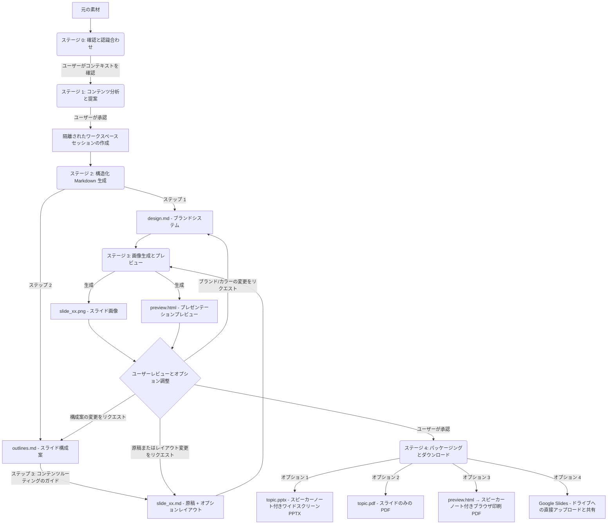

# Slide Gen Agent

[English](README.md) | [繁體中文 (zh-TW)](README.zh-TW.md) | [简体中文 (zh-CN)](README.zh-CN.md) | [日本語 (ja)](README.ja.md) | [한국어 (ko)](README.ko.md)

`slide-gen-agent` は、対話型のスライドデック生成器です。エージェントとチャットするだけで、あらゆるソース素材（記事、レポート、アウトライン、生のメモなど）を、完成された美しく洗練されたプレゼンテーションに変換します。要望を伝え、出力をレビューし、納得がいくまで自然な会話を通じて微調整を行うことができます。

**主な機能：**
- **対話型かつ反復的な調整** — スライドのコンテンツ調整、色の変更、あるいはセッション途中でのアウトライン全体の再構築などをエージェントに指示できます。変更はスライド全体を再生成することなく、必要な箇所にのみ適用されます。
- **スピーカー原稿を同梱** — 各スライドには、自然なプレゼンターの口調で書かれた 1〜2 分のスピーカー原稿が用意されています。原稿は PPTX のノートセクションに埋め込まれ、プレビューページにも表示されるため、本番に自信を持って臨むことができます。
- **多言語対応** — CJK（日本語・中国語・韓国語）や東南アジアの文字を含む、あらゆる言語のコンテンツとスピーカーノートをサポートしています。サーバー側のフォントに依存せず、ブラウザ印刷経由で PDF に書き出すことで、ローカルシステムフォントを保持できます。
- **本番環境対応の書き出し** — PPTX（スピーカーノート付き）、スライド PDF、ブラウザ印刷用スピーカーノート付き PDF としてダウンロードできるほか、**Google スライド**に直接アップロードして、ブラウザ上での即時編集や共有が可能です。

このリポジトリは、軽量なプロンプトベースのスキルから、本番稼働可能なエンタープライズ向けエージェントまで、3つの段階的なデプロイおよび利用方法に対応するように構成されています。

---

## 📖 コア設計思想とロジック

従来の AI スライド生成器は、レイアウトとビジュアルを単一のブラックボックス的なステップで作成するため、デザインの一貫性が失われたり、フォーマットがランダムになったり、プレゼンテーション全体を再生成しないと個々のスライドを微調整できないという問題がありました。

`slide-gen-agent` は、プレーンテキストの中間ファイルをバックボーンとする**分離された 5 段階のパイプライン**を採用しています。すべてのデザイン決定は編集可能な Markdown ファイルに保存されるため、チャットを通じて任意のレイヤー（グローバルスタイル、スライド構成、またはスライドごとのコンテンツ）を調整でき、影響を受けるスライドのみが再生成されます。



### 5段階のパイプライン

0. **ステージ 0: 確認と認識合わせ (Clarification & Alignment)**
   - ソース素材を処理する前に、エージェントは3つのコアコンテキスト要素を確認します：**想定プレゼンテーション時間**（またはスライド枚数）、**ターゲット層**、および**期待されるゴール/成果**。
   - *エージェントは一時停止し、ユーザーの入力を待ちます。* 初回の指示でこれらが不足している場合、続行する前に質問します。

1. **ステージ 1: コンテンツ分析と提案 (Content Analysis & Proposal)**
   - エージェントはソース素材（ドキュメント、トランスクリプト、未整理のメモなど）を読み取り、領域、トーン、ターゲット層を理解します。
   - スライドの**想定枚数**、**デザインテーマ**、**16進数カラーコードのパレット**を提案します。
   - *エージェントは一時停止し、ユーザーの入力を待ちます。* 提案を受け入れるか、テーマやパレットを調整できます。

2. **ステージ 2: 構造化 Markdown 生成 (Structured Markdown Generation)**
   - 承認されると、エージェントは隔離されたセッションフォルダー内に3種類の Markdown ファイルを生成します：
     - **`design.md`**：ブランドシステム — カラーパレット、タイポグラフィ、スペーシング、ビジュアルスタイルルール。スライド全体のブランド一貫性を保つための「唯一の真実のソース（SSoT）」です。
     - **`outlines.md`**：各スライドのレイアウトタイプと 2〜3 文の要約を含むスライドリスト。
     - **`slide_xx.md`**：スライドごとのファイル。タイトル、スピーカー原稿（260〜300文字）、およびオプションの `## Layout` セクション（初回生成時は空欄 — スライドタイプと原稿から画像モデルが適切な構成を推測します）。
   - *パイプラインは停止することなく、ステージ 3 に直接進みます。*

3. **ステージ 3: 画像生成とプレビュー (Image Generation & Preview)**
   - エージェントは `design.md`（ブランド）と `slide_xx.md`（スライド仕様）を組み合わせて、スライドごとの構造化プロンプトを作成します。
   - これを画像生成モデルに送信し、最終的な 16:9 高解像度 PNG (`slide_xx.png`) を生成します。
   - スライド画像とスピーカーノートは、レビューしやすいように `preview.html` ページにコンパイルされます。
   - *エージェントは一時停止し、ユーザーのレビューを待ちます。*
   - **調整方法**: 修正したい内容を自然な言葉でエージェントに伝えます。原稿の修正は `slide_xx.md` を更新し、レイアウトの変更（例：「スライド3を2カラムにして、グラフを右側に配置」）は `## Layout` セクションを更新し、カラーやブランドの変更は `design.md` を更新します。影響を受けるスライドのみが再生成されます。

4. **ステージ 4: パッケージングとダウンロード (Presentation Packaging & Download)**
   - 最終的なスライドを承認すると、エージェントは4つの書き出しオプションを提供します：
     - **PPTX（スピーカーノート付き PowerPoint）**：スライド画像を含み、各スライドのノートセクションにスピーカーノートが埋め込まれたワイドスクリーンの PowerPoint ファイル。ファイル名にはプレゼンテーションのトピックが使用されます（例：`ai-trends-2025.pptx`）。
     - **PDF: スライドのみ**：スライド画像からコンパイルされた PDF（プレゼンに最適）。ファイル名にはプレゼンテーションのトピックが使用されます（例：`ai-trends-2025.pdf`）。
     - **PDF: スピーカーノート付き**：`preview.html` リンクを開き、**「PDF として保存」**ボタンをクリックします。ブラウザは、ローカルシステムフォントを使用して、各スライドとノートをきれいにページ分けされた PDF としてレンダリングします。これにより、サーバー側のフォントに依存せず、日本語（CJK）や東南アジア言語も正しく処理されます。
     - **Google スライド**：エージェントは PPTX を Google ドライブの `slide-gen-agent` フォルダーにアップロードし、編集権限付きで共有します。Google スライドで直接開いて編集や共有が可能です。*(GCP で Google Drive API が有効化され、サービスアカウントにドライブの書き込み権限が付与されている必要があります。)*

---

## 🛠️ ディレクトリ構造

```text
slide-gen-agent/
├── README.md                # プロジェクトの概要とセットアップ（本ファイル）
├── skills/
│   └── slide-gen-agent/     # 🌟 スタンドアロンのエージェントスキル（Antigravity/Codex用）
│       ├── SKILL.md         # ガイドライン（YAML フロントマター + 指示書）
│       ├── assets/          # スキルで使用する静的テンプレート
│       │   ├── design.md    # ブランドシステムテンプレート（色、フォント、ビジュアルスタイル）
│       │   ├── outlines.md  # スライド構成案テンプレート
│       │   └── slide_xx.md  # スライドごとのテンプレート（タイトル、レイアウト、原稿）
│       └── scripts/         # スキルにバンドルされたカスタムツール
│           ├── pdf_exporter.py # ワイドスクリーンスライド PDF コンパイラ
│           ├── pptx_exporter.py # スピーカーノート付きワイドスクリーン PPTX コンパイラ
│           └── preview_generator.py # HTMLプレビューページコンパイラ（PDF保存機能付き）
└── adk_agent/               # プログラマティックホストエージェント（Python ADK 2.0 実装）
    ├── requirements.txt     # Python 依存関係の設定（python-pptx および reportlab を含む）
    ├── agent.py             # エージェントのメインエントリポイント
    └── tools/               # エージェントツール
        ├── __init__.py
        ├── file_manager.py  # セッション初期化およびファイル書き込みツール
        ├── imagen.py        # Gemini スライド画像生成ツール
        ├── pdf_exporter.py  # Pillow ベースのワイドスクリーン PDF エクスポーター
        ├── pptx_exporter.py # スピーカーノート付き PowerPoint ワイドスクリーン (PPTX) エクスポーター
        ├── drive_exporter.py # Google ドライブアップロード → Google スライド変換・共有ツール
        └── preview_generator.py # HTMLスライドプレビューおよびノートコンパイラ（PDF保存機能付き）
```

---

## 🚀 インストールとデプロイ方法

対象の環境に合わせてインストール方法を選択してください：

### 🔹 方法 1: ユニバーサルスキル (`SKILL.md`) — プラットフォーム非依存
これはガイドラインベースのインストールであり、コードのホスティングは不要です。
* **ユースケース**: 一般的な LLM システム（Antigravity、Codex、または画像生成機能を持つ一般的なチャットアシスタント）。
* **インストール方法**:
  1. [SKILL.md](file:///Users/sylph/Documents/Antigravity/slide-gen-agent/skills/slide-gen-agent/SKILL.md) の内容を、お使いの LLM アシスタントのカスタム指示書またはシステムプロンプトにインポートまたはコピーします。
  2. `skills/slide-gen-agent/templates/` ディレクトリ内の Markdown ファイルを、アシスタントが従うべきテンプレートの例として参照させます。

---

### 🔹 方法 2: ADK Web を使用したローカル検証（テストに推奨）
ビジュアルな Web UI を備えたフル機能の Python エージェントをローカルコンピュータで実行します。標準のコマンドラインインターフェースよりも簡単にテストや検証を行えます。

#### 1. 前提条件
- **Python 3.10** (v3.11 推奨)
- コンピュータに **Google Cloud SDK (gcloud)** がインストールされ、認証されていること。
- **Vertex AI API** が有効化された **Google Cloud プロジェクト (GCP)**。
- ローカルの IAM 認証情報が設定されていること (`gcloud auth application-default login`)。

#### 2. プロジェクトのインストール
**ルート**の `slide-gen-agent` ディレクトリに仮想環境を作成し（デプロイ時に仮想環境がアップロードされないようにするため、`adk_agent` ではなくルートディレクトリで作成します）、有効化して依存関係をインストールします：
```bash
# slide-gen-agent ルートディレクトリに移動:
python3 -m venv venv
source venv/bin/activate

# adk_agent ディレクトリに移動して依存関係をインストール:
cd adk_agent
pip install "google-adk[gcp]" google-genai Pillow python-dotenv
```

#### 3. 環境変数の設定
ローカルで実行する前に、Google Cloud プロジェクト ID を環境変数として設定する必要があります：
```bash
export GOOGLE_CLOUD_PROJECT="your-actual-gcp-project-id"
```
または、`adk_agent` フォルダー内に `.env` ファイルを作成して GCP プロジェクト ID を指定することもできます（ロケーションはデフォルトの `'global'`、成果物ディレクトリは `./artifacts` に自動設定されます）：
```text
GOOGLE_CLOUD_PROJECT="your-actual-gcp-project-id"
```

#### 4. Web UI モードでの実行
`adk_agent` ディレクトリからローカル Web インターフェースを起動します（`--allow_origins="*"` フラグを含めることで、ローカルマシンと Google Cloud Shell の両方でシームレスに動作します）：
```bash
# adk_agent ディレクトリにいて、仮想環境が有効であることを確認してください:
adk web --allow_origins="*" .
```
これによりローカルサーバーが立ち上がります。表示された URL をブラウザで開き、エージェントと対話的に操作してください！

---

### 🔹 方法 3: Agent Engine (Gemini Enterprise) への本番デプロイ
Python エージェントを Vertex AI の Reasoning Engine (Agent Engine) インスタンスとしてデプロイし、**Gemini Enterprise** に直接接続します。

#### 1. セットアップと前提条件
`requirements.txt` に `a2a-sdk` が記載されていることを確認します（このリポジトリではすでに設定済みです）。これは、ADK 2.0 デプロイヤーが Reasoning Engine 起動時に `--a2a` フラグをハードコードするため、コンテナ内に `a2a-sdk` がインストールされていないと `ModuleNotFoundError` でクラッシュするのを防ぐために必要です。

まだ仮想環境をセットアップしていない場合は、`slide-gen-agent` ルートディレクトリから以下のコマンドを実行します：
```bash
python3 -m venv venv
source venv/bin/activate
cd adk_agent
pip install "google-adk[gcp]" google-genai Pillow python-dotenv
```

#### 2. 環境変数の設定
デプロイする前に、Google Cloud プロジェクト ID とプロジェクト番号を環境変数として設定する必要があります：
```bash
export GOOGLE_CLOUD_PROJECT="your-actual-gcp-project-id"
export GOOGLE_CLOUD_PROJECT_NUMBER="your-actual-gcp-project-number"
```

#### 3. ワンコマンドでのデプロイ
環境変数が設定され、依存関係がインストールされ、仮想環境が有効になっている状態で、`adk_agent` ディレクトリから ADK デプロイコマンドを実行します：
```bash
adk deploy agent_engine \
  --project=$GOOGLE_CLOUD_PROJECT \
  --region=us-central1 \
  --display_name="slide-gen-agent" \
  --artifact_service_uri="gs://your-runtime-bucket" \
  .
```
*バックグラウンドで、ADK CLI がコンテナ化、デプロイ用ステージング、Reasoning Engine への登録を処理します。完了すると、**Reasoning Engine リソース ID**（例: `projects/${GOOGLE_CLOUD_PROJECT_NUMBER}/locations/us-central1/reasoningEngines/{ENGINE_ID}`）が出力されます。*

#### 4. IAM 権限の設定

##### A. ビルドとデプロイの権限（初回のみ）
デプロイコマンドが「Build failed」エラーで失敗する場合、プロジェクトのデフォルトの compute サービスアカウント (`${GOOGLE_CLOUD_PROJECT_NUMBER}-compute@developer.gserviceaccount.com`) に、ビルドログの書き込みやビルド済みイメージのプッシュ権限が不足している可能性があります。
**IAM と管理 > IAM** で、サービスアカウントに以下のロールを付与します：
- **ログ書き込みプロセッサ (Logs Writer)** (`roles/logging.logWriter`)
- **Artifact Registry 書き込みプロセッサ (Artifact Registry Writer)** (`roles/artifactregistry.writer`)

##### B. ランタイム権限（必須）
デプロイされた Agent Engine (Reasoning Engine) インスタンスとそのオーケストレータには、Vertex AI モデルの呼び出しと GCS バケットへの読み書き権限が必要です。

1. **Google Cloud コンソール**を開きます。
2. **IAM と管理 > IAM** に移動します。
3. **エージェントのランタイムサービスアカウントに権限を付与**します：
   - プロジェクトのランタイム ID（通常は **Compute Engine デフォルトサービスアカウント**：`${GOOGLE_CLOUD_PROJECT_NUMBER}-compute@developer.gserviceaccount.com`）を探します。
   - 以下のロールを付与します：
     - **Vertex AI ユーザー (Agent Platform User)** (`roles/aiplatform.user`)（Vertex AI モデルの呼び出しと Gemini 画像生成に必要）
     - **ストレージオブジェクトユーザー (Storage Object User)** (`roles/storage.objectUser`)（スライド、プレビュー、PDF ファイルの GCS バケットへの読み書きに必要）

4. **Vertex AI サービスエージェントに権限を付与**します：
   - **[アクセス権を付与]**をクリックして新しいプリンシパルを追加します。
   - Vertex AI Reasoning Engine サービスエージェントのアドレスを入力します：
     `service-${GOOGLE_CLOUD_PROJECT_NUMBER}@gcp-sa-aiplatform-re.iam.gserviceaccount.com`
   - 以下のロールを付与します：
     - **ストレージオブジェクトユーザー (Storage Object User)** (`roles/storage.objectUser`)（プラットフォームがエージェントに代わって GCS に成果物を同期・保存するために必要）
*生の API キーや秘密ファイルを管理する必要はありません。ホストされた推論エンジンは、安全な IAM/ADC 認証情報を自動的に使用します。*

#### 5. Gemini Enterprise コンソールへの接続
エージェントを企業のユーザーに公開するには：
1. **Gemini Enterprise 管理コンソール**にログインします。
2. 左サイドバーから **[エージェント]** ページに移動します。
3. **[+ エージェントの追加]** をクリックします。
4. **[Agent Engine 経由のカスタムエージェント]** を選択し、**[Agent Engine 推論エンジン]** 入力フィールドにデプロイ時に取得した **Reasoning Engine リソース ID** を入力します。
5. Gemini Enterprise と Reasoning Engine エージェント間の接続を保護するため、IAM 認証を構成します。

#### 6. (オプション) Google スライド書き出しの有効化

これにより、「Google スライドで開く」書き出しオプションが有効になります。生成されたスライドを、各ユーザーの Google ドライブに直接 Google スライドファイルとしてアップロードします。

**ステップ 1 — Google Drive API の有効化**

GCP プロジェクトで [Google Drive API](https://console.cloud.google.com/apis/library/drive.googleapis.com) を有効にします。

**ステップ 2 — ドメイン全体の委任の設定**

1. [Google Workspace 管理コンソール](https://admin.google.com)で、**[セキュリティ] → [API コントロール] → [ドメイン全体の委任]** に移動します。
2. **[新しく追加]** をクリックし、以下を入力します：
   - **クライアント ID**: Agent Engine サービスアカウントのクライアント ID（[IAM サービスアカウントページ](https://console.cloud.google.com/iam-admin/serviceaccounts) → 対象のアカウントを選択 → **[詳細]** タブで確認できます）
   - **OAuth スコープ**: `https://www.googleapis.com/auth/drive.file`
3. **[承認]** をクリックします。

**ステップ 3 — サービスアカウントキーの Secret Manager への保存**

```bash
# Agent Engine サービスアカウントの JSON キーを作成してダウンロード
gcloud iam service-accounts keys create /tmp/drive-sa-key.json \
  --iam-account=${GOOGLE_CLOUD_PROJECT_NUMBER}-compute@developer.gserviceaccount.com

# Secret Manager に保存
gcloud secrets create drive-sa-key \
  --data-file=/tmp/drive-sa-key.json \
  --project=$GOOGLE_CLOUD_PROJECT

# ローカルコピーを削除
rm /tmp/drive-sa-key.json
```

**ステップ 4 — デプロイ時のキー挿入**

デプロイ時に、シークレットを環境変数 `DRIVE_SERVICE_ACCOUNT_KEY` として渡します：

```bash
adk deploy agent_engine \
  --project=$GOOGLE_CLOUD_PROJECT \
  --region=us-central1 \
  --display_name="slide-gen-agent" \
  --artifact_service_uri="gs://your-runtime-bucket" \
  --env_vars="DRIVE_SERVICE_ACCOUNT_KEY=$(gcloud secrets versions access latest --secret=drive-sa-key --project=$GOOGLE_CLOUD_PROJECT)" \
  .
```

設定が完了すると、エージェントは各ユーザーの「マイドライブ」に `slide-gen-agent` フォルダーを作成し、生成されたプレゼンテーションをユーザーが所有する Google スライドファイルとしてそこに保存します。
