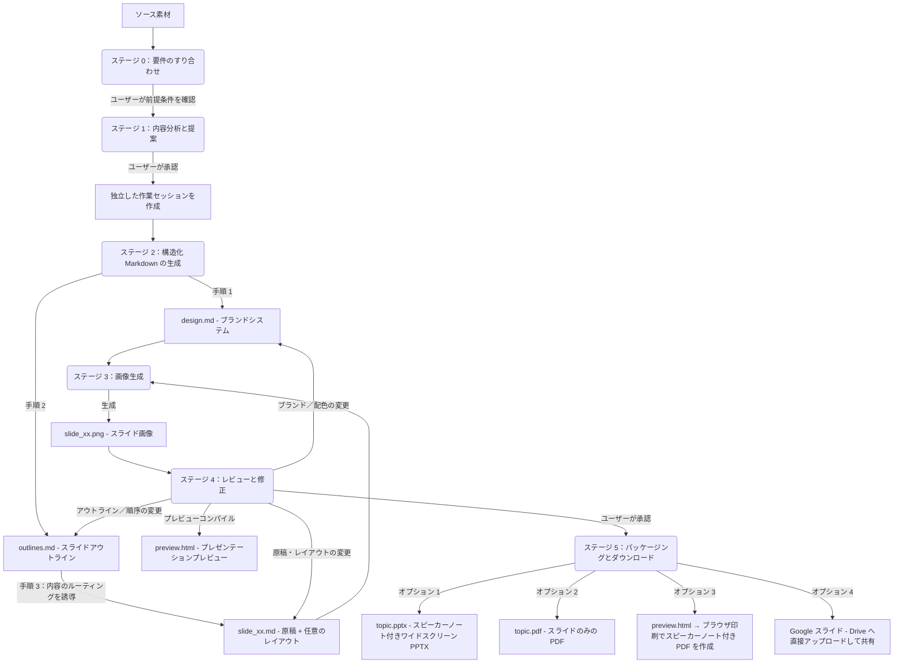

# Slide Gen Agent

[English (en)](README.md) | [繁體中文 (zh-TW)](README.zh-TW.md) | [简体中文 (zh-CN)](README.zh-CN.md) | [日本語 (ja)](README.ja.md) | [한국어 (ko)](README.ko.md)

`slide-gen-agent` は対話型のスライドデック生成エージェントです——エージェントとチャットするだけで、あらゆる素材（記事、レポート、アウトライン、メモなど）を完成度の高い、視覚的に洗練されたプレゼンテーションへと変換できます。要望を伝え、生成結果を確認し、自然な対話を通じて納得のいく仕上がりになるまで何度でも調整できます。

**主な特徴：**
- **対話型・反復改善** — スライドの内容を調整したり、配色を変更したり、セッションの途中でアウトライン全体を作り直すよう指示できます。変更は対象範囲に対してピンポイントで適用され、デック全体を再生成する必要はありません。
- **スピーカースクリプト同梱** — 各スライドには、自然な発表者の語り口で書かれた1〜2分の完全なスピーチ原稿が付属します。原稿は PPTX のノート欄に埋め込まれ、プレビューページにも表示されるため、本番に向けた準備が万全に整います。
- **多言語対応** — 繁体字中国語・簡体字中国語・英語・日本語・韓国語・タイ語・ベトナム語をはじめ、100 以上の言語と各種アジア文字に対応し、スライド本文・スピーカーノートの両方で利用できます。ブラウザ印刷による PDF 出力にも対応しており、サーバー側のフォント依存なしにシステムフォントをそのまま維持できます。
- **すぐに使えるエクスポート形式** — スピーカーノートが編集可能な PPTX、スライド PDF、ブラウザ印刷によるスピーカーノート付き PDF としてダウンロードできるほか、**Google スライド**へ直接アップロードしてブラウザ上で即座にプレゼンテーションや共有（注：スライドは高解像度画像として書き出されますが、スピーカーノートは編集可能）を行うこともできます。

本リポジトリは、軽量なプロンプトベースのスキルからエンタープライズ向けの本番運用エージェントまで、段階的に導入できる 3 つの方式に対応した構成になっています。

---

## 📖 設計思想とロジック

従来の AI スライド生成ツールは、レイアウトとビジュアルを単一のブラックボックス処理で同時に作り出すため、デザインに一貫性がなくなったり、書式がランダムになったり、反復作業が雑になりがちでした——あるスライドの構成を少し直したい、あるいは更新済みのスピーチ内容を反映したいだけでも、デック全体を作り直す必要があるのが常でした。

`slide-gen-agent` は、プレーンテキストの中間ファイルを軸とした**疎結合な 6 段階パイプライン**を採用しています。あらゆるデザイン上の決定は編集可能な Markdown ファイルとして保存されるため、チャットを通じて任意のレイヤー（全体スタイル、スライド構成、各スライドの内容）を調整でき、影響を受けるスライドだけが再生成されます。



### 6 段階のパイプライン

0. **ステージ 0：要件のすり合わせ**
   - 素材を分析したりデザインスタイルを提案したりする前に、エージェントはプレゼンテーションの中心となる 3 つの前提条件を確認します：**想定する発表時間**（またはスライド枚数）、**想定する聴衆**、**達成したい目標／成果**です。
   - *エージェントはここで一旦立ち止まり、ユーザーからの返答を待ちます。* 最初のリクエストにこれらの情報が欠けている場合、エージェントは先に進む前に確認の質問をします。

1. **ステージ 1：内容分析と提案**
   - エージェントは提供された素材（文書、書き起こし、メモなど）を丁寧に読み込み、その内容のドメイン、トーン、そしてステージ 0 で確認した前提条件を理解します。
   - 続いて、推奨する**スライド枚数**、**デザインテーマ**、**16 進数カラーコードによる配色案**を提示します。
   - *エージェントはここで一旦立ち止まり、ユーザーからの返答を待ちます。* 提案をそのまま承認することも、テーマや配色の調整を求めることもできます。

2. **ステージ 2：構造化 Markdown の生成**
   - 承認が得られると、エージェントは独立したセッションフォルダ内に 3 種類の Markdown ファイルを生成します：
     - **`design.md`**：ブランドシステム——16 進数のカラーパレット、タイポグラフィ、余白、ビジュアルスタイルのルールをまとめたもの。すべてのスライドにおけるブランドの一貫性を担保する単一の正典（SSoT）です。
     - **`outlines.md`**：各スライドのレイアウトタイプと 2〜3 文の要約を含む、デック全体のスライド一覧。
     - **`slide_xx.md`**：各スライドごとのファイルで、タイトル、スピーカー原稿（260〜300 語）、そして任意の `## Layout` セクション（初回生成時は空のまま——画像生成モデルがスライドの種類と原稿の内容から適切な構図を推測します）を含みます。
   - *一時停止することなく、そのままステージ 3 へ進みます。*

3. **ステージ 3：画像生成**
   - エージェントは `design.md`（ブランド情報）と `slide_xx.md`（各スライドの仕様）を統合し、各スライド用の構造化されたプロンプトを作成します。
   - これを画像生成モデルに送信し、最終的な 16:9 の高品質な PNG 画像（`slide_xx.png`）を生成します。
   - *そのままステージ 4 へ進みます。*

4. **ステージ 4：レビューと修正**
   - エージェントはすべてのスライド画像とスピーカーノートを `preview.html` ページにまとめ、チャット上にプレビューリンクとスライド画像を表示します。
   - *エージェントはユーザーからのフィードバックを待って一旦停止します。*
   - 自然な言葉で変更したい内容を伝えてください。変更はが的確に適用され——影響を受けるスライドだけが再生成されます：
     - 原稿やレイアウトの修正 → 該当する `slide_xx.md` を更新し、そのスライドのみ再生成
     - スライドの並べ替え／追加／削除 → `outlines.md` と影響を受ける `slide_xx.md` を更新（つなぎの導入部分も書き直し）し、変更があったスライドのみ再生成
     - ブランド／配色の変更 → `design.md` を更新し、すべてのスライドを再生成
   - このサイクルは、ユーザーがすべてのスライドに明確に満足を示すまで繰り返されます。

5. **ステージ 5：プレゼンテーションのパッケージングとダウンロード**
   - 最終的なスライドが承認されると、エージェントは次の 4 つのエクスポート方法を提示します：
     - **Google スライド**：エージェントが PPTX を Google ドライブの `slide-gen-agent` フォルダにアップロードし、Google スライド形式に変換したうえで、編集者としてユーザーと共有します。すぐに Google スライドで開いてプレゼンテーションや共有を行えます。*(注：スライドのレイアウトは高画質な静止画像としてレンダリングされますが、ノート欄のスピーカーノートは完全に編集可能です。GCP で Google Drive API を有効化し、Google Workspace 管理コンソールでドメイン全体の委任を設定する必要があります。）*
     - **PPTX（スピーカーノート付き PowerPoint）**：すべてのスライド画像を含むワイドスクリーンの PowerPoint ファイルで、各スライドの PowerPoint ノート欄にスピーカーノートが完全に編集可能な状態で含まれています。ファイル名はプレゼンテーションのトピック名が使われます（例：`ai-trends-2025.pptx`）。
     - **PDF：スライド**：すべてのスライド画像から作成された PDF（そのままプレゼンテーションに利用可能）。ファイル名はプレゼンテーションのトピック名が使われます（例：`ai-trends-2025.pdf`）。
     - **PDF：スピーカーノート**：`preview.html` のリンクを開き、**「Save as PDF」** ボタンをクリックします。ブラウザが各スライドとそのノートをきれいにページ分割された PDF としてレンダリングし、ローカルのシステムフォントを使用します——これにより、CJK や東南アジアの文字を含むあらゆる言語を、サーバー側のフォント依存なしに正しく扱うことができます。

---

## 🛠️ ディレクトリ構成

```text
slide-gen-agent/
├── README.md                # プロジェクト概要とセットアップ手順（このファイル）
├── skills/
│   └── slide-gen-agent/     # 🌟 標準の自己完結型エージェントスキル（Antigravity/Codex 向け）
│       ├── SKILL.md         # プレイブック／ガイドライン（YAML フロントマター + 実行手順）
│       ├── assets/          # スキルに同梱された静的テンプレート
│       │   ├── design.md    # ブランドシステムのテンプレート（配色、タイポグラフィ、ビジュアルスタイル）
│       │   ├── outlines.md  # デックのアウトラインテンプレート
│       │   └── slide_xx.md  # 各スライドのテンプレート（タイトル、任意のレイアウト、原稿）
│       └── scripts/         # スキルに同梱されたカスタムツール
│           ├── pdf_exporter.py # ワイドスクリーンのプレゼンテーション PDF コンパイラ
│           ├── pptx_exporter.py # スピーカーノート付きワイドスクリーン PPTX コンパイラ
│           └── preview_generator.py # HTML プレビューページのコンパイラ（Save as PDF 機能を含む）
└── adk_agent/               # プログラム実装のホストエージェント（Python ADK 2.0 実装）
    ├── requirements.txt     # Python の依存関係設定（python-pptx・reportlab を含む）
    ├── agent.py             # エージェントのメインエントリーポイント
    └── tools/               # エージェントツール
        ├── __init__.py
        ├── file_manager.py  # セッション初期化およびファイル書き込みツール
        ├── image_generation.py # Gemini によるスライド画像生成ツール
        ├── pdf_exporter.py  # Pillow ベースのワイドスクリーン PDF エクスポートツール
        ├── pptx_exporter.py # スピーカーノート付き PowerPoint ワイドスクリーン（PPTX）エクスポートツール
        ├── drive_exporter.py # Google ドライブへのアップロード → Google スライド変換・共有ツール
        └── preview_generator.py # HTML スライドプレビューおよびノートのコンパイラ（Save as PDF 機能を含む）
```

---

## 🚀 インストールとデプロイ方法

ご利用の環境に合った導入方法を選択してください：

### 🔹 方法 1：汎用スキル（`SKILL.md`）— プラットフォームを問わない方式
コードのホスティングを必要としない、純粋にプロンプト／ガイドラインベースのインストール方法です。
* **想定用途**：Agent Skills に対応し、サンドボックス化されたコード実行環境を備え、テキストから画像を生成する機能を持つ LLM システム（例：Antigravity、Codex）。
* **インストール手順**：
  1. [SKILL.md](file:///Users/sylph/Documents/Antigravity/slide-gen-agent/skills/slide-gen-agent/SKILL.md) の内容を、利用している LLM アシスタントのカスタムシステム指示やシステムプロンプトにインポートまたはコピーしてください。
  2. `skills/slide-gen-agent/templates/` ディレクトリ内の Markdown ファイルを参考例として、アシスタントに参照させてください。

---

### 🔹 方法 2：Gemini Enterprise への本番デプロイ
この Python エージェントを Vertex AI 上の Reasoning Engine（Agent Engine）インスタンスとしてデプロイし、**Gemini Enterprise** に直接組み込みます。

---

#### オプション 1: ワンクリックインストール (One-Click Installation)
**Terraform** と付随する**オーケストレーションスクリプト** (`deploy.sh`) を使用した、自動化された本番環境対応のデプロイ環境を提供しています。これにより、API の有効化、Google ドライブ委任サービスアカウントの作成、GCS セッションバケットのプロビジョニング、複雑な IAM ロールバインディングの設定、Python 仮想環境のセットアップ、Vertex AI へのエージェントの登録が完全に自動化されます。

> [!NOTE]
> このスクリプトの前提条件、対話型設定、および実行ステージの詳細な手順については、[Deployment Script Details (英語)](deploy_details.md) のガイドを参照してください。

##### 1. 前提条件
**[Google Cloud Shell](https://shell.cloud.google.com)** から直接デプロイすることを**強く推奨**します。これはブラウザ上で動作する無料の事前構成済み環境であり、必要なすべてのツールがプリインストールされています。

* **Google Cloud Shell を使用する場合 (推奨)**:
  - すべてのツール（`gcloud` および `terraform`）はプリインストールされています。
  - アプリケーションのデフォルト認証情報 (ADC) を認証するだけで済みます:
    ```bash
    gcloud auth application-default login
    ```

* **ローカルマシンを使用する場合**:
  - [Google Cloud SDK](https://cloud.google.com/sdk/docs/install) および [Terraform CLI](https://developer.hashicorp.com/terraform/downloads) を手動でインストールする必要があります。
  - gcloud CLI とアプリケーションのデフォルト認証情報 (ADC) の両方を認証する必要があります:
    ```bash
    gcloud auth login
    gcloud auth application-default login
    ```

##### 2. デプロイの実行
ターミナル（または Google Cloud Shell）を開き、以下のコマンドを実行してリポジトリをクローンし、対話型デプロイスクリプトを起動します:
```bash
git clone https://github.com/sylphlin/slide-gen-agent
cd slide-gen-agent
./deploy.sh
```

スクリプトは以下のステップを案内します：
1. **対話型設定**: 対象の GCP プロジェクト ID とリージョンを確認します。
2. **インフラのプロビジョニング**: Terraform を実行して、API、IAM 権限、GCS バケット、およびサービスアカウントを構成します。
3. **環境設定**: プロジェクト構成を含む `adk_agent/.env` ファイルを生成します。
4. **エージェントのパッケージングとデプロイ**: Python の依存関係をインストールし、ADK CLI を使用してエージェントを Vertex AI Reasoning Engine にパッケージングおよび登録します。

完了すると、スクリプトは **Reasoning Engine リソース ID** を出力します（例: `projects/{PROJECT_NUMBER}/locations/{REGION}/reasoningEngines/{ENGINE_ID}`）。

##### 3. デプロイ後の設定
統合を完了するには、次の 2 つの手動ステップを実行してください：

###### A. Google Workspace のドメイン全体の委任の設定
これにより、エージェントがユーザーの Google ドライブにスライドを直接アップロードできるようになります：
1. [Google Workspace Admin Console](https://admin.google.com) にログインします。
2. **セキュリティ ➔ アクセスとデータ管理 ➔ API コントロール ➔ ドメイン全体の委任** に移動します。
3. **新規追加** をクリックし、以下を入力します：
   - **クライアント ID**: Drive サービスアカウントの OAuth2 クライアント ID（この ID は `deploy.sh` スクリプトの最後に出力されるか、Terraform の出力から確認できます）。
   - **OAuth スコープ**: `https://www.googleapis.com/auth/drive.file`
4. **承認** をクリックします。

###### B. Gemini Enterprise への接続
1. **Gemini Enterprise 管理コンソール** にログインします。
2. 左側のサイドバーで **エージェント** に移動します。
3. **+ エージェントを追加** をクリックします。
4. **Agent Engine 経由のカスタムエージェント（Custom agent via Agent Engine）** を選択し、スクリプトで出力された **Reasoning Engine リソース ID** を貼り付けます。
5. 接続を保護するため、IAM 認証権限を設定します。

---

#### オプション 2: 手動インストール (Manual Installation)

##### パート A — 一度きりのプロジェクトセットアップ
GCP プロジェクトごとに一度だけ実施します。今後の再インストールや再デプロイの際にこれらの手順を繰り返す必要はありません。

##### 1. GCP API の有効化
GCP プロジェクトで以下の API を有効にしてください：
- [Vertex AI API](https://console.cloud.google.com/apis/library/aiplatform.googleapis.com)
- [Google Drive API](https://console.cloud.google.com/apis/library/drive.googleapis.com)

##### 2. IAM 権限の設定

Agent Engine は **Vertex AI Reasoning Engine サービスエージェント**（`service-{PROJECT_NUMBER}@gcp-sa-aiplatform-re.iam.gserviceaccount.com`）としてコードを実行します。この Google 管理のサービスアカウントは Vertex AI と GCS へのアクセスを処理しますが、ドメイン全体の委任（DWD）に直接登録することは**できません**。Google ドライブへのエクスポートを行うには、別途ユーザー管理のサービスアカウント（`slide-gen-drive`）を作成し、ランタイムのサービスアカウントがそれをなりすませるようにします。

```bash
export GOOGLE_CLOUD_PROJECT="your-actual-gcp-project-id"

PROJECT_NUMBER=$(gcloud projects describe $GOOGLE_CLOUD_PROJECT --format="value(projectNumber)")

# ランタイムサービスアカウント：エージェントのコードを実行する Google 管理の ID
RUNTIME_SA="service-${PROJECT_NUMBER}@gcp-sa-aiplatform-re.iam.gserviceaccount.com"

# ビルドサービスアカウント：`adk deploy` 実行時のコンテナイメージのプッシュとビルドログにのみ使用
BUILD_SA="${PROJECT_NUMBER}-compute@developer.gserviceaccount.com"

# Drive サービスアカウント：あなたが作成・所有し、DWD 用に登録するユーザー管理のサービスアカウント
gcloud iam service-accounts create slide-gen-drive \
  --display-name="Slide Gen Drive Exporter" \
  --project=$GOOGLE_CLOUD_PROJECT
DRIVE_SA="slide-gen-drive@${GOOGLE_CLOUD_PROJECT}.iam.gserviceaccount.com"

# 必須：Vertex AI モデルおよび Gemini の画像生成機能を呼び出すため
gcloud projects add-iam-policy-binding $GOOGLE_CLOUD_PROJECT \
  --member="serviceAccount:$RUNTIME_SA" \
  --role="roles/aiplatform.user"

# 必須：スライド・プレビュー・エクスポートファイルを GCS バケットに読み書きするため
gcloud projects add-iam-policy-binding $GOOGLE_CLOUD_PROJECT \
  --member="serviceAccount:$RUNTIME_SA" \
  --role="roles/storage.objectUser"

# 必須：ランタイムサービスアカウントが Drive サービスアカウントとして JWT に署名できるようにする（DWD 用）。
# ここでの方向は、上下にあるプロジェクトレベルのバインディングとは「逆」になっている点に注意してください：
# Drive サービスアカウントがリソースそのものであり（`service-accounts add-iam-policy-binding $DRIVE_SA`）、
# ランタイムサービスアカウントはそのリソース上でロールを付与される `--member` 側です——順序を逆にしないでください。
# これを逆にすると、Drive サービスアカウントがプロジェクト内の「あらゆる」サービスアカウントに
# なりすませる権限を持つことになってしまいます（誤った設定であり、signJwt の 404 エラーも解決しません）。
gcloud iam service-accounts add-iam-policy-binding $DRIVE_SA \
  --member="serviceAccount:${RUNTIME_SA}" \
  --role="roles/iam.serviceAccountTokenCreator" \
  --project=$GOOGLE_CLOUD_PROJECT

# adk deploy に必要：ビルドログの書き込みとコンテナイメージのプッシュ
gcloud projects add-iam-policy-binding $GOOGLE_CLOUD_PROJECT \
  --member="serviceAccount:$BUILD_SA" \
  --role="roles/logging.logWriter"
gcloud projects add-iam-policy-binding $GOOGLE_CLOUD_PROJECT \
  --member="serviceAccount:$BUILD_SA" \
  --role="roles/artifactregistry.writer"
```

> **注**：同じロール＋メンバーの組み合わせのバインディングがすでに存在する場合——条件付きかどうかにかかわらず（例えば Cloud Build などの別のセットアップから残っているもの）——`gcloud` は新しいバインディングをどう適用するか選択を求めてきます：
> ```
>  [1] EXPRESSION=request.time < timestamp(...), TITLE=cloudbuild-connection-setup
>  [2] None
>  [3] Specify a new condition
> ```
> **`[2] None`** を選択してください——上記のバインディングは無条件である必要があり、そうしないとエージェントが常にこれらの権限を持てなくなります。

> **注**：Drive サービスアカウントへのバインディングコマンド（`gcloud iam service-accounts add-iam-policy-binding $DRIVE_SA ...`）は、このスクリプトの中で**唯一、方向が逆になっている**バインディングです。他のすべてのコマンドは、あるサービスアカウントに対して「プロジェクト」レベルでロールを付与するものです（`gcloud projects add-iam-policy-binding $GOOGLE_CLOUD_PROJECT --member="serviceAccount:<SA>" ...`）。これに対してこのコマンドは、「Drive サービスアカウント自身」というリソースに対して、ランタイムサービスアカウントにロールを付与します（`gcloud iam service-accounts add-iam-policy-binding $DRIVE_SA --member="serviceAccount:$RUNTIME_SA" ...`）。もし誤ってプロジェクトレベルのパターンをここに適用してしまうと——つまりプロジェクトレベルで `roles/iam.serviceAccountTokenCreator` を `$DRIVE_SA` に付与してしまうと——Drive サービスアカウントはプロジェクト内の「あらゆる」サービスアカウントになりすませるようになってしまい（はるかに広範囲かつ誤った権限付与）、それでもランタイムサービスアカウントには Drive サービスアカウントへのなりすまし権限がないままなので、Google ドライブへのエクスポートは引き続き `[step:signJwt] HTTP 404` エラーで失敗し続けます。`gcloud iam service-accounts get-iam-policy $DRIVE_SA` を実行して、バインディングが実際に Drive サービスアカウントというリソース上に設定されているか確認してください（`roles/iam.serviceAccountTokenCreator` がメンバー `$RUNTIME_SA` に対して設定されているはずです）。


##### 3. ドメイン全体の委任の設定（Google Workspace 管理コンソール）
これにより、エージェントは生成したデックを各ユーザー自身の Google ドライブへ直接アップロードできるようになります。

1. [Google Workspace 管理コンソール](https://admin.google.com) にアクセスし、**セキュリティ → API の管理 → ドメイン全体の委任** に進みます。
2. **新規追加** をクリックし、以下を入力します：
   - **クライアント ID**：**Drive サービスアカウント**（`slide-gen-drive@{PROJECT_ID}.iam.gserviceaccount.com`）の OAuth 2 クライアント ID。[IAM サービスアカウントページ](https://console.cloud.google.com/iam-admin/serviceaccounts) で `slide-gen-drive` を選択し、**詳細** タブから確認できます。
   - **OAuth スコープ**：`https://www.googleapis.com/auth/drive.file`
3. **承認** をクリックします。

---

##### パート B — インストールとデプロイ
新規インストールや再デプロイのたびに、以下の手順を繰り返します。

##### 1. 依存関係のインストール
ルートの `slide-gen-agent` ディレクトリから仮想環境をセットアップします：
```bash
python3 -m venv venv
source venv/bin/activate
cd adk_agent
pip install "google-adk[gcp]" google-genai Pillow python-dotenv
```

##### 2. 環境変数の設定
`adk_agent` ディレクトリ内に `.env` ファイルを作成してください。これによりデプロイ用コンテナに同梱され、起動時に読み込まれます。**これは必須です**——デプロイ後のランタイムは、プロジェクト ID を確実に自動検出することができません（ホスティング環境によって解決される値が異なり、数値のプロジェクト番号や無関係なテナントプロジェクトが返ってくることがあります）。誤った値が設定されると、モデル呼び出しとエクスポートで使用される Drive サービスアカウントのメールアドレスの両方が壊れてしまいます：
```bash
export GOOGLE_CLOUD_PROJECT="your-actual-gcp-project-id"

cat > .env <<EOF
GOOGLE_CLOUD_PROJECT="$GOOGLE_CLOUD_PROJECT"
EOF
```

##### 3. デプロイ
`adk_agent` ディレクトリから ADK のデプロイツールを実行します。エージェントは `.env` の `GOOGLE_CLOUD_PROJECT` を使って、Drive サービスアカウントを `slide-gen-drive@{PROJECT_ID}.iam.gserviceaccount.com` として解決します：
```bash
adk deploy agent_engine \
  --project=$GOOGLE_CLOUD_PROJECT \
  --region=us-central1 \
  --display_name="slide-gen-agent" \
  --artifact_service_uri="gs://your-runtime-bucket" \
  .
```
*ADK の CLI がコンテナ化、デプロイのステージング、Reasoning Engine への登録までを処理します。完了すると **Reasoning Engine リソース ID**（例：`projects/{PROJECT_NUMBER}/locations/us-central1/reasoningEngines/{ENGINE_ID}`）が出力されます。*

##### 4. Gemini Enterprise コンソールへの接続
1. **Gemini Enterprise 管理コンソール** にログインします。
2. 左側のサイドバーから **Agents** に移動します。
3. **+ エージェントを追加** をクリックします。
4. **Agent Engine 経由のカスタムエージェント（Custom agent via Agent Engine）** を選択し、**Reasoning Engine リソース ID** を入力します。
5. 接続を保護するため、IAM 認証権限を設定します。