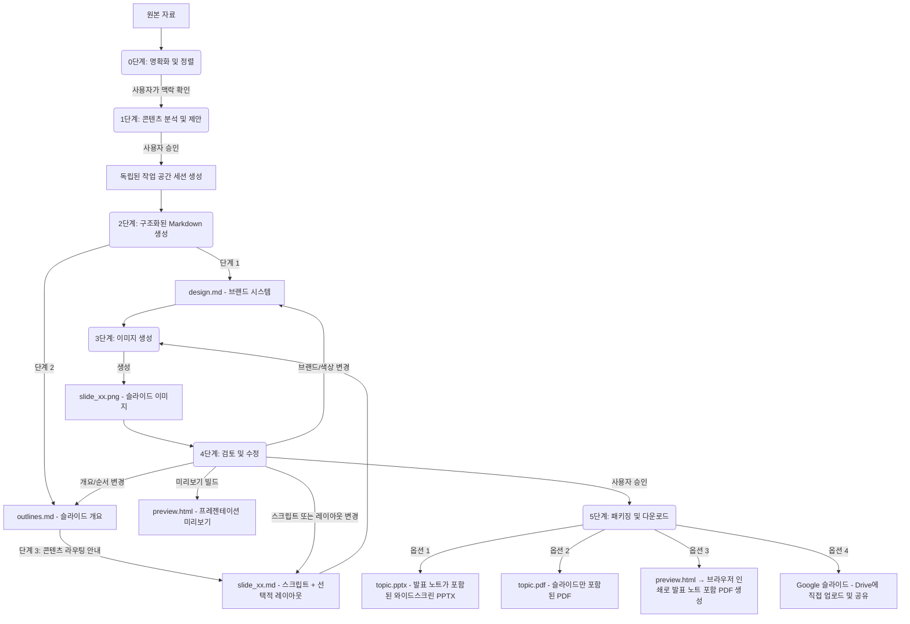

# Slide Gen Agent

[English (en)](README.md) | [繁體中文 (zh-TW)](README.zh-TW.md) | [简体中文 (zh-CN)](README.zh-CN.md) | [日本語 (ja)](README.ja.md) | [한국어 (ko)](README.ko.md)

`slide-gen-agent`는 대화형 슬라이드 덱 생성 에이전트입니다 — 에이전트와 대화하는 것만으로 어떤 원본 자료(기사, 보고서, 개요, 메모 등)든 완성도 높고 시각적으로 세련된 프레젠테이션으로 변환할 수 있습니다. 원하는 바를 설명하고, 결과물을 검토하고, 자연스러운 대화를 통해 완벽하게 만족스러울 때까지 다듬어 나가세요.

**핵심 기능:**
- **대화형 & 반복 개선** — 슬라이드의 내용을 조정하거나, 색상을 바꾸거나, 세션 도중 전체 개요를 다시 구성하도록 요청할 수 있습니다. 변경 사항은 해당 부분에만 정밀하게 적용되며, 덱 전체를 다시 생성할 필요가 없습니다.
- **발표 스크립트 포함** — 모든 슬라이드에는 자연스러운 발표자의 어조로 작성된 1~2분 분량의 완전한 발표 스크립트가 함께 제공됩니다. 스크립트는 PPTX의 노트 영역에 포함되며, 미리보기 페이지에도 표시되어 발표 준비를 완벽하게 마칠 수 있습니다.
- **다국어 지원** — 번체 중국어, 간체 중국어, 영어, 일본어, 한국어, 태국어, 베트남어를 비롯한 100개 이상의 언어와 다양한 아시아 문자 체계를 슬라이드 본문과 발표 노트 모두에서 지원합니다. 브라우저 인쇄를 통한 PDF 내보내기도 지원하므로, 서버 측 폰트 의존성 없이 시스템 폰트를 그대로 유지할 수 있습니다.
- **바로 활용 가능한 내보내기** — 발표 노트가 포함된 PPTX, 슬라이드 PDF, 브라우저 인쇄로 생성한 발표 노트 PDF로 다운로드하거나, **Google 슬라이드**로 직접 전송하여 브라우저에서 즉시 편집하고 공유할 수 있습니다.

이 저장소는 가벼운 프롬프트 기반 스킬부터 엔터프라이즈급 운영 환경 에이전트까지, 단계적으로 도입할 수 있는 세 가지 배포 및 사용 방식을 지원하도록 구성되어 있습니다.

---

## 📖 핵심 설계 철학과 로직

기존의 AI 슬라이드 생성기는 레이아웃과 비주얼을 하나의 블랙박스 단계에서 한꺼번에 만들어내기 때문에, 디자인이 일관되지 않거나 서식이 제멋대로 적용되고, 반복 수정 작업이 매우 번거로워지는 경우가 많았습니다 — 슬라이드 하나의 구조를 살짝 바꾸거나 수정된 발표 내용을 반영하고 싶을 뿐인데도, 보통은 덱 전체를 다시 만들어야 했습니다.

`slide-gen-agent`는 일반 텍스트 중간 파일을 중심축으로 삼는 **분리형 6단계 파이프라인**을 사용합니다. 모든 디자인 결정은 편집 가능한 Markdown 파일 안에 존재하므로, 대화를 통해 어떤 레이어든(전체 스타일, 슬라이드 구조, 개별 슬라이드 내용) 수정할 수 있으며, 영향을 받는 슬라이드만 다시 생성됩니다.



### 6단계 파이프라인

0. **0단계: 명확화 및 정렬**
   - 자료를 분석하거나 디자인 스타일을 제안하기 전에, 에이전트는 프레젠테이션의 핵심 맥락 세 가지를 먼저 확인해야 합니다: **예상 발표 시간**(또는 슬라이드 수), **대상 청중**, 그리고 **목표/기대하는 결과**입니다.
   - *에이전트는 여기서 멈추고 사용자의 응답을 기다립니다.* 처음 요청에 이러한 정보가 빠져 있다면, 에이전트는 진행하기 전에 먼저 질문합니다.

1. **1단계: 콘텐츠 분석 및 제안**
   - 에이전트는 제공된 자료(문서, 녹취록, 메모 등)를 꼼꼼히 읽고, 콘텐츠의 영역, 어조, 그리고 0단계에서 확인한 맥락을 파악합니다.
   - 그런 다음 추천하는 **슬라이드 수**, **디자인 테마**, 그리고 **16진수 색상 코드 팔레트**를 제시합니다.
   - *에이전트는 여기서 멈추고 사용자의 응답을 기다립니다.* 제안을 그대로 수락하거나, 테마/팔레트를 조정해 달라고 요청할 수 있습니다.

2. **2단계: 구조화된 Markdown 생성**
   - 사용자가 승인하면, 에이전트는 독립된 세션 폴더 안에 세 가지 종류의 Markdown 파일을 생성합니다:
     - **`design.md`**: 브랜드 시스템 — 16진수 색상 팔레트, 타이포그래피, 여백, 비주얼 스타일 규칙을 담고 있으며, 모든 슬라이드의 브랜드 일관성을 보장하는 단일 진실 공급원(SSoT)입니다.
     - **`outlines.md`**: 각 슬라이드의 레이아웃 유형과 2~3문장 요약이 담긴 전체 슬라이드 목록입니다.
     - **`slide_xx.md`**: 각 슬라이드별 파일로, 제목, 발표 스크립트(260~300단어), 그리고 선택적인 `## Layout` 섹션(처음 생성할 때는 비워둠 — 이미지 생성 모델이 슬라이드 유형과 스크립트 내용을 바탕으로 적절한 구성을 추론합니다)을 포함합니다.
   - *멈추지 않고 곧바로 3단계로 진행됩니다.*

3. **3단계: 이미지 생성**
   - 에이전트는 `design.md`(브랜드 정보)와 `slide_xx.md`(개별 슬라이드 사양)를 결합하여 각 슬라이드용 구조화된 프롬프트를 만듭니다.
   - 이를 이미지 생성 모델로 전송하여 최종 16:9 고화질 PNG 이미지(`slide_xx.png`)를 생성합니다.
   - *곧바로 4단계로 진행됩니다.*

4. **4단계: 검토 및 수정**
   - 에이전트는 모든 슬라이드 이미지와 발표 노트를 `preview.html` 페이지로 정리하고, 대화창에 미리보기 링크와 슬라이드 이미지를 표시합니다.
   - *에이전트는 사용자의 피드백을 기다리며 멈춥니다.*
   - 자연스러운 언어로 변경하고 싶은 내용을 알려주세요. 변경 사항은 정밀하게 적용되며 — 영향을 받는 슬라이드만 다시 생성됩니다:
     - 스크립트나 레이아웃 수정 → 해당 `slide_xx.md`를 업데이트하고 그 슬라이드만 다시 생성
     - 슬라이드 순서 변경/추가/삭제 → `outlines.md`와 영향을 받는 `slide_xx.md` 파일을 업데이트(이어지는 도입부도 새로 작성)하고, 변경된 슬라이드만 다시 생성
     - 브랜드/색상 변경 → `design.md`를 업데이트하고 모든 슬라이드를 다시 생성
   - 이 과정은 사용자가 모든 슬라이드에 명확히 만족을 표현할 때까지 반복됩니다.

5. **5단계: 프레젠테이션 패키징 및 다운로드**
   - 최종 슬라이드가 승인되면, 에이전트는 다음 네 가지 내보내기 옵션을 제공합니다:
     - **Google 슬라이드**: 에이전트가 PPTX를 Google Drive의 `slide-gen-agent` 폴더에 업로드하여 Google 슬라이드 파일로 변환하고, 편집자 권한으로 사용자와 공유합니다. 바로 Google 슬라이드에서 열어 즉시 편집하고 공유할 수 있습니다. *(GCP에서 Google Drive API를 활성화하고, Google Workspace 관리 콘솔에서 도메인 전체 위임을 설정해야 합니다.)*
     - **PPTX (발표 노트가 포함된 PowerPoint)**: 모든 슬라이드 이미지를 포함하는 와이드스크린 PowerPoint 파일로, 각 슬라이드의 PowerPoint 노트 영역에 발표 노트가 완전히 포함되어 있습니다. 파일명은 프레젠테이션 주제를 사용합니다(예: `ai-trends-2025.pptx`).
     - **PDF: 슬라이드**: 모든 슬라이드 이미지를 하나로 모은 PDF입니다(직접 발표하기에 적합). 파일명은 프레젠테이션 주제를 사용합니다(예: `ai-trends-2025.pdf`).
     - **PDF: 발표 노트**: `preview.html` 링크를 열고 **"Save as PDF"** 버튼을 클릭하세요. 브라우저가 각 슬라이드와 노트를 깔끔하게 페이지로 나뉜 PDF로 렌더링하며, 사용자의 로컬 시스템 폰트를 사용합니다 — 이를 통해 CJK 및 동남아시아 문자를 포함한 모든 언어를 서버 측 폰트 의존성 없이 정확하게 처리할 수 있습니다.

---

## 🛠️ 디렉터리 구조

```text
slide-gen-agent/
├── README.md                # 프로젝트 개요 및 설치 가이드 (이 파일)
├── skills/
│   └── slide-gen-agent/     # 🌟 표준 독립형 에이전트 스킬 (Antigravity/Codex용)
│       ├── SKILL.md         # 플레이북/가이드라인 (YAML 프런트매터 + 작업 지침)
│       ├── assets/          # 스킬에 포함된 정적 템플릿
│       │   ├── design.md    # 브랜드 시스템 템플릿 (색상, 타이포그래피, 비주얼 스타일)
│       │   ├── outlines.md  # 덱 개요 템플릿
│       │   └── slide_xx.md  # 개별 슬라이드 템플릿 (제목, 선택적 레이아웃, 스크립트)
│       └── scripts/         # 스킬에 포함된 커스텀 도구
│           ├── pdf_exporter.py # 와이드스크린 프레젠테이션 PDF 컴파일러
│           ├── pptx_exporter.py # 발표 노트가 포함된 와이드스크린 PPTX 컴파일러
│           └── preview_generator.py # HTML 미리보기 페이지 컴파일러 (Save as PDF 기능 포함)
└── adk_agent/               # 프로그래밍 방식의 호스트 에이전트 (Python ADK 2.0 구현)
    ├── requirements.txt     # Python 의존성 설정 (python-pptx, reportlab 포함)
    ├── agent.py             # 에이전트 메인 진입점
    └── tools/               # 에이전트 도구
        ├── __init__.py
        ├── file_manager.py  # 세션 초기화 및 파일 작성 도구
        ├── imagen.py        # Gemini 슬라이드 이미지 생성 도구
        ├── pdf_exporter.py  # Pillow 기반 와이드스크린 PDF 내보내기 도구
        ├── pptx_exporter.py # 발표 노트가 포함된 PowerPoint 와이드스크린 (PPTX) 내보내기 도구
        ├── drive_exporter.py # Google Drive 업로드 → Google 슬라이드 변환 및 공유 도구
        └── preview_generator.py # HTML 슬라이드 미리보기 및 노트 컴파일러 (Save as PDF 기능 포함)
```

---

## 🚀 설치 및 배포 방법

대상 환경에 맞는 설치 방법을 선택하세요:

### 🔹 방법 1: 범용 스킬 (`SKILL.md`) — 플랫폼 독립적
코드 호스팅이 필요 없는, 순전히 프롬프트/가이드라인 기반의 설치 방법입니다.
* **사용 사례**: Agent Skills를 지원하고, 샌드박스화된 코드 실행 환경을 제공하며, 텍스트-이미지 생성 기능을 갖춘 Agent Platform(예: Antigravity, Codex).
* **설치 방법**:
  1. `skills/slide-gen-agent/` 디렉터리 전체를 사용 중인 Agent Platform의 skills 폴더로 복사하십시오. 이렇게 하면 플랫폼이 핵심 플레이북(`SKILL.md`), `assets/` 안의 정적 템플릿, 그리고 `scripts/` 안의 커스텀 실행 스크립트(예: PPTX 및 PDF 컴파일러)에 접근할 수 있게 됩니다.
  2. 사용 중인 Agent Platform에서 skill을 등록하고 활성화하십시오.

---

### 🔹 방법 2: Gemini Enterprise에 운영 배포
이 Python 에이전트를 Vertex AI의 Reasoning Engine(Agent Engine) 인스턴스로 배포하고, **Gemini Enterprise**에 직접 연동합니다.

---

#### 옵션 1: 원클릭 설치 (One-Click Installation) (권장)
**Terraform**과 이와 동반되는 **오케스트레이션 스크립트** (`deploy.sh`)를 사용하는 자동화된 프로덕션급 배포 도구를 제공합니다. 이 스크립트는 API 활성화, Google Drive 위임 서비스 계정 생성, GCS 세션 버킷 프로비저닝, 복잡한 IAM 역할 바인딩 설정, Python 가상 환경 구성, Vertex AI 에이전트 등록 등을 완전히 자동화합니다.

> [!NOTE]
> 이 스크립트의 사전 요구 사항, 대화형 구성 및 실행 단계에 대한 자세한 단계별 설명은 [Deployment Script Details (영어)](deploy_details.md) 가이드를 참조하세요.

##### 1. 사전 요구 사항
**[Google Cloud Shell](https://shell.cloud.google.com)**에서 직접 배포하는 것을 **강력히 권장**합니다. 브라우저에서 실행되는 무료 사전 구성 환경으로, 필요한 모든 도구가 사전 설치되어 있습니다.

* **Google Cloud Shell을 사용하는 경우 (권장)**:
  - 모든 도구(`gcloud` 및 `terraform`)가 사전 설치되어 있습니다.
  - 애플리케이션 기본 자격 증명(ADC)만 인증하면 됩니다:
    ```bash
    gcloud auth application-default login
    ```

* **로컬 컴퓨터를 사용하는 경우**:
  - [Google Cloud SDK](https://cloud.google.com/sdk/docs/install) 및 [Terraform CLI](https://developer.hashicorp.com/terraform/downloads)를 수동으로 설치해야 합니다.
  - gcloud CLI와 애플리케이션 기본 자격 증명(ADC)을 모두 인증해야 합니다:
    ```bash
    gcloud auth login
    gcloud auth application-default login
    ```

##### 2. 배포 실행
터미널(또는 Google Cloud Shell)을 열고 다음 명령어를 실행하여 리포지토리를 복제하고 대화형 배포 스크립트를 실행합니다:
```bash
git clone https://github.com/sylphlin/slide-gen-agent
cd slide-gen-agent
./deploy.sh
```

스크립트가 다음 단계를 안내합니다:
1. **대화형 구성**: 대상 GCP 프로젝트 ID 및 리전을 확인합니다.
2. **인프라 프로비저닝**: Terraform을 실행하여 API, IAM 권한, GCS 버킷 및 서비스 계정을 구성합니다.
3. **환경 설정**: 프로젝트 구성이 포함된 `adk_agent/.env` 파일을 생성합니다.
4. **에이전트 패키징 및 배포**: Python 의존성을 설치하고 ADK CLI를 사용하여 에이전트를 Vertex AI Reasoning Engine으로 패키징 및 등록합니다.

완료되면 스크립트가 **Reasoning Engine 리소스 ID**를 출력합니다 (예: `projects/{PROJECT_NUMBER}/locations/{REGION}/reasoningEngines/{ENGINE_ID}`).

##### 3. 배포 후 설정
통합을 완료하려면 다음 두 가지 수동 단계를 수행하세요:

###### A. Google Workspace 도메인 전체 위임 구성
에이전트가 사용자의 Google Drive에 슬라이드를 직접 업로드할 수 있도록 허용합니다:
1. [Google Workspace 관리 콘솔](https://admin.google.com)에 로그인합니다.
2. **보안 → 액세스 및 데이터 제어 → API 제어 → 도메인 전체 위임**으로 이동합니다.
3. **새로 추가**를 클릭하고 다음을 입력합니다:
   - **클라이언트 ID**: Drive 서비스 계정의 OAuth2 클라이언트 ID (이 ID는 `deploy.sh` 스크립트 끝에 출력되거나 Terraform 출력에서 찾을 수 있습니다).
   - **OAuth 범위**: `https://www.googleapis.com/auth/drive.file`
4. **승인**을 클릭합니다.

###### B. Gemini Enterprise 연결
1. **Gemini Enterprise 관리 콘솔**에 로그인합니다.
2. 왼쪽 사이드바에서 **에이전트**로 이동합니다.
3. **+ 에이전트 추가**를 클릭합니다.
4. **Agent Engine을 통한 커스텀 에이전트**를 선택하고 스크립트에서 출력된 **Reasoning Engine 리소스 ID**를 붙여넣습니다.
5. 연결을 보호하기 위해 IAM 인증 권한을 구성합니다.

---

#### 옵션 2: 수동 설치 (Manual Installation)

> [!IMPORTANT]
> 이미 **옵션 1: 원클릭 설치 (One-Click Installation) (권장)**을 사용하여 배포를 완료한 경우, 이 수동 설치 섹션은 완전히 건너뛰어도 됩니다.

##### 파트 A — 일회성 프로젝트 설정
GCP 프로젝트마다 한 번만 수행하면 됩니다. 이후 재설치나 재배포 시에는 이 단계들을 반복할 필요가 없습니다.

##### 1. GCP API 활성화
GCP 프로젝트에서 다음 API를 활성화하세요:
- [Vertex AI API](https://console.cloud.google.com/apis/library/aiplatform.googleapis.com)
- [Google Drive API](https://console.cloud.google.com/apis/library/drive.googleapis.com)

##### 2. IAM 권한 설정

Agent Engine은 **Vertex AI Reasoning Engine 서비스 에이전트**(`service-{PROJECT_NUMBER}@gcp-sa-aiplatform-re.iam.gserviceaccount.com`)로 코드를 실행합니다. 이 Google 관리형 서비스 계정은 Vertex AI 및 GCS 액세스를 처리하지만, 도메인 전체 위임(DWD)에 직접 등록할 수는 **없습니다**. Google Drive 내보내기를 지원하려면, 별도의 사용자 관리형 서비스 계정(`slide-gen-drive`)을 만들고 런타임 서비스 계정이 이를 가장(impersonate)할 수 있도록 허용해야 합니다.

```bash
export GOOGLE_CLOUD_PROJECT="your-actual-gcp-project-id"

PROJECT_NUMBER=$(gcloud projects describe $GOOGLE_CLOUD_PROJECT --format="value(projectNumber)")

# 런타임 서비스 계정: 에이전트 코드를 실행하는 Google 관리형 ID
RUNTIME_SA="service-${PROJECT_NUMBER}@gcp-sa-aiplatform-re.iam.gserviceaccount.com"

# 빌드 서비스 계정: `adk deploy` 실행 중 컨테이너 이미지 푸시와 빌드 로그에만 사용
BUILD_SA="${PROJECT_NUMBER}-compute@developer.gserviceaccount.com"

# Drive 서비스 계정: 사용자가 직접 만들고 소유하며 DWD용으로 등록하는 사용자 관리형 서비스 계정
gcloud iam service-accounts create slide-gen-drive \
  --display-name="Slide Gen Drive Exporter" \
  --project=$GOOGLE_CLOUD_PROJECT
DRIVE_SA="slide-gen-drive@${GOOGLE_CLOUD_PROJECT}.iam.gserviceaccount.com"

# 필수: Vertex AI 모델 및 Gemini 이미지 생성 기능 호출용
gcloud projects add-iam-policy-binding $GOOGLE_CLOUD_PROJECT \
  --member="serviceAccount:$RUNTIME_SA" \
  --role="roles/aiplatform.user"

# 필수: 슬라이드, 미리보기, 내보내기 파일을 GCS 버킷에 읽고 쓰기 위함
gcloud projects add-iam-policy-binding $GOOGLE_CLOUD_PROJECT \
  --member="serviceAccount:$RUNTIME_SA" \
  --role="roles/storage.objectUser"

# 필수: 런타임 서비스 계정이 Drive 서비스 계정 자격으로 JWT에 서명할 수 있도록 허용 (DWD용).
# 여기서의 방향은 위/아래의 프로젝트 수준 바인딩과 "반대"라는 점에 유의하세요:
# Drive 서비스 계정이 리소스 자체이고(`service-accounts add-iam-policy-binding $DRIVE_SA`),
# 런타임 서비스 계정은 그 리소스에 대해 역할을 부여받는 `--member` 쪽입니다 — 순서를 바꾸면 안 됩니다.
# 이를 반대로 하면 Drive 서비스 계정이 프로젝트 내 "모든" 서비스 계정을 가장할 수 있는 권한을
# 갖게 됩니다(잘못된 설정이며, signJwt 404 오류도 해결되지 않습니다).
gcloud iam service-accounts add-iam-policy-binding $DRIVE_SA \
  --member="serviceAccount:${RUNTIME_SA}" \
  --role="roles/iam.serviceAccountTokenCreator" \
  --project=$GOOGLE_CLOUD_PROJECT

# adk deploy에 필요: 빌드 로그 작성 및 아티팩트 레지스트리 푸시
gcloud projects add-iam-policy-binding $GOOGLE_CLOUD_PROJECT \
  --member="serviceAccount:$BUILD_SA" \
  --role="roles/logging.logWriter"
gcloud projects add-iam-policy-binding $GOOGLE_CLOUD_PROJECT \
  --member="serviceAccount:$BUILD_SA" \
  --role="roles/artifactregistry.writer"
```

> **참고**: 동일한 역할 + 멤버 조합의 바인딩이 이미 존재하는 경우 — 조건이 있든 없든 (예: Cloud Build 같은 다른 설정 과정에서 남은 바인딩) — `gcloud`는 새 바인딩을 어떻게 적용할지 선택하라는 메시지를 표시합니다:
> ```
>  [1] EXPRESSION=request.time < timestamp(...), TITLE=cloudbuild-connection-setup
>  [2] None
>  [3] Specify a new condition
> ```
> **`[2] None`**을 선택하세요 — 위 바인딩들은 무조건적이어야 에이전트가 항상 이 권한들을 가질 수 있습니다.

> **참고**: Drive 서비스 계정 바인딩 명령(`gcloud iam service-accounts add-iam-policy-binding $DRIVE_SA ...`)은 이 스크립트에서 **방향이 반대인 유일한 바인딩**입니다. 다른 모든 명령은 어떤 서비스 계정에게 "프로젝트" 수준에서 역할을 부여합니다(`gcloud projects add-iam-policy-binding $GOOGLE_CLOUD_PROJECT --member="serviceAccount:<SA>" ...`). 반면 이 명령은 "Drive 서비스 계정 자체"라는 리소스에 대해 런타임 서비스 계정에게 역할을 부여합니다(`gcloud iam service-accounts add-iam-policy-binding $DRIVE_SA --member="serviceAccount:$RUNTIME_SA" ...`). 만약 실수로 프로젝트 수준 패턴을 여기에 그대로 적용하면 — 즉 프로젝트 수준에서 `roles/iam.serviceAccountTokenCreator`를 `$DRIVE_SA`에 부여하면 — Drive 서비스 계정은 결국 프로젝트 내 "모든" 서비스 계정을 가장할 수 있게 되고(훨씬 더 광범위하고 잘못된 권한 부여), 런타임 서비스 계정은 여전히 Drive 서비스 계정을 가장할 권한이 없어 Google Drive 내보내기가 계속 `[step:signJwt] HTTP 404` 오류로 실패하게 됩니다. `gcloud iam service-accounts get-iam-policy $DRIVE_SA`를 실행하여 바인딩이 실제로 Drive 서비스 계정 리소스에 적용되었는지 확인하세요(`roles/iam.serviceAccountTokenCreator`가 멤버 `$RUNTIME_SA`로 설정되어 있어야 합니다).


##### 3. 도메인 전체 위임 설정 (Google Workspace 관리 콘솔)
이를 통해 에이전트는 생성된 덱을 각 사용자 본인의 Google Drive에 직접 업로드할 수 있게 됩니다.

1. [Google Workspace 관리 콘솔](https://admin.google.com)에서 **보안 → API 제어 → 도메인 전체 위임**으로 이동합니다.
2. **새로 추가**를 클릭하고 다음을 입력합니다:
   - **클라이언트 ID**: **Drive 서비스 계정**(`slide-gen-drive@{PROJECT_ID}.iam.gserviceaccount.com`)의 OAuth 2 클라이언트 ID. [IAM 서비스 계정 페이지](https://console.cloud.google.com/iam-admin/serviceaccounts)에서 `slide-gen-drive`를 선택한 뒤 **세부정보** 탭에서 확인할 수 있습니다.
   - **OAuth 범위**: `https://www.googleapis.com/auth/drive.file`
3. **승인**을 클릭합니다.

---

##### 파트 B — 설치 및 배포
새로 설치하거나 재배포할 때마다 다음 단계를 반복합니다.

##### 1. 의존성 설치
루트 `slide-gen-agent` 디렉터리에서 가상 환경을 설정합니다:
```bash
python3 -m venv venv
source venv/bin/activate
cd adk_agent
pip install "google-adk[gcp]" google-genai Pillow python-dotenv
```

##### 2. 환경 변수 설정
`adk_agent` 디렉터리 안에 `.env` 파일을 만들어, 배포 컨테이너에 함께 포함되어 시작 시 로드되도록 합니다. **이 단계는 필수입니다** — 배포된 런타임은 프로젝트 ID를 안정적으로 자동 감지할 수 없습니다(서로 다른 호스팅 환경마다 다른 잘못된 값으로 해석됩니다. 예: 숫자 형태의 프로젝트 번호나 관련 없는 테넌트 프로젝트). 잘못된 값이 설정되면 모델 호출과, 내보내기에 사용되는 Drive 서비스 계정 이메일 주소가 모두 깨집니다:
```bash
export GOOGLE_CLOUD_PROJECT="your-actual-gcp-project-id"

cat > .env <<EOF
GOOGLE_CLOUD_PROJECT="$GOOGLE_CLOUD_PROJECT"
EOF
```

##### 3. 배포
`adk_agent` 디렉터리에서 ADK 배포 도구를 실행합니다. 에이전트는 `.env`의 `GOOGLE_CLOUD_PROJECT`를 사용하여 Drive 서비스 계정을 `slide-gen-drive@{PROJECT_ID}.iam.gserviceaccount.com`으로 해석합니다:
```bash
adk deploy agent_engine \
  --project=$GOOGLE_CLOUD_PROJECT \
  --region=us-central1 \
  --display_name="slide-gen-agent" \
  --artifact_service_uri="gs://your-runtime-bucket" \
  .
```
*ADK CLI가 컨테이너화, 배포 스테이징, Reasoning Engine 등록을 처리합니다. 완료되면 **Reasoning Engine 리소스 ID**(예: `projects/{PROJECT_NUMBER}/locations/us-central1/reasoningEngines/{ENGINE_ID}`)가 출력됩니다.*

##### 4. Gemini Enterprise 콘솔에 연결
1. **Gemini Enterprise 관리 콘솔**에 로그인합니다.
2. 왼쪽 사이드바에서 **Agents**로 이동합니다.
3. **+ 에이전트 추가**를 클릭합니다.
4. **Agent Engine을 통한 사용자 지정 에이전트(Custom agent via Agent Engine)**를 선택하고 **Reasoning Engine 리소스 ID**를 입력합니다.
5. 연결을 보호하기 위해 IAM 인증 권한을 설정합니다.