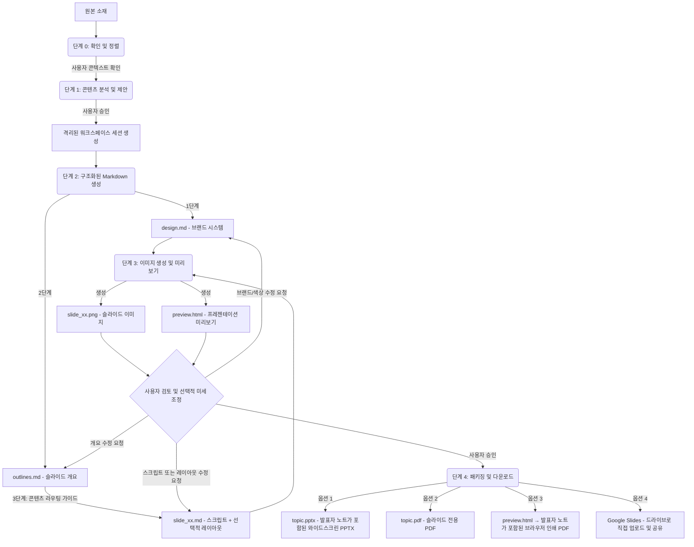

# Slide Gen Agent

[English](README.md) | [繁體中文 (zh-TW)](README.zh-TW.md) | [简体中文 (zh-CN)](README.zh-CN.md) | [日本語 (ja)](README.ja.md) | [한국어 (ko)](README.ko.md)

`slide-gen-agent`는 대화형 슬라이드 덱 생성기입니다. 에이전트와 채팅을 나누는 것만으로 기사, 보고서, 개요, 가공되지 않은 메모 등 모든 원본 자료를 완성도 높고 시각적으로 세련된 프레젠테이션으로 바꿀 수 있습니다. 원하는 방향을 설명하고, 출력을 검토하고, 슬라이드가 완성될 때까지 자연스러운 대화로 다듬어 나가세요.

**주요 기능:**
- **대화형 및 반복적 조정** — 세션 도중 슬라이드 내용 수정, 색상 변경, 또는 전체 개요의 재구성을 에이전트에게 지시할 수 있습니다. 슬라이드 전체를 다시 생성하지 않고 필요한 부분만 정밀하게 적용됩니다.
- **발표자 스크립트 포함** — 모든 슬라이드에는 실제 발표자가 말하는 듯한 자연스러운 1~2분 분량의 발표자 스크립트가 제공됩니다. 스크립트는 PPTX의 슬라이드 노트 영역에 삽입되고 미리보기 페이지에도 포함되므로 무대에 서기 전에 완벽히 대비할 수 있습니다.
- **다국어 지원** — 한국어, 중국어, 일본어(CJK) 및 동남아시아 문자 등 모든 언어의 콘텐츠와 발표자 노트를 지원합니다. 서버 쪽의 폰트에 의존하지 않고 브라우저 인쇄를 통해 PDF로 내보내어 로컬 시스템 폰트를 그대로 유지할 수 있습니다.
- **운영 준비 완료된 내보내기 옵션** — PPTX(발표자 노트 포함), 슬라이드 PDF, 브라우저로 인쇄한 발표자 노트 PDF로 다운로드하거나, **Google Slides**로 직접 전송하여 브라우저에서 즉시 편집 및 공유할 수 있습니다.

이 저장소는 가벼운 프롬프트 기반의 스킬부터 기업용 프로덕션 에이전트까지 점진적으로 구축할 수 있는 세 가지 배포 및 사용 방법을 제공합니다.

---

## 📖 핵심 디자인 철학 및 로직

기존의 AI 슬라이드 생성기는 레이아웃과 비주얼을 단일 블랙박스 단계로 생성하기 때문에 디자인이 일관되지 않고 서식이 무작위로 적용되며, 전체 덱을 다시 생성하지 않고는 개별 슬라이드를 미세 조정할 방법이 없었습니다.

`slide-gen-agent`는 일반 텍스트 중간 파일을 중추로 삼는 **분리된 5단계 파이프라인**을 사용합니다. 모든 디자인 결정이 편집 가능한 Markdown 파일에 저장되므로 채팅을 통해 어떤 레이어(전체 스타일, 슬라이드 구성, 슬라이드별 콘텐츠)든 수정할 수 있으며, 영향을 받는 슬라이드만 다시 생성됩니다.



### 5단계 파이프라인

0. **단계 0: 확인 및 정렬 (Clarification & Alignment)**
   - 원본 소재를 처리하기 전에 에이전트는 세 가지 핵심 콘텍스트 요소를 확인합니다. **예상 발표 시간**(또는 슬라이드 장수), **타겟 독자**, 그리고 **예상 목표/결과**입니다.
   - *에이전트는 일시 중지하고 사용자를 기다립니다.* 최초 요청에 이러한 내용이 누락된 경우 진행하기 전에 질문합니다.

1. **단계 1: 콘텐츠 분석 및 제안 (Content Analysis & Proposal)**
   - 에이전트는 원본 소재(문서, 녹취록, 메모)를 읽어 도메인, 어조, 타겟 독자를 이해합니다.
   - **슬라이드 장수**, **디자인 테마**, **16진수 색상 코드 팔레트**를 제안합니다.
   - *에이전트는 일시 중지하고 사용자를 기다립니다.* 제안을 수락하거나 테마/팔레트를 수정할 수 있습니다.

2. **단계 2: 구조화된 Markdown 생성 (Structured Markdown Generation)**
   - 승인되면 에이전트는 격리된 세션 폴더에 세 가지 유형의 Markdown 파일을 생성합니다.
     - **`design.md`**: 브랜드 시스템 — 16진수 색상 팔레트, 타이포그래피, 간격 및 비주얼 스타일 규칙입니다. 모든 슬라이드에서 일관된 브랜딩을 유지하기 위한 유일한 단일 소스(SSoT)입니다.
     - **`outlines.md`**: 레이아웃 유형 및 슬라이드별 2~3문장 요약이 포함된 전체 슬라이드 목록입니다.
     - **`slide_xx.md`**: 슬라이드별 파일로 제목, 발표자 스크립트(260~300단어) 및 선택적 `## Layout` 섹션(첫 번째 패스에서는 빈칸으로 둠 — 이미지 모델이 슬라이드 유형과 스크립트로부터 적절한 레이아웃을 추론함)이 포함됩니다.
   - *파이프라인은 멈추지 않고 단계 3으로 바로 넘어갑니다.*

3. **단계 3: 이미지 생성 및 미리보기 (Image Generation & Preview)**
   - 에이전트는 `design.md`(브랜드)와 `slide_xx.md`(슬라이드 사양)를 결합하여 슬라이드별 구조화된 프롬프트를 만듭니다.
   - 이를 이미지 생성 모델에 전송하여 최종 16:9 고해상도 PNG(`slide_xx.png`)를 생성합니다.
   - 모든 슬라이드 이미지와 발표자 노트가 리뷰하기 쉬운 `preview.html` 페이지로 컴파일됩니다.
   - *에이전트는 일시 중지하고 사용자의 리뷰를 기다립니다.*
   - **반복 수정 방법**: 수정하고 싶은 부분을 에이전트에게 자연스러운 언어로 전달하세요. 스크립트 수정은 `slide_xx.md`를 업데이트하고, 레이아웃 변경(예: "3번 슬라이드를 2단으로 만들고 차트를 오른쪽에 놓아줘")은 `## Layout` 섹션에 채워지며, 색상이나 브랜드 변경은 `design.md`를 업데이트합니다. 수정 사항의 영향을 받는 슬라이드만 다시 생성됩니다.

4. **단계 4: 프레젠테이션 패키징 및 다운로드 (Presentation Packaging & Download)**
   - 최종 슬라이드를 승인하면 에이전트가 네 가지 내보내기 옵션을 제공합니다.
     - **PPTX(발표자 노트가 포함된 PowerPoint)**: 각 슬라이드의 슬라이드 노트 영역에 발표자 스크립트가 포함된 와이드스크린 PowerPoint 파일입니다. 파일명은 프레젠테이션 주제를 사용합니다(예: `ai-trends-2025.pptx`).
     - **PDF: 슬라이드 전용**: 모든 슬라이드 이미지로 컴파일된 PDF(직접 발표하기에 적합). 파일명은 프레젠테이션 주제를 사용합니다(예: `ai-trends-2025.pdf`).
     - **PDF: 발표자 노트 포함**: `preview.html` 링크를 열고 **"PDF로 저장"** 버튼을 클릭합니다. 브라우저는 로컬 시스템 폰트를 활용하여 각 슬라이드와 해당 노트를 깔끔하게 분할된 PDF로 렌더링합니다. 서버 쪽 폰트에 의존하지 않으므로 한국어(CJK) 및 동남아시아 문자를 완벽하게 처리할 수 있습니다.
     - **Google Slides**: 에이전트가 PPTX를 Google 드라이브의 `slide-gen-agent` 폴더에 업로드하고 편집 권한으로 공유합니다. Google Slides에서 바로 열어 즉시 편집하고 공유할 수 있습니다. *(GCP에서 Google Drive API가 활성화되어 있어야 하며 서비스 계정에 드라이브 쓰기 권한이 필요합니다.)*

---

## 🛠️ 디렉터리 구조

```text
slide-gen-agent/
├── README.md                # 프로젝트 개요 및 설정 (본 파일)
├── skills/
│   └── slide-gen-agent/     # 🌟 표준 독립형 에이전트 스킬 (Antigravity/Codex용)
│       ├── SKILL.md         # 플레이북/가이드라인 (YAML 프런트매터 + 사용 설명)
│       ├── assets/          # 스킬이 사용하는 정적 템플릿
│       │   ├── design.md    # 브랜드 시스템 템플릿 (색상, 타이포그래피, 비주얼 스타일)
│       │   ├── outlines.md  # 덱 개요 템플릿
│       │   └── slide_xx.md  # 슬라이드별 템플릿 (제목, 선택적 레이아웃, 스크립트)
│       └── scripts/         # 스킬에 포함된 커스텀 도구
│           ├── pdf_exporter.py # 와이드스크린 프레젠테이션 PDF 컴파일러
│           ├── pptx_exporter.py # 발표자 노트가 포함된 와이드스크린 PPTX 컴파일러
│           └── preview_generator.py # HTML 미리보기 페이지 컴파일러 (PDF 저장 기능 포함)
└── adk_agent/               # 프로그래밍 방식의 호스트 에이전트 (Python ADK 2.0 구현)
    ├── requirements.txt     # Python 종속성 구성 (python-pptx 및 reportlab 포함)
    ├── agent.py             # 에이전트 메인 진입점
    └── tools/               # 에이전트 도구
        ├── __init__.py
        ├── file_manager.py  # 세션 초기화 및 파일 쓰기 도구
        ├── imagen.py        # Gemini 슬라이드 이미지 생성 도구
        ├── pdf_exporter.py  # Pillow 기반 와이드스크린 PDF 내보내기 도구
        ├── pptx_exporter.py # 발표자 노트가 포함된 PowerPoint 와이드스크린 (PPTX) 내보내기 도구
        ├── drive_exporter.py # Google 드라이브 업로드 → Google Slides 변환 및 공유 도구
        └── preview_generator.py # HTML 슬라이드 미리보기 및 노트 컴파일러 (PDF 저장 기능 포함)
```

---

## 🚀 설치 및 배포 방법

대상 환경에 맞는 설치 방법을 선택하세요.

### 🔹 방법 1: 범용 스킬 (`SKILL.md`) — 플랫폼 독립적
코드 호스팅이 필요 없는 순수 프롬프트/가이드라인 기반의 설치 방법입니다.
* **사용 사례**: 일반 LLM 시스템 (Antigravity, Codex 또는 이미지 생성 기능이 있는 표준 챗 에이전트).
* **설치 방법**:
  1. [SKILL.md](file:///Users/sylph/Documents/Antigravity/slide-gen-agent/skills/slide-gen-agent/SKILL.md)의 내용을 복사하여 LLM 에이전트의 맞춤 지침이나 시스템 프롬프트에 붙여넣습니다.
  2. `skills/slide-gen-agent/templates/` 디렉터리에 있는 Markdown 파일을 참고용 템플릿 예시로 지정합니다.

---

### 🔹 방법 2: ADK Web을 통한 로컬 검증 (테스트 권장)
시각적인 웹 UI가 제공되는 완전한 기능의 Python 에이전트를 로컬 컴퓨터에서 실행합니다. 표준 명령줄 인터페이스보다 테스트와 검증이 훨씬 수월합니다.

#### 1. 사전 요구사항
- **Python 3.10** (v3.11 권장)
- 컴퓨터에 **Google Cloud SDK (gcloud)** 가 설치 및 인증되어 있어야 합니다.
- **Vertex AI API**가 활성화된 **Google Cloud 프로젝트 (GCP)**가 필요합니다.
- 로컬 IAM 사용자 인증 정보가 구성되어 있어야 합니다 (`gcloud auth application-default login`).

#### 3. 프로젝트 설치
**루트** `slide-gen-agent` 디렉터리에서 가상 환경을 생성하고(배포 중에 임시 준비 영역에 등록되는 것을 방지하기 위해 가상 환경은 `adk_agent`가 아닌 루트 디렉터리에 생성해야 합니다), 가상 환경을 활성화한 후 종속성을 설치합니다.
```bash
# slide-gen-agent 루트 디렉터리로 이동:
python3 -m venv venv
source venv/bin/activate

# adk_agent 디렉터리로 이동하여 종속성 설치:
cd adk_agent
pip install "google-adk[gcp]" google-genai Pillow python-dotenv
```

#### 3. 환경 변수 설정
로컬에서 실행하기 전에 Google Cloud 프로젝트 ID를 환경 변수로 설정해야 합니다.
```bash
export GOOGLE_CLOUD_PROJECT="your-actual-gcp-project-id"
```
또는 `adk_agent` 폴더 내에 `.env` 파일을 생성하여 GCP 프로젝트 ID를 지정할 수도 있습니다 (위치 값은 기본적으로 `'global'`, 아티팩트 디렉터리는 `./artifacts`로 자동 설정됨).
```text
GOOGLE_CLOUD_PROJECT="your-actual-gcp-project-id"
```

#### 4. 웹 UI 모드로 실행
`adk_agent` 디렉터리에서 로컬 웹 인터페이스를 실행합니다 (`--allow_origins="*"` 플래그는 로컬 컴퓨터와 Google Cloud Shell 모두에서 원활하게 작동할 수 있도록 포함되었습니다).
```bash
# adk_agent 디렉터리에 있고 가상 환경이 활성화되어 있는지 확인하세요.
adk web --allow_origins="*" .
```
로컬 서버가 시작됩니다. 제공된 URL을 브라우저에 입력하여 에이전트와 시각적으로 상호작용하세요!

---

### 🔹 방법 3: Agent Engine (Gemini Enterprise) 프로덕션 배포
Python 에이전트를 Vertex AI의 Reasoning Engine (Agent Engine) 인스턴스로 배포하고 **Gemini Enterprise**에 직접 연결합니다.

#### 1. 설정 및 사전 요구사항
`requirements.txt`에 `a2a-sdk`가 포함되어 있는지 확인합니다(이 저장소는 이미 구성되어 있음). 이는 ADK 2.0 배포 도구가 Reasoning Engine 시작 시 `--a2a` 플래그를 하드코딩하기 때문에 컨테이너에 `a2a-sdk`가 설치되어 있지 않으면 `ModuleNotFoundError`로 중단되는 것을 방지하기 위해 반드시 필요합니다.

가상 환경을 구성하지 않았다면 `slide-gen-agent` 루트 디렉터리에서 다음 명령을 실행합니다.
```bash
python3 -m venv venv
source venv/bin/activate
cd adk_agent
pip install "google-adk[gcp]" google-genai Pillow python-dotenv
```

#### 2. 환경 변수 설정
배포하기 전에 Google Cloud 프로젝트 ID와 프로젝트 번호를 환경 변수로 지정해야 합니다.
```bash
export GOOGLE_CLOUD_PROJECT="your-actual-gcp-project-id"
export GOOGLE_CLOUD_PROJECT_NUMBER="your-actual-gcp-project-number"
```

#### 3. 한 줄 명령어로 배포
환경 변수가 설정되고 종속성이 설치되었으며 가상 환경이 활성화된 상태에서 `adk_agent` 디렉터리에서 ADK 배포를 실행합니다.
```bash
adk deploy agent_engine \
  --project=$GOOGLE_CLOUD_PROJECT \
  --region=us-central1 \
  --display_name="slide-gen-agent" \
  --artifact_service_uri="gs://your-runtime-bucket" \
  .
```
*백그라운드에서 ADK CLI가 컨테이너화, 배포 준비 및 Reasoning Engine 등록을 처리합니다. 완료되면 **Reasoning Engine 리소스 ID**(예: `projects/${GOOGLE_CLOUD_PROJECT_NUMBER}/locations/us-central1/reasoningEngines/{ENGINE_ID}`)가 출력됩니다.*

#### 4. IAM 권한 구성

##### A. 빌드 및 배포 권한 (최초 1회 설정)
배포 명령이 "Build failed" 에러로 실패하는 경우 프로젝트의 기본 compute 서비스 계정 (`${GOOGLE_CLOUD_PROJECT_NUMBER}-compute@developer.gserviceaccount.com`)에 빌드 로그 쓰기 또는 빌드된 이미지 푸시 권한이 없는 것일 수 있습니다.
**IAM 및 관리자 > IAM**에서 해당 서비스 계정에 다음 역할을 부여하세요.
- **로그 작성자 (Logs Writer)** (`roles/logging.logWriter`)
- **Artifact Registry 작성자 (Artifact Registry Writer)** (`roles/artifactregistry.writer`)

##### B. 런타임 권한 (필수)
배포된 Agent Engine (Reasoning Engine) 인스턴스와 플랫폼 오케스트레이터가 Vertex AI 모델을 호출하고 GCS 버킷에 읽기/쓰기를 하려면 다음 권한이 필요합니다.

1. **Google Cloud 콘솔**을 엽니다.
2. **IAM 및 관리자 > IAM**으로 이동합니다.
3. **에이전트의 런타임 서비스 계정에 권한 부여**:
   - 프로젝트의 런타임 ID(일반적으로 **Compute Engine 기본 서비스 계정**: `${GOOGLE_CLOUD_PROJECT_NUMBER}-compute@developer.gserviceaccount.com`)를 찾습니다.
   - 다음 역할을 부여합니다.
     - **Vertex AI 사용자 (Agent Platform User)** (`roles/aiplatform.user`) (Vertex AI 모델 호출 및 Gemini 이미지 생성에 필수)
     - **스토리지 객체 사용자 (Storage Object User)** (`roles/storage.objectUser`) (슬라이드, 미리보기 및 PDF 파일을 GCS 버킷에 읽고 쓰기 위해 필수)

4. **Vertex AI 서비스 에이전트에 권한 부여**:
   - **[권한 부여]**를 클릭하여 새로운 주체를 추가합니다.
   - Vertex AI Reasoning Engine 서비스 에이전트 주소를 입력합니다:
     `service-${GOOGLE_CLOUD_PROJECT_NUMBER}@gcp-sa-aiplatform-re.iam.gserviceaccount.com`
   - 다음 역할을 부여합니다.
     - **스토리지 객체 사용자 (Storage Object User)** (`roles/storage.objectUser`) (플랫폼이 에이전트를 대신하여 GCS로 아티팩트를 동기화하고 저장할 때 필요)
*별도의 API 키나 비밀번호 파일을 관리할 필요가 없으며, 호스팅된 추론 엔진이 안전한 IAM/ADC 사용자 인증 정보를 자동으로 활용합니다.*

#### 5. Gemini Enterprise 콘솔 연결
기업 내 사용자에게 에이전트를 제공하려면 다음을 수행합니다.
1. **Gemini Enterprise 관리 콘솔**에 로그인합니다.
2. 왼쪽 사이드바에서 **에이전트(Agents)** 페이지로 이동합니다.
3. **[+ 에이전트 추가]**를 클릭합니다.
4. **[Agent Engine을 통한 커스텀 에이전트]**를 선택하고 **[Agent Engine Reasoning Engine]** 입력란에 앞서 배포 시 획득한 **Reasoning Engine 리소스 ID**를 입력합니다.
5. Gemini Enterprise와 Reasoning Engine 에이전트 간의 안전한 연결을 보장하기 위해 IAM 인증을 구성합니다.

#### 6. (선택사항) Google Slides 내보내기 활성화

이 작업을 수행하면 "Google Slides에서 열기" 내보내기 옵션이 활성화되어 생성된 프레젠테이션을 사용자의 Google 드라이브에 직접 Google Slides 파일로 업로드할 수 있습니다.

**단계 1 — Google Drive API 활성화**

사용 중인 GCP 프로젝트에서 [Google Drive API](https://console.cloud.google.com/apis/library/drive.googleapis.com)를 활성화합니다.

**단계 2 — 도메인 전체 위임 구성**

1. [Google Workspace 관리 콘솔](https://admin.google.com)에서 **보안 → API 제어 → 도메인 전체 위임**으로 이동합니다.
2. **[새로 추가]**를 클릭하고 다음을 입력합니다.
   - **클라이언트 ID**: Agent Engine 서비스 계정의 클라이언트 ID ([IAM 서비스 계정 페이지](https://console.cloud.google.com/iam-admin/serviceaccounts) → 계정 선택 → **상세 정보** 탭에서 확인)
   - **OAuth 범위**: `https://www.googleapis.com/auth/drive.file`
3. **[승인]**을 클릭합니다.

**단계 3 — Secret Manager에 서비스 계정 키 저장**

```bash
# Agent Engine 서비스 계정의 JSON 키 생성 및 다운로드
gcloud iam service-accounts keys create /tmp/drive-sa-key.json \
  --iam-account=${GOOGLE_CLOUD_PROJECT_NUMBER}-compute@developer.gserviceaccount.com

# Secret Manager에 키 저장
gcloud secrets create drive-sa-key \
  --data-file=/tmp/drive-sa-key.json \
  --project=$GOOGLE_CLOUD_PROJECT

# 로컬 복사본 제거
rm /tmp/drive-sa-key.json
```

**단계 4 — 배포 시 키 주입**

배포 시 `DRIVE_SERVICE_ACCOUNT_KEY` 환경 변수로 비밀 키를 전달합니다.

```bash
adk deploy agent_engine \
  --project=$GOOGLE_CLOUD_PROJECT \
  --region=us-central1 \
  --display_name="slide-gen-agent" \
  --artifact_service_uri="gs://your-runtime-bucket" \
  --env_vars="DRIVE_SERVICE_ACCOUNT_KEY=$(gcloud secrets versions access latest --secret=drive-sa-key --project=$GOOGLE_CLOUD_PROJECT)" \
  .
```

구성 완료되면 에이전트는 각 사용자의 **내 드라이브**에 `slide-gen-agent` 폴더를 생성하고 생성된 프레젠테이션을 사용자가 직접 소유하는 Google Slides 파일 형식으로 그 안에 저장합니다.
