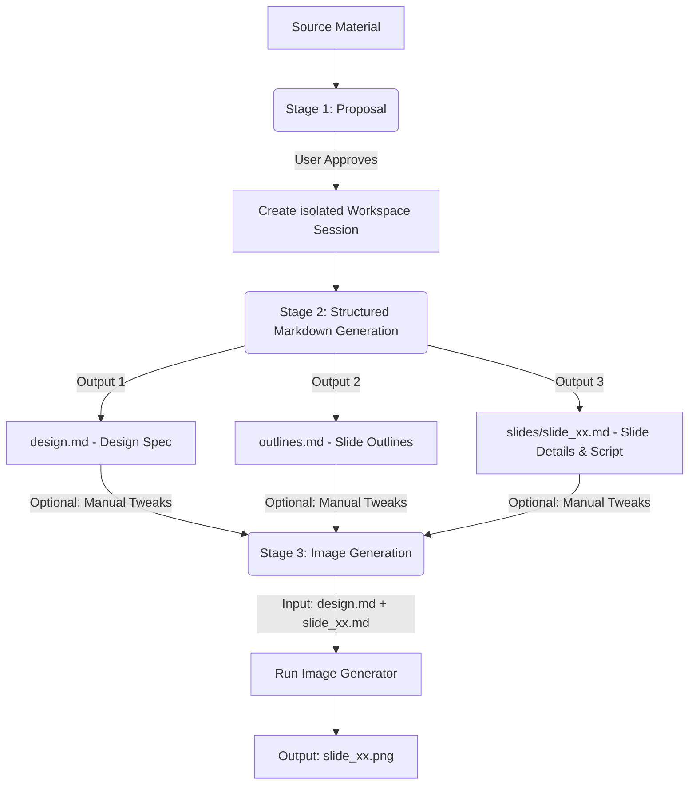

# Slide Gen Agent

`slide-gen-agent` is a slide deck generation solution that automates the entire pipeline of transforming raw content (articles, outlines, reports) into visually polished, high-quality presentation slide decks.

This repository is structured to support three progressive deployment and usage methods, ranging from lightweight prompt-based skills to production-grade enterprise agents.

---

## 📖 Core Design Philosophy & Logic

Traditional AI slide generators try to create layouts and slide visual files in a single black-box step, which often results in inconsistent designs, random formatting, and an inability to tweak specific parts without regenerating the entire deck.

Our agent uses a **decoupled, three-stage pipeline** with plain-text intermediate outputs. This guarantees that you can easily jump in, modify any design choice or script manually, and get consistent, updated results without having to regenerate the entire deck from scratch.



### The Three-Stage Pipeline

1. **Stage 1: Content Analysis & Proposal**
   - The agent reads your source material (documents, transcripts, raw notes) to understand the domain, tone, and target audience.
   - It proposes a **slide count**, **design theme**, and **hex-code color palette**.
   - *The agent pauses and waits for you.* You can accept the proposal or adjust the theme/color palette.

2. **Stage 2: Structured Markdown Generation**
   - Once approved, the agent generates visual specifications and slide-by-slide details as clean Markdown files in an isolated session folder:
     - **`design.md`**: The global design system (hex codes, fonts, layout classes). This acts as the **Single Source of Truth (SSoT)**.
     - **`outlines.md`**: Complete slide list with visual layout type and short summary.
     - **`slides/slide_xx.md`**: Individual slide metadata, title content, and a detailed presenter script (150–300 words).
   - **Why it's stable**: You can fix typos in a script or title directly in `slide_xx.md` without touching other slides or risking visual template layout corruption.

3. **Stage 3: Image Generation**
   - The agent merges `design.md` and `slide_xx.md` into a structured XML prompt.
   - It sends this prompt to the image generation model to generate the final 16:9 high-fidelity slide PNG (`slide_xx.png`).
   - **Why it's easy to modify**: Want a new brand color? Edit `design.md` once and regenerate. Need to fix Slide 5? Edit `slides/slide_05.md` and regenerate just that slide.

---

## 🛠️ Directory Structure

```text
slide-gen-agent/
├── README.md                # Project overview and setup (this file)
├── skills/
│   └── slide-gen-agent/     # 🌟 Standard self-contained Agent Skill (for Antigravity/Codex)
│       ├── SKILL.md         # Playbook/guidelines (YAML frontmatter + instructions)
│       ├── assets/          # Static templates used by the skill
│       │   ├── design.md    # Design system template
│       │   ├── outlines.md  # Deck outline template
│       │   └── slide_xx.md  # Individual slide content template
│       └── scripts/         # Custom tools bundled with the skill
│           └── pdfExporter.ts # Widescreen presentation PDF compiler (only custom tool needed)
└── adk_agent/               # Programmatic Host Agent (Python ADK 2.0 implementation)
    ├── requirements.txt     # Python dependency configuration
    ├── agent.py             # Main agent entry point
    └── tools/               # Agent tools
        ├── __init__.py
        ├── file_manager.py  # Session initialization and file writer tools
        ├── imagen.py        # Imagen 3 slide image generator tool
        ├── pdf_exporter.py  # Pillow-based widescreen PDF exporter
        └── preview_generator.py # HTML slide preview and notes compiler
```

---

## 🚀 Installation & Deployment Methods

Select the installation method that fits your target environment:

### 🔹 Method 1: Universal Skill (`SKILL.md`) — Platform-Agnostic
This is a pure prompt/guideline-based installation, requiring no code hosting.
* **Use Case**: General LLM systems (like Antigravity, Codex, or standard chat assistants with image-generation abilities).
* **How to Install**:
  1. Import or copy the contents of [SKILL.md](file:///Users/sylph/Documents/Antigravity/slide-gen-agent/skills/slide-gen-agent/SKILL.md) into your LLM assistant's custom system instructions or system prompts.
  2. Reference the Markdown files in the `skills/slide-gen-agent/templates/` directory as examples for the assistant to follow.

---

### 🔹 Method 2: Local Verification via ADK Web (Recommended for Testing)
Run the fully functional Python agent locally on your computer with a visual Web UI. This is much easier to test and verify than standard command-line interfaces.

#### 1. Prerequisites
- **Python 3.10** (v3.11 recommended)
- **Google Cloud SDK (gcloud)** installed and authenticated on your machine.
- A **Google Cloud Project (GCP)** with the **Vertex AI API** enabled.
- Local IAM credentials configured (`gcloud auth application-default login`).

#### 2. Project Installation
Navigate to the `adk_agent` folder, create a virtual environment, and install dependencies:
```bash
cd adk_agent
python3 -m venv venv
source venv/bin/activate
# Standard installation of google-adk with GCP support and all required libraries
pip install "google-adk[gcp]" google-genai Pillow python-dotenv
```

#### 3. Configure Environment Variables
Before running locally, you must set your Google Cloud Project ID as an environment variable:
```bash
export GOOGLE_CLOUD_PROJECT="your-actual-gcp-project-id"
```
Alternatively, you can create a `.env` file inside the `adk_agent` folder to specify your GCP project ID (other configs like location default to `'global'` and artifacts directory default to `./artifacts` automatically):
```text
GOOGLE_CLOUD_PROJECT="your-actual-gcp-project-id"
```

#### 4. Run in Web UI Mode
Launch the local web interface (the `--allow_origins="*"` flag is included to ensure it works seamlessly both on local machines and inside Google Cloud Shell):
```bash
source venv/bin/activate
adk web --allow_origins="*" .
```
This will spin up a local server. Open the provided URL in your browser to interact with the Agent visually!

---

### 🔹 Method 3: Production Deployment to Agent Engine (Gemini Enterprise)
Deploy the Python agent as a Reasoning Engine (Agent Engine) instance on Vertex AI and hook it directly into **Gemini Enterprise**.

#### 1. One-Command Deployment
From the `adk_agent/` directory, activate the virtual environment and run the ADK deployer:
```bash
cd adk_agent
source venv/bin/activate
adk deploy agent_engine \
  --project=$GOOGLE_CLOUD_PROJECT \
  --region=us-central1 \
  --display_name="slide-gen-agent" \
  --artifact_service_uri="gs://your-runtime-bucket" \
  .
```
*Behind the scenes, the ADK CLI handles containerization, deployment staging, and Reasoning Engine registration. When the command completes, it will output your **Reasoning Engine Resource ID** (e.g., `projects/{PROJECT_NUMBER}/locations/us-central1/reasoningEngines/{ENGINE_ID}`).*

#### 2. Configure IAM Permissions

##### A. Build & Deploy Permissions (One-Time Setup)
If the deployment command fails with a "Build failed" error, your project's default compute service account (`{PROJECT_NUMBER}-compute@developer.gserviceaccount.com`) might lack permission to write build logs or push built images.
Grant these roles to the service account in **IAM & Admin > IAM**:
- **Logs Writer** (`roles/logging.logWriter`)
- **Artifact Registry Writer** (`roles/artifactregistry.writer`)

##### B. Runtime Permissions (Required)
The deployed Agent Engine (Reasoning Engine) instance uses your project's service account (typically the Compute Engine default service account) to call Vertex AI models and read/write to the GCS bucket:
1. Open the **Google Cloud Console**.
2. Go to **IAM & Admin > IAM**.
3. Locate the service account used by the agent (by default, the **Compute Engine default service account**: `{PROJECT_NUMBER}-compute@developer.gserviceaccount.com`).
4. Grant that Service Account the following roles:
   - **Agent Platform User** (`roles/aiplatform.user`) (required for calling Vertex AI models and Imagen 3)
   - **Storage Object Admin** (`roles/storage.objectAdmin`) (required to save slides, previews, and PDF files to your GCS bucket).
*No raw API keys or secret files need to be managed; the hosted reasoning engine utilizes secure IAM/ADC credentials automatically.*

#### 3. Connect to Gemini Enterprise Console
To make the agent available to your Enterprise users:
1. Log in to the **Gemini Enterprise Admin Console**.
2. Go to **Extensions** or **Agent Management**.
3. Register a new **Custom Extension** or **Agent Link** using your **Reasoning Engine Resource ID** (obtained from the deployment step above).
4. Configure IAM authentication permissions to secure the connection between Gemini Enterprise and your Reasoning Engine agent.
