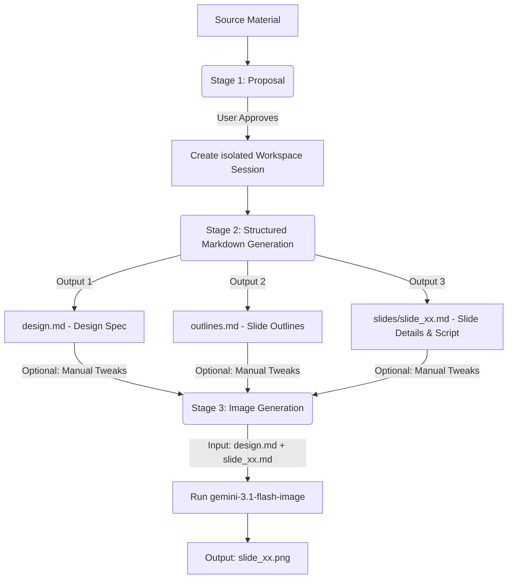

# Slide Gen Agent

`slide-gen-agent` is a slide deck generation solution that automates the entire pipeline of transforming raw content (articles, outlines, reports) into visually polished, high-quality presentation slide decks.

This repository is structured to support three progressive deployment and usage methods, ranging from lightweight prompt-based skills to production-grade enterprise agents.

---

## 📖 Core Design Philosophy & Logic

Traditional AI slide generators try to create layouts and slide visual files in a single black-box step, which often results in inconsistent designs, random formatting, and an inability to tweak specific parts without regenerating the entire deck.

Our agent uses a **decoupled, three-stage pipeline** with plain-text intermediate outputs. This guarantees that you can easily jump in, modify any design choice or script manually, and get consistent, updated results without having to regenerate the entire deck from scratch.



### The Three-Stage Pipeline

1. **Stage 1: Content Analysis & Proposal**
   - The agent reads your source material (documents, transcripts, raw notes) to understand the domain, tone, and target audience.
   - It proposes a **slide count**, **design theme**, and **hex-code color palette**.
   - *The agent pauses and waits for you.* You can accept the proposal or adjust the theme/color palette.

2. **Stage 2: Structured Markdown Generation**
   - Once approved, the agent generates visual specifications and slide-by-slide details as clean Markdown files in an isolated session folder:
     - **`design.md`**: The global design system (hex codes, fonts, layout classes). This acts as the **Single Source of Truth (SSoT)**.
     - **`outlines.md`**: Complete slide list with visual layout type and short summary.
     - **`slides/slide_xx.md`**: Individual slide metadata, title content, and a detailed presenter script (150–300 words).
   - **Why it's stable**: You can fix typos in a script or title directly in `slide_xx.md` without touching other slides or risking visual template layout corruption.

3. **Stage 3: Image Generation**
   - The agent merges `design.md` and `slide_xx.md` into a structured XML prompt.
   - It sends this prompt to `gemini-3.1-flash-image` via Vertex AI to generate the final 16:9 high-fidelity slide PNG (`slide_xx.png`).
   - **Why it's easy to modify**: Want a new brand color? Edit `design.md` once and regenerate. Need to fix Slide 5? Edit `slides/slide_05.md` and regenerate just that slide.

---

## 🛠️ Directory Structure

```text
slide-gen-agent/
├── SKILL.md                 # Universal skill guidelines and visual prompts
├── README.md                # Project overview and setup (this file)
├── templates/               # Markdown templates used for structured generation
│   ├── design.md            # Design system template
│   ├── outlines.md          # Deck outline template
│   └── slide_xx.md          # Individual slide content template
└── adk-agent/               # Programmatic ADK Agent (TypeScript)
    ├── package.json         # Dependencies and build scripts
    ├── tsconfig.json        # TypeScript configuration
    ├── src/
    │   ├── agent.ts         # Main agent logic & system instructions
    │   ├── config.ts        # GCP project, region, and model configurations
    │   ├── tools/
    │   │   ├── fileManager.ts  # Local session workspace and markdown tools
    │   │   └── imagen.ts       # Imagen 3 Vertex AI calling tool
    │   └── utils/
    │       └── vertex.ts    # Vertex AI SDK integration layer
    └── dist/                # Compiled JavaScript outputs
```

---

## 🚀 Installation & Deployment Methods

Select the installation method that fits your target environment:

### 🔹 Method 1: Universal Skill (`SKILL.md`) — Platform-Agnostic
This is a pure prompt/guideline-based installation, requiring no code hosting.
* **Use Case**: General LLM systems (like Antigravity, Codex, or standard chat assistants with image-generation abilities).
* **How to Install**:
  1. Import or copy the contents of [SKILL.md](file:///Users/sylph/Documents/Antigravity/slide-gen-agent/SKILL.md) into your LLM assistant's custom system instructions or system prompts.
  2. Reference the Markdown files in the `templates/` directory as examples for the assistant to follow.

---

### 🔹 Method 2: Local Verification via ADK Web (Recommended for Testing)
Run the fully functional TypeScript agent locally on your computer with a visual Web UI. This is much easier to test and verify than standard command-line interfaces.

#### 1. Prerequisites
- **Node.js** (v18.0.0 or higher recommended)
- **Google Cloud SDK (gcloud)** installed and authenticated on your machine.
- A **Google Cloud Project (GCP)** with the **Vertex AI API** enabled.
- Local IAM credentials configured (`gcloud auth application-default login`).

#### 2. Project Installation
Navigate to the `adk-agent` folder and install Node dependencies:
```bash
cd adk-agent
npm install
```

#### 3. Configure Environment Variables
Before running locally, you must set environment variables to direct ADK to utilize your GCP Vertex AI resources:
```bash
# 1. Force the ADK SDK to use Vertex AI mode
export GOOGLE_GENAI_USE_VERTEXAI=true

# 2. Set your GCP Project ID
export GOOGLE_CLOUD_PROJECT="your-actual-gcp-project-id"

# 3. Set your Vertex AI deployment region
export GCP_LOCATION="us-central1"
```
*(Alternatively, you can modify the default values inside [adk-agent/src/config.ts](file:///Users/sylph/Documents/Antigravity/slide-gen-agent/adk-agent/src/config.ts)).*

#### 4. Build and Run in Web UI Mode
Compile the TypeScript project and launch the local web interface:
```bash
# Build the agent
npm run build

# Start the agent in local Web UI mode
npx adk run src/agent.ts --web
```
*Note: If `--web` is not supported by your version of the devtools, you can also try:*
```bash
npx adk run src/agent.ts --ui
```
This will spin up a local server. Open the provided URL (usually `http://localhost:8080`) in your browser to interact with the Agent visually!

---

### 🔹 Method 3: Production Deployment to Gemini Enterprise
Deploy the TypeScript agent as a fully managed, production-ready API on Google Cloud Run and hook it directly into **Gemini Enterprise**.

#### 1. One-Command Deployment
From the `adk-agent/` directory, run the ADK deployer. It will automatically containerize the project, push the image to Artifact Registry, and provision the Cloud Run service:
```bash
cd adk-agent
npx adk deploy cloud_run --project=$GOOGLE_CLOUD_PROJECT --region=$GCP_LOCATION
```
*Behind the scenes, the ADK CLI handles containerization and deployment seamlessly. When the command completes, it will output your **Cloud Run Service URL**.*

#### 2. Configure IAM Permissions
Because the agent uses Vertex AI (Imagen 3) to generate slide images, you must ensure the Cloud Run service has the correct permissions:
1. Open the **Google Cloud Console**.
2. Go to **Cloud Run** and select your newly deployed service.
3. Identify the **Service Account** assigned to the service (typically the default compute service account or a custom one).
4. Go to **IAM & Admin > IAM** and grant that Service Account the **Vertex AI User** role.
*No raw API keys or secret files need to be managed; Cloud Run uses secure ADC (Application Default Credentials) automatically.*

#### 3. Connect to Gemini Enterprise Console
To make the agent available to your Enterprise users:
1. Log in to the **Gemini Enterprise Admin Console**.
2. Go to **Extensions** or **Agent Management**.
3. Register a new **Custom Extension** or **Agent Link** using your **Cloud Run Service URL**.
4. Configure Google OIDC / IAM authentication to secure the connection between Gemini Enterprise and your Cloud Run agent.
