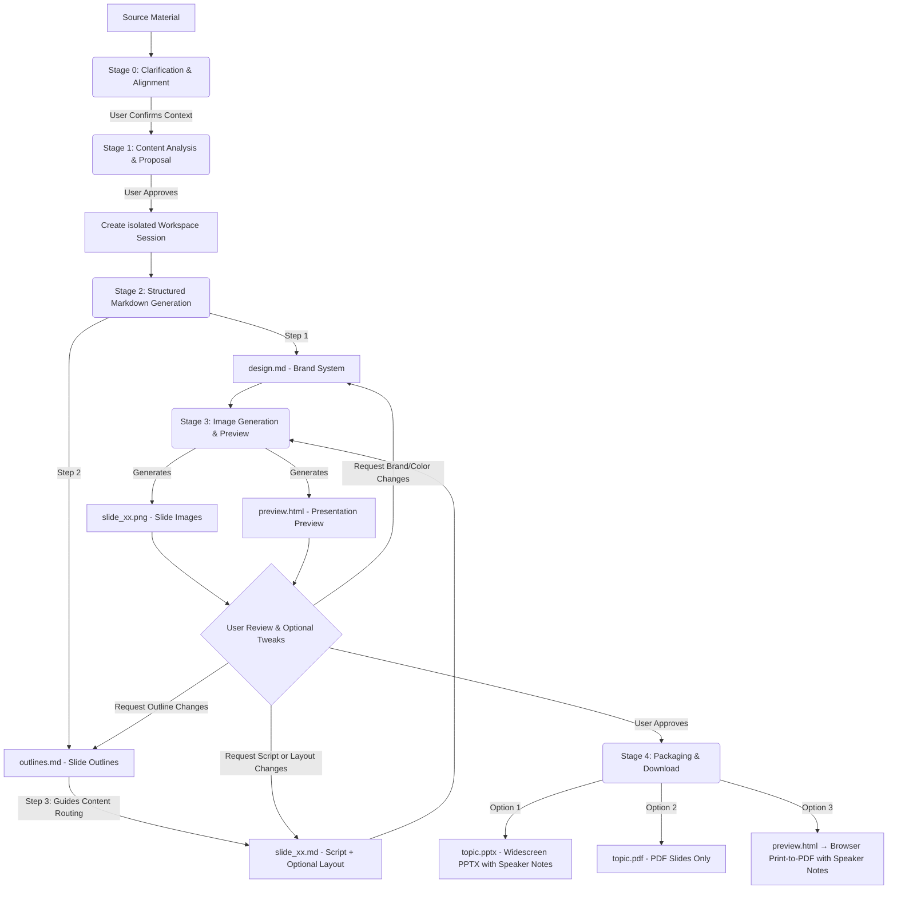

# Slide Gen Agent

`slide-gen-agent` is a conversational slide deck generator — just chat with the agent to turn any source material (articles, reports, outlines, raw notes) into a complete, visually polished presentation. Describe what you want, review the output, and refine it through natural conversation until the deck is exactly right.

**Key capabilities:**
- **Conversational & iterative** — tell the agent to adjust a slide's content, swap a color, or restructure the entire outline mid-session. Changes are applied surgically without regenerating the whole deck.
- **Speaker scripts included** — every slide comes with a full 1–2 minute spoken script, written as natural presenter delivery. Scripts are embedded in the PPTX notes section and included in the preview page, so you walk into the room prepared.
- **Multilingual** — handles content and speaker notes in any language, including CJK (Chinese, Japanese, Korean) and Southeast Asian scripts. Export to PDF via browser print to preserve system fonts without server-side font dependencies.
- **Production-ready exports** — download as PPTX (with embedded speaker notes), PDF slides, or a browser-printed speaker-notes PDF.

This repository is structured to support three progressive deployment and usage methods, ranging from lightweight prompt-based skills to production-grade enterprise agents.

---

## 📖 Core Design Philosophy & Logic

Traditional AI slide generators create layouts and visuals in a single black-box step, which often results in inconsistent designs, random formatting, and no way to tweak individual slides without regenerating the entire deck.

`slide-gen-agent` uses a **decoupled, five-stage pipeline** with plain-text intermediate files as the backbone. Every design decision lives in an editable Markdown file — so you can refine any layer (global style, slide structure, or per-slide content) through chat, and only the affected slides get regenerated.



### The Five-Stage Pipeline

0. **Stage 0: Clarification & Alignment**
   - Before touching the source material, the agent confirms three core context elements: **expected presentation duration** (or slide count), **target audience**, and **expected goal/outcome**.
   - *The agent pauses and waits for you.* If any of these are missing from your initial request, it will ask before proceeding.

1. **Stage 1: Content Analysis & Proposal**
   - The agent reads your source material (documents, transcripts, raw notes) to understand the domain, tone, and target audience.
   - It proposes a **slide count**, **design theme**, and **hex-code color palette**.
   - *The agent pauses and waits for you.* You can accept the proposal or adjust the theme/color palette.

2. **Stage 2: Structured Markdown Generation**
   - Once approved, the agent generates three types of Markdown files in an isolated session folder:
     - **`design.md`**: The brand system — hex color palette, typography, spacing, and visual style rules. This is the SSoT for brand consistency across all slides.
     - **`outlines.md`**: Complete slide list with layout type and 2–3 sentence summary per slide.
     - **`slide_xx.md`**: Per-slide file with title, speaker script (260–300 words), and an optional `## Layout` section (left empty on first pass — the image model infers a suitable composition from the slide type and script).
   - *The pipeline flows directly into Stage 3 without pausing.*

3. **Stage 3: Image Generation & Preview**
   - The agent combines `design.md` (brand) and `slide_xx.md` (per-slide spec) into a structured prompt for each slide.
   - It sends this to the image generation model to produce the final 16:9 high-fidelity PNG (`slide_xx.png`).
   - All slide images and speaker notes are compiled into a `preview.html` page for easy review.
   - *The agent pauses and waits for your review.*
   - **How to Iterate**: Tell the agent what to change in plain language. Script edits update `slide_xx.md`; layout changes (e.g., "make slide 3 two-column, chart on the right") populate the `## Layout` section; color or brand changes update `design.md`. Only the affected slides are regenerated.

4. **Stage 4: Presentation Packaging & Download**
   - Once you approve the final slides, the agent offers four export options:
     - **PPTX (PowerPoint with Speaker Notes)**: A widescreen PowerPoint file featuring slide images, with speaker notes fully embedded in the PowerPoint notes section of each slide. Filename uses the presentation topic (e.g. `ai-trends-2025.pptx`).
     - **PDF: Slides**: A PDF compiled from all slide images (perfect for presenting directly). Filename uses the presentation topic (e.g. `ai-trends-2025.pdf`).
     - **PDF: Speaker Notes**: Open the `preview.html` link and click the **"Save as PDF"** button. The browser renders each slide and its notes as a clean, paginated PDF using your local system fonts — this correctly handles all languages including CJK and Southeast Asian scripts without any server-side font dependencies.
     - **Google Slides**: The agent uploads the PPTX to Google Drive as a Google Slides file in the `slide-gen-agent` folder and shares it with you as editor. Opens directly in Google Slides for immediate editing and sharing. *(Requires Google Drive API enabled in GCP and Drive write access on the service account.)*

---

## 🛠️ Directory Structure

```text
slide-gen-agent/
├── README.md                # Project overview and setup (this file)
├── skills/
│   └── slide-gen-agent/     # 🌟 Standard self-contained Agent Skill (for Antigravity/Codex)
│       ├── SKILL.md         # Playbook/guidelines (YAML frontmatter + instructions)
│       ├── assets/          # Static templates used by the skill
│       │   ├── design.md    # Brand system template (colors, typography, visual style)
│       │   ├── outlines.md  # Deck outline template
│       │   └── slide_xx.md  # Per-slide template (title, optional layout, script)
│       └── scripts/         # Custom tools bundled with the skill
│           ├── pdf_exporter.py # Widescreen presentation PDF compiler
│           ├── pptx_exporter.py # Widescreen PPTX compiler with speaker notes
│           └── preview_generator.py # HTML preview page compiler (includes Save as PDF)
└── adk_agent/               # Programmatic Host Agent (Python ADK 2.0 implementation)
    ├── requirements.txt     # Python dependency configuration (includes python-pptx & reportlab)
    ├── agent.py             # Main agent entry point
    └── tools/               # Agent tools
        ├── __init__.py
        ├── file_manager.py  # Session initialization and file writer tools
        ├── imagen.py        # Gemini slide image generator tool
        ├── pdf_exporter.py  # Pillow-based widescreen PDF exporter
        ├── pptx_exporter.py # PowerPoint widescreen (PPTX) with speaker notes exporter
        └── preview_generator.py # HTML slide preview and notes compiler (includes Save as PDF)
```

---

## 🚀 Installation & Deployment Methods

Select the installation method that fits your target environment:

### 🔹 Method 1: Universal Skill (`SKILL.md`) — Platform-Agnostic
This is a pure prompt/guideline-based installation, requiring no code hosting.
* **Use Case**: General LLM systems (like Antigravity, Codex, or standard chat assistants with image-generation abilities).
* **How to Install**:
  1. Import or copy the contents of [SKILL.md](file:///Users/sylph/Documents/Antigravity/slide-gen-agent/skills/slide-gen-agent/SKILL.md) into your LLM assistant's custom system instructions or system prompts.
  2. Reference the Markdown files in the `skills/slide-gen-agent/templates/` directory as examples for the assistant to follow.

---

### 🔹 Method 2: Local Verification via ADK Web (Recommended for Testing)
Run the fully functional Python agent locally on your computer with a visual Web UI. This is much easier to test and verify than standard command-line interfaces.

#### 1. Prerequisites
- **Python 3.10** (v3.11 recommended)
- **Google Cloud SDK (gcloud)** installed and authenticated on your machine.
- A **Google Cloud Project (GCP)** with the **Vertex AI API** enabled.
- Local IAM credentials configured (`gcloud auth application-default login`).

#### 2. Project Installation
Create a virtual environment in the **root** `slide-gen-agent` directory (creating the virtual environment in the root directory rather than `adk_agent` prevents it from being staged during deployment), then activate it and install dependencies:
```bash
# Navigate to the root slide-gen-agent directory:
python3 -m venv venv
source venv/bin/activate

# Navigate to the adk_agent directory and install dependencies:
cd adk_agent
pip install "google-adk[gcp]" google-genai Pillow python-dotenv
```

#### 3. Configure Environment Variables
Before running locally, you must set your Google Cloud Project ID as an environment variable:
```bash
export GOOGLE_CLOUD_PROJECT="your-actual-gcp-project-id"
```
Alternatively, you can create a `.env` file inside the `adk_agent` folder to specify your GCP project ID (other configs like location default to `'global'` and artifacts directory default to `./artifacts` automatically):
```text
GOOGLE_CLOUD_PROJECT="your-actual-gcp-project-id"
```

#### 4. Run in Web UI Mode
Launch the local web interface from the `adk_agent` directory (the `--allow_origins="*"` flag is included to ensure it works seamlessly both on local machines and inside Google Cloud Shell):
```bash
# Ensure you are inside the adk_agent directory and your virtual environment is active:
adk web --allow_origins="*" .
```
This will spin up a local server. Open the provided URL in your browser to interact with the Agent visually!

---

### 🔹 Method 3: Production Deployment to Agent Engine (Gemini Enterprise)
Deploy the Python agent as a Reasoning Engine (Agent Engine) instance on Vertex AI and hook it directly into **Gemini Enterprise**.

#### 1. Setup & One-Command Deployment
Ensure that `a2a-sdk` is listed in your `requirements.txt` (this is already configured in this repository). This is required because the ADK 2.0 deployer hardcodes the `--a2a` flag during Reasoning Engine startup, which requires `a2a-sdk` to be installed in the container to prevent a `ModuleNotFoundError` crash.

If you haven't set up the virtual environment yet, run the following setup commands from the root `slide-gen-agent` directory:
```bash
python3 -m venv venv
source venv/bin/activate
cd adk_agent
pip install "google-adk[gcp]" google-genai Pillow python-dotenv
```

Once dependencies are installed and the virtual environment is active, run the ADK deployer from the `adk_agent` directory:
```bash
adk deploy agent_engine \
  --project=$GOOGLE_CLOUD_PROJECT \
  --region=us-central1 \
  --display_name="slide-gen-agent" \
  --artifact_service_uri="gs://your-runtime-bucket" \
  .
```
*Behind the scenes, the ADK CLI handles containerization, deployment staging, and Reasoning Engine registration. When the command completes, it will output your **Reasoning Engine Resource ID** (e.g., `projects/{PROJECT_NUMBER}/locations/us-central1/reasoningEngines/{ENGINE_ID}`).*

#### 2. Configure IAM Permissions

##### A. Build & Deploy Permissions (One-Time Setup)
If the deployment command fails with a "Build failed" error, your project's default compute service account (`{PROJECT_NUMBER}-compute@developer.gserviceaccount.com`) might lack permission to write build logs or push built images.
Grant these roles to the service account in **IAM & Admin > IAM**:
- **Logs Writer** (`roles/logging.logWriter`)
- **Artifact Registry Writer** (`roles/artifactregistry.writer`)

##### B. Runtime Permissions (Required)
The deployed Agent Engine (Reasoning Engine) instance and its platform orchestrator need permissions to call Vertex AI models and read/write to the GCS bucket:

1. Open the **Google Cloud Console**.
2. Go to **IAM & Admin > IAM**.
3. **Grant permissions to the agent's runtime service account**:
   - Locate your project's runtime identity (typically the **Compute Engine default service account**: `{PROJECT_NUMBER}-compute@developer.gserviceaccount.com`).
   - Grant it the following roles:
     - **Agent Platform User** (`roles/aiplatform.user`) (required for calling Vertex AI models and Gemini image generation)
     - **Storage Object User** (`roles/storage.objectUser`) (required to read/write slides, previews, and PDF files to your GCS bucket)

4. **Grant permissions to the Vertex AI Service Agent**:
   - Click **ADD** to add a new principal.
   - Enter the Vertex AI Reasoning Engine Service Agent address:
     `service-{PROJECT_NUMBER}@gcp-sa-aiplatform-re.iam.gserviceaccount.com`
   - Grant it the following role:
     - **Storage Object User** (`roles/storage.objectUser`) (required for the platform to synchronize and save artifacts to GCS on behalf of the agent)
*No raw API keys or secret files need to be managed; the hosted reasoning engine utilizes secure IAM/ADC credentials automatically.*

#### 3. Connect to Gemini Enterprise Console
To make the agent available to your Enterprise users:
1. Log in to the **Gemini Enterprise Admin Console**.
2. Navigate to the **Agents** page from the left sidebar.
3. Click **+ Add Agent**.
4. Select **Custom agent via Agent Engine** and enter your **Reasoning Engine Resource ID** (obtained from the deployment step above) in the **Agent Engine reasoning engine** input field.
5. Configure IAM authentication permissions to secure the connection between Gemini Enterprise and your Reasoning Engine agent.
