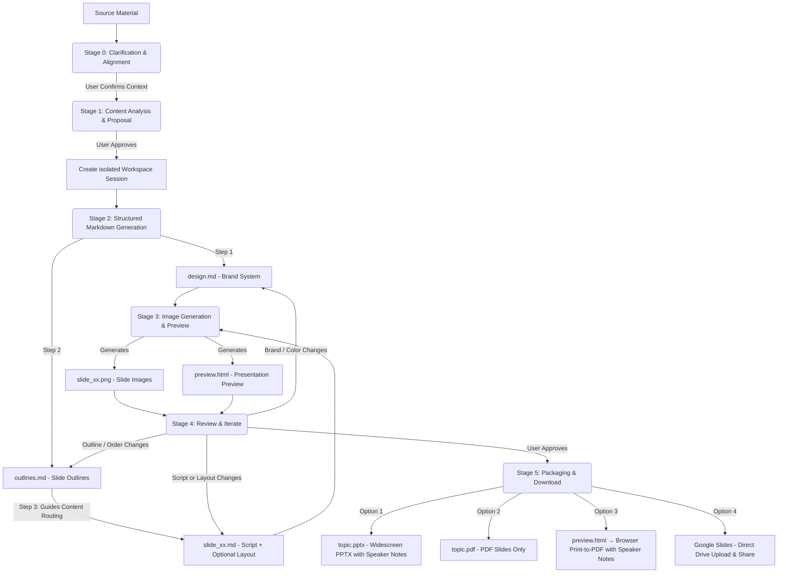

# Slide Gen Agent

`slide-gen-agent` is a conversational slide deck generator — just chat with the agent to turn any source material (articles, reports, outlines, raw notes) into a complete, visually polished presentation. Describe what you want, review the output, and refine it through natural conversation until the deck is exactly right.

**Key capabilities:**
- **Conversational & iterative** — tell the agent to adjust a slide's content, swap a color, or restructure the entire outline mid-session. Changes are applied surgically without regenerating the whole deck.
- **Speaker scripts included** — every slide comes with a full 1–2 minute spoken script, written as natural presenter delivery. Scripts are embedded in the PPTX notes section and included in the preview page, so you walk into the room prepared.
- **Multilingual** — supports 100+ languages including Chinese (Traditional & Simplified), English, Japanese, Korean, Thai, Vietnamese, and other Asian scripts for both slide content and speaker notes. Export to PDF via browser print to preserve system fonts without server-side font dependencies.
- **Production-ready exports** — download as PPTX (with embedded speaker notes), PDF slides, browser-printed speaker-notes PDF, or push directly to **Google Slides** for instant in-browser editing and sharing.

This repository is structured to support three progressive deployment and usage methods, ranging from lightweight prompt-based skills to production-grade enterprise agents.

---

## 📖 Core Design Philosophy & Logic

Traditional AI slide generators create layouts and visuals in a single black-box step, which often results in inconsistent designs, random formatting, and crude iteration — tweaking a single slide's structure or integrating revised speaker content typically requires regenerating the entire deck.

`slide-gen-agent` uses a **decoupled, six-stage pipeline** with plain-text intermediate files as the backbone. Every design decision lives in an editable Markdown file — so you can refine any layer (global style, slide structure, or per-slide content) through chat, and only the affected slides get regenerated.



### The Six-Stage Pipeline

0. **Stage 0: Clarification & Alignment**
   - Before touching the source material, the agent confirms three core context elements: **expected presentation duration** (or slide count), **target audience**, and **expected goal/outcome**.
   - *The agent pauses and waits for you.* If any of these are missing from your initial request, it will ask before proceeding.

1. **Stage 1: Content Analysis & Proposal**
   - The agent reads your source material (documents, transcripts, raw notes) to understand the domain, tone, and target audience.
   - It proposes a **slide count**, **design theme**, and **hex-code color palette**.
   - *The agent pauses and waits for you.* You can accept the proposal or adjust the theme/color palette.

2. **Stage 2: Structured Markdown Generation**
   - Once approved, the agent generates three types of Markdown files in an isolated session folder:
     - **`design.md`**: The brand system — hex color palette, typography, spacing, and visual style rules. This is the SSoT for brand consistency across all slides.
     - **`outlines.md`**: Complete slide list with layout type and 2–3 sentence summary per slide.
     - **`slide_xx.md`**: Per-slide file with title, speaker script (260–300 words), and an optional `## Layout` section (left empty on first pass — the image model infers a suitable composition from the slide type and script).
   - *The pipeline flows directly into Stage 3 without pausing.*

3. **Stage 3: Image Generation & Preview**
   - The agent combines `design.md` (brand) and `slide_xx.md` (per-slide spec) into a structured prompt for each slide.
   - It sends this to the image generation model to produce the final 16:9 high-fidelity PNG (`slide_xx.png`).
   - All slide images and speaker notes are compiled into a `preview.html` page for easy review.
   - *The pipeline flows directly into Stage 4.*

4. **Stage 4: Review & Iterate**
   - *The agent pauses and waits for your feedback.*
   - Tell the agent what to change in plain language. Changes are applied surgically — only the affected slides are regenerated:
     - Script or layout edits → update the relevant `slide_xx.md` + regenerate that slide only
     - Slide reorder / add / delete → update `outlines.md` + affected `slide_xx.md` files (including Transition & Hook rewrites) + regenerate only the changed slides
     - Brand / color change → update `design.md` + regenerate all slides
   - The loop repeats until you explicitly approve all slides.

5. **Stage 5: Presentation Packaging & Download**
   - Once you approve the final slides, the agent offers four export options:
     - **Google Slides**: The agent uploads the PPTX to Google Drive as a Google Slides file in the `slide-gen-agent` folder and shares it with you as editor. Opens directly in Google Slides for immediate editing and sharing. *(Requires Google Drive API enabled in GCP and Domain-Wide Delegation configured in Google Workspace Admin.)*
     - **PPTX (PowerPoint with Speaker Notes)**: A widescreen PowerPoint file featuring slide images, with speaker notes fully embedded in the PowerPoint notes section of each slide. Filename uses the presentation topic (e.g. `ai-trends-2025.pptx`).
     - **PDF: Slides**: A PDF compiled from all slide images (perfect for presenting directly). Filename uses the presentation topic (e.g. `ai-trends-2025.pdf`).
     - **PDF: Speaker Notes**: Open the `preview.html` link and click the **"Save as PDF"** button. The browser renders each slide and its notes as a clean, paginated PDF using your local system fonts — this correctly handles all languages including CJK and Southeast Asian scripts without any server-side font dependencies.

---

## 🛠️ Directory Structure

```text
slide-gen-agent/
├── README.md                # Project overview and setup (this file)
├── skills/
│   └── slide-gen-agent/     # 🌟 Standard self-contained Agent Skill (for Antigravity/Codex)
│       ├── SKILL.md         # Playbook/guidelines (YAML frontmatter + instructions)
│       ├── assets/          # Static templates used by the skill
│       │   ├── design.md    # Brand system template (colors, typography, visual style)
│       │   ├── outlines.md  # Deck outline template
│       │   └── slide_xx.md  # Per-slide template (title, optional layout, script)
│       └── scripts/         # Custom tools bundled with the skill
│           ├── pdf_exporter.py # Widescreen presentation PDF compiler
│           ├── pptx_exporter.py # Widescreen PPTX compiler with speaker notes
│           └── preview_generator.py # HTML preview page compiler (includes Save as PDF)
└── adk_agent/               # Programmatic Host Agent (Python ADK 2.0 implementation)
    ├── requirements.txt     # Python dependency configuration (includes python-pptx & reportlab)
    ├── agent.py             # Main agent entry point
    └── tools/               # Agent tools
        ├── __init__.py
        ├── file_manager.py  # Session initialization and file writer tools
        ├── imagen.py        # Gemini slide image generator tool
        ├── pdf_exporter.py  # Pillow-based widescreen PDF exporter
        ├── pptx_exporter.py # PowerPoint widescreen (PPTX) with speaker notes exporter
        ├── drive_exporter.py # Google Drive upload → Google Slides converter & sharer
        └── preview_generator.py # HTML slide preview and notes compiler (includes Save as PDF)
```

---

## 🚀 Installation & Deployment Methods

Select the installation method that fits your target environment:

### 🔹 Method 1: Universal Skill (`SKILL.md`) — Platform-Agnostic
This is a pure prompt/guideline-based installation, requiring no code hosting.
* **Use Case**: LLM systems that support Agent Skills, provide a sandboxed code-execution environment, and have text-to-image generation capabilities (e.g., Antigravity, Codex).
* **How to Install**:
  1. Import or copy the contents of [SKILL.md](file:///Users/sylph/Documents/Antigravity/slide-gen-agent/skills/slide-gen-agent/SKILL.md) into your LLM assistant's custom system instructions or system prompts.
  2. Reference the Markdown files in the `skills/slide-gen-agent/templates/` directory as examples for the assistant to follow.

---

### 🔹 Method 2: Production Deployment to Agent Engine (Gemini Enterprise)
Deploy the Python agent as a Reasoning Engine (Agent Engine) instance on Vertex AI and hook it directly into **Gemini Enterprise**.

---

#### Part A — One-Time Project Setup
Do this once per GCP project. You won't need to repeat these steps for future installs or redeploys.

##### 1. Enable GCP APIs
Enable the following APIs in your GCP project:
- [Vertex AI API](https://console.cloud.google.com/apis/library/aiplatform.googleapis.com)
- [Google Drive API](https://console.cloud.google.com/apis/library/drive.googleapis.com)

##### 2. Configure IAM Permissions

Agent Engine runs your code under the **Vertex AI Reasoning Engine service agent** (`service-{PROJECT_NUMBER}@gcp-sa-aiplatform-re.iam.gserviceaccount.com`). This Google-managed SA handles Vertex AI and GCS access, but **cannot** be directly registered for Domain-Wide Delegation (DWD). For Google Drive export, you create a separate user-managed SA (`slide-gen-drive`) that the runtime SA is allowed to impersonate.

```bash
PROJECT_NUMBER=$(gcloud projects describe $GOOGLE_CLOUD_PROJECT --format="value(projectNumber)")

# Runtime SA: Google-managed identity that runs your agent code
RUNTIME_SA="service-${PROJECT_NUMBER}@gcp-sa-aiplatform-re.iam.gserviceaccount.com"

# Build SA: used only during `adk deploy` for container image push and build logs
BUILD_SA="${PROJECT_NUMBER}-compute@developer.gserviceaccount.com"

# Drive SA: user-managed SA registered for DWD — created and owned by you
gcloud iam service-accounts create slide-gen-drive \
  --display-name="Slide Gen Drive Exporter" \
  --project=$GOOGLE_CLOUD_PROJECT
DRIVE_SA="slide-gen-drive@${GOOGLE_CLOUD_PROJECT}.iam.gserviceaccount.com"

# Required: call Vertex AI models and Gemini image generation
gcloud projects add-iam-policy-binding $GOOGLE_CLOUD_PROJECT \
  --member="serviceAccount:$RUNTIME_SA" \
  --role="roles/aiplatform.user"

# Required: read/write slides, previews, and exports to your GCS bucket
gcloud projects add-iam-policy-binding $GOOGLE_CLOUD_PROJECT \
  --member="serviceAccount:$RUNTIME_SA" \
  --role="roles/storage.objectUser"

# Required: allow runtime SA to sign JWTs as the Drive SA (for DWD).
# NOTE the direction here is the OPPOSITE of the project-level bindings above/below:
# the Drive SA is the resource (`service-accounts add-iam-policy-binding $DRIVE_SA`)
# and the runtime SA is the `--member` being granted a role ON it — not the other
# way around. Reversing this grants the Drive SA permission to impersonate ANY SA
# in the project (wrong, and will not fix a signJwt 404).
gcloud iam service-accounts add-iam-policy-binding $DRIVE_SA \
  --member="serviceAccount:${RUNTIME_SA}" \
  --role="roles/iam.serviceAccountTokenCreator" \
  --project=$GOOGLE_CLOUD_PROJECT

# Required for adk deploy: build logs and container image push
gcloud projects add-iam-policy-binding $GOOGLE_CLOUD_PROJECT \
  --member="serviceAccount:$BUILD_SA" \
  --role="roles/logging.logWriter"
gcloud projects add-iam-policy-binding $GOOGLE_CLOUD_PROJECT \
  --member="serviceAccount:$BUILD_SA" \
  --role="roles/artifactregistry.writer"
```

> **Note**: If a binding for the same role + member already exists — regardless of whether it has a condition (e.g. left over from another setup like Cloud Build) — `gcloud` will prompt you to choose how to apply the new one:
> ```
>  [1] EXPRESSION=request.time < timestamp(...), TITLE=cloudbuild-connection-setup
>  [2] None
>  [3] Specify a new condition
> ```
> Select **`[2] None`** — the bindings above must be unconditional so the agent always has these permissions.

> **Note**: The Drive SA binding (`gcloud iam service-accounts add-iam-policy-binding $DRIVE_SA ...`) is the **one binding in this script with a reversed direction** compared to the rest. Every other command grants a role *on the project* to some SA (`gcloud projects add-iam-policy-binding $GOOGLE_CLOUD_PROJECT --member="serviceAccount:<SA>" ...`). This one instead grants a role *on the Drive SA itself* to the runtime SA (`gcloud iam service-accounts add-iam-policy-binding $DRIVE_SA --member="serviceAccount:$RUNTIME_SA" ...`). If you accidentally copy the project-level pattern here — granting `roles/iam.serviceAccountTokenCreator` to `$DRIVE_SA` at the project level — the Drive SA ends up able to impersonate *any* SA in the project (a much broader, incorrect grant), while the runtime SA still lacks permission to impersonate the Drive SA, and Google Drive export keeps failing with `[step:signJwt] HTTP 404`. Run `gcloud iam service-accounts get-iam-policy $DRIVE_SA` to verify the binding actually landed on the Drive SA resource (you should see `roles/iam.serviceAccountTokenCreator` with `$RUNTIME_SA` as the member).


##### 3. Configure Domain-Wide Delegation (Google Workspace Admin)
This allows the agent to upload generated decks directly to each user's own Google Drive.

1. In the [Google Workspace Admin Console](https://admin.google.com), go to **Security → API controls → Domain-wide delegation**.
2. Click **Add new** and enter:
   - **Client ID**: the OAuth 2 Client ID of the **Drive SA** (`slide-gen-drive@{PROJECT_ID}.iam.gserviceaccount.com`). Find it on the [IAM Service Accounts page](https://console.cloud.google.com/iam-admin/serviceaccounts) → select `slide-gen-drive` → **Details** tab.
   - **OAuth scopes**: `https://www.googleapis.com/auth/drive.file`
3. Click **Authorise**.

---

#### Part B — Install & Deploy
Repeat these steps for every fresh install or redeploy.

##### 1. Install Dependencies
Set up the virtual environment from the root `slide-gen-agent` directory:
```bash
python3 -m venv venv
source venv/bin/activate
cd adk_agent
pip install "google-adk[gcp]" google-genai Pillow python-dotenv
```

##### 2. Configure Environment Variables
Create a `.env` file inside the `adk_agent` directory so it gets bundled into the deployed container and loaded at startup. **This is required** — the deployed runtime cannot reliably auto-detect your project ID (different hosting contexts resolve it to the wrong value, e.g. a numeric project number or an unrelated tenant project), and a wrong value breaks both model calls and the Drive SA email used for export:
```bash
cat > .env <<EOF
GOOGLE_CLOUD_PROJECT="$GOOGLE_CLOUD_PROJECT"
EOF
```

##### 3. Deploy
Run the ADK deployer from the `adk_agent` directory. The agent resolves the Drive SA as `slide-gen-drive@{PROJECT_ID}.iam.gserviceaccount.com` using the `GOOGLE_CLOUD_PROJECT` from your `.env`:
```bash
adk deploy agent_engine \
  --project=$GOOGLE_CLOUD_PROJECT \
  --region=us-central1 \
  --display_name="slide-gen-agent" \
  --artifact_service_uri="gs://your-runtime-bucket" \
  .
```
*The ADK CLI handles containerization, deployment staging, and Reasoning Engine registration. When complete, it outputs your **Reasoning Engine Resource ID** (e.g., `projects/{PROJECT_NUMBER}/locations/us-central1/reasoningEngines/{ENGINE_ID}`).*

##### 4. Connect to Gemini Enterprise Console
1. Log in to the **Gemini Enterprise Admin Console**.
2. Navigate to **Agents** in the left sidebar.
3. Click **+ Add Agent**.
4. Select **Custom agent via Agent Engine** and enter your **Reasoning Engine Resource ID**.
5. Configure IAM authentication permissions to secure the connection.
