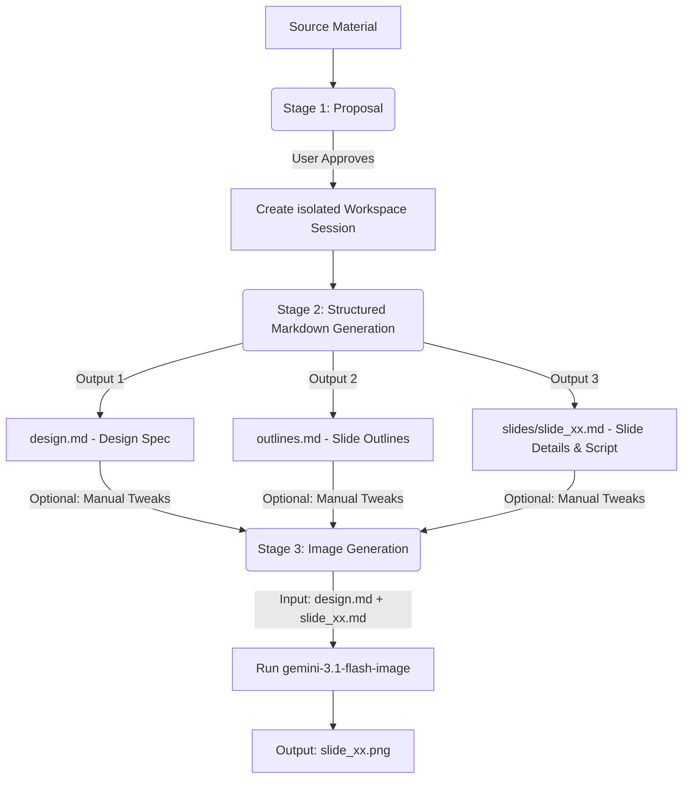

# Slide Gen Agent

`slide-gen-agent` is a slide deck generation solution that automates the entire pipeline of transforming raw content (articles, outlines, reports) into visually polished, high-quality presentation slide decks.

This repository supports **two usage methods** to fit different runtime environments:

### Method 1: Universal Skill (`SKILL.md`) — Platform-Agnostic
This is a pure Markdown-based specification of the slide deck generation workflow. 
- **Use Case**: Universal, ready for general-purpose LLM/Agent environments.
- **Compatible Platforms**: **Antigravity**, **Codex**, or any agent/IDE platform that supports advanced prompting and has Text-to-Image capabilities.
- **How to use**: Simply import or reference [SKILL.md](file:///Users/sylph/Documents/Antigravity/slide-gen-agent/SKILL.md) as the system instruction or skill definition for your agent. It details the prompts, formatting templates, and generation workflows.

### Method 2: Dedicated ADK Agent (`adk-agent/`) — Programmatic
A fully implemented TypeScript agent built with the **ADK (Agent Development Kit)** framework.
- **Use Case**: Native programmatic execution on **Google Cloud Agent Platform** or local automated scripts.
- **Features**: Automatically orchestrates file management, isolates sandbox directories per execution session, and invokes the **Vertex AI API** using `gemini-3.1-flash-image` for high-quality slide image generation.
- **How to use**: Follow the [Installation](#installation), [Configuration](#configuration), and [Usage](#usage) sections below.

---

## Directory Structure

```text
slide-gen-agent/
├── SKILL.md                 # Detailed skill guidelines and quality principles
├── README.md                # Project overview and instructions (this file)
├── templates/               # Markdown templates used for structured generation
│   ├── design.md            # Design system template
│   ├── outlines.md          # Deck outline template
│   └── slide_xx.md          # Individual slide content template
└── adk-agent/               # ADK Agent implementation
    ├── package.json         # Node.js dependencies and scripts
    ├── tsconfig.json        # TypeScript compiler configuration
    ├── src/
    │   ├── agent.ts         # Main agent definition & system instruction
    │   ├── config.ts        # GCP project, location, and model configuration
    │   ├── tools/
    │   │   ├── fileManager.ts  # Tools for session initialization and saving markdown files
    │   │   └── imagen.ts       # Tool for invoking image generation
    │   └── utils/
    │       └── vertex.ts    # Vertex AI client and prediction execution
    └── dist/                # Compiled JavaScript outputs
```

---

## Prerequisites

Before setting up the agent, ensure you have the following:
- **Node.js** (v18.0.0 or higher recommended)
- **Google Cloud SDK (gcloud)** installed and authenticated.
- A **Google Cloud Project (GCP)** with the **Vertex AI API** enabled.
- Proper local IAM credentials to call Vertex AI (`gcloud auth application-default login`).

---

## Installation

1. **Clone the Repository**:
   ```bash
   git clone <repository-url>
   cd slide-gen-agent
   ```

2. **Install Dependencies**:
   Navigate to the `adk-agent` directory and install all required Node.js modules:
   ```bash
   cd adk-agent
   npm install
   ```

---

## Configuration

The agent reads its configuration from `adk-agent/src/config.ts`. 

To configure it for your environment:
1. Set your **GCP Project ID** and **Location** using environment variables, or edit `adk-agent/src/config.ts` directly:
   ```bash
   export GCP_PROJECT="your-gcp-project-id"
   export GCP_LOCATION="us-central1"  # e.g. us-central1, asia-east1
   ```
2. **Image Generation Model**: 
   The agent uses `gemini-3.1-flash-image` as the default model for slide image generation.
3. **Text Generation Model & Thinking Config**:
   The agent uses `gemini-3.5-flash` as the default text generation model, with thinking reasoning configured to maximize precision. 

Both models and thinking settings are configured in `src/config.ts`:
```typescript
export const CONFIG = {
  ...
  IMAGEN_MODEL: 'gemini-3.1-flash-image', // Default image model
  TEXT_MODEL: 'gemini-3.5-flash',         // Default text model
  THINKING_LEVEL: 'HIGH',                 // Thinking level (e.g. 'HIGH', 'MEDIUM')
  THINKING_BUDGET: 2048,                  // Token budget for thinking
};
```

---

## Usage

### 1. Build the Project
Compile the TypeScript files into JavaScript (outputs to the `dist/` folder):
```bash
npm run build
```

### 2. Run the Agent
You can launch the agent directly using the ADK runner:
```bash
npm run agent
```
This runs the command:
```bash
npx adk run src/agent.ts
```
The ADK framework will start the interactive agent session. You can then interact with it, provide source materials, and watch it generate the slide deck step by step.

---

## Core Design Philosophy & Workflow

The core goal of `slide-gen-agent` is to provide a **highly stable, highly predictable, and easily modifiable** approach to generating professional slide decks. 

To achieve this, the workflow is completely decoupled into **three progressive stages** with plain-text intermediate outputs. This guarantees that you can easily jump in, modify any design choice or script manually, and get consistent, updated results without having to regenerate the entire deck from scratch.



### Stage 1: Content Analysis & Proposal
Instead of rushing into slide generation, the agent first reads your source material (documents, transcripts, raw notes) to understand the domain, tone, and target audience.
- **Input**: Raw text, article, outlines, or notes.
- **Agent Action**: Suggests a customized presentation direction.
- **Output**: A concise proposal specifying:
  1. **Recommended slide count** (typically 8-15 slides).
  2. **Design style theme** (e.g., Technology, Business/Finance, Lifestyle, Education, Data-Driven).
  3. **Color palette** (Primary, Secondary, Background Hex codes) aligned with the content's feel.
- **User Loop**: *The agent pauses and waits for you.* You can accept the recommendation, tweak the colors, suggest a different style, or adjust the slide count.

---

### Stage 2: Structured Markdown Generation
Once the proposal is approved, the agent starts generating the slide structure and detailed script content. It uses pre-defined structures in the `templates/` folder.
All documents are written as clean, structured, and human-readable Markdown files into an isolated session directory:

1. **`design.md` (The Design Specification)**:
   - Establishes the global design system (specific hex codes, font-sizes, spacing, and structure defaults like Cover, Title & Text, Section Divider, Data & Stats, etc.).
   - **Why it's stable**: It serves as the **Single Source of Truth (SSoT)** for the visual layout of the entire deck.
2. **`outlines.md` (The Deck Outline)**:
   - A complete slide-by-slide outline detailing the slide number, visual layout type (chosen from `design.md`), and a 2-3 sentence descriptive summary.
3. **`slides/slide_xx.md` (Per-slide Detailed Content & Script)**:
   - Generates a dedicated file for every single slide representing the complete detailed payload:
     - **Slide Metadata**: Slide number and layout type (Cover, Section Header, Quote, etc.).
     - **Title**: The actual title text content to be rendered on the slide.
     - **Spoken Script**: A highly visual and detailed presenter's narrative (150–300 words) providing context, transitions, deep-dives, analogies, and statistics.
     - **Why it's stable**: It isolates the slide's core information and verbal narrative away from the styling code. You can modify the title or script content directly for a single slide without risking visual layout corruption or needing to rebuild the rest of the presentation.

---

### Stage 3: Image Generation
With all structured Markdown files generated, the agent converts each slide script into a high-fidelity 16:9 widescreen PNG slide image (`slide_xx.png`).
For each slide:
1. The agent reads the global `design.md` and the specific `slide_xx.md`.
2. It merges them into a highly structured, XML-tagged prompt:
   - `<design_system>` block: Holds the contents of `design.md` to enforce visual guidelines.
   - `<slide_content>` block: Holds the contents of `slide_xx.md` containing the titles to render and scripts.
3. It sends this prompt to the `gemini-3.1-flash-image` model on Vertex AI to produce the final high-resolution slide PNG (`slide_xx.png`).

---

## Why This Workflow is Highly Stable & Easy to Modify

Traditional AI slide generators try to create layouts and slides in a single black-box step, which often results in inconsistent designs, random formatting, and an inability to tweak specific parts without regenerating the entire deck.

Our **decoupled markdown approach** gives you full control:
- **Modify Visuals in One Click**: Want to change the theme color, update a font, or switch from light to dark mode? Simply edit `design.md` in your session folder, and regenerate Stage 3. Every slide will immediately inherit the new styles.
- **Fix Typos or Tweak Content Directly**: Found a spelling error on Slide 5 or want to change a bullet point? Just open `slides/slide_05.md`, edit the Markdown file directly, and run the `generateSlideImage` tool for Slide 5. You don't need to rerun the LLM pipeline or wait for other slides to regenerate.
- **Predictable Outcomes**: By keeping the design guidelines (`design.md`) separate from the slide content (`slide_xx.md`), the image generation model receives highly consistent formatting parameters, resulting in exceptionally stable layout renders.
