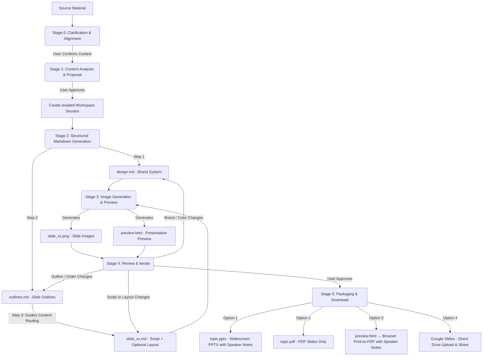

# Slide Gen Agent

[English (en)](README.md) | [繁體中文 (zh-TW)](README.zh-TW.md) | [简体中文 (zh-CN)](README.zh-CN.md) | [日本語 (ja)](README.ja.md) | [한국어 (ko)](README.ko.md)

`slide-gen-agent` is a conversational slide deck generator — just chat with the agent to turn any source material (articles, reports, outlines, raw notes) into a complete, visually polished presentation. Describe what you want, review the output, and refine it through natural conversation until the deck is exactly right.

**Key capabilities:**
- **Conversational & iterative** — tell the agent to adjust a slide's content, swap a color, or restructure the entire outline mid-session. Changes are applied surgically without regenerating the whole deck.
- **Speaker scripts included** — every slide comes with a full 1–2 minute spoken script, written as natural presenter delivery. Scripts are embedded in the PPTX notes section and included in the preview page, so you walk into the room prepared.
- **Multilingual** — supports 100+ languages including Chinese (Traditional & Simplified), English, Japanese, Korean, Thai, Vietnamese, and other Asian scripts for both slide content and speaker notes. Export to PDF via browser print to preserve system fonts without server-side font dependencies.
- **Production-ready exports** — download as PPTX (with embedded speaker notes), PDF slides, browser-printed speaker-notes PDF, or push directly to **Google Slides** for instant in-browser editing and sharing.

This repository is structured to support three progressive deployment and usage methods, ranging from lightweight prompt-based skills to production-grade enterprise agents.

---

## 📖 Core Design Philosophy & Logic

Traditional AI slide generators create layouts and visuals in a single black-box step, which often results in inconsistent designs, random formatting, and crude iteration — tweaking a single slide's structure or integrating revised speaker content typically requires regenerating the entire deck.

`slide-gen-agent` uses a **decoupled, six-stage pipeline** with plain-text intermediate files as the backbone. Every design decision lives in an editable Markdown file — so you can refine any layer (global style, slide structure, or per-slide content) through chat, and only the affected slides get regenerated.



### The Six-Stage Pipeline

0. **Stage 0: Clarification & Alignment**
   - Before touching the source material, the agent confirms three core context elements: **expected presentation duration** (or slide count), **target audience**, and **expected goal/outcome**.
   - *The agent pauses and waits for you.* If any of these are missing from your initial request, it will ask before proceeding.

1. **Stage 1: Content Analysis & Proposal**
   - The agent reads your source material (documents, transcripts, raw notes) to understand the domain, tone, and target audience.
   - It proposes a **slide count**, **design theme**, and **hex-code color palette**.
   - *The agent pauses and waits for you.* You can accept the proposal or adjust the theme/color palette.

2. **Stage 2: Structured Markdown Generation**
   - Once approved, the agent generates three types of Markdown files in an isolated session folder:
     - **`design.md`**: The brand system — hex color palette, typography, spacing, and visual style rules. This is the SSoT for brand consistency across all slides.
     - **`outlines.md`**: Complete slide list with layout type and 2–3 sentence summary per slide.
     - **`slide_xx.md`**: Per-slide file with title, speaker script (260–300 words), and an optional `## Layout` section (left empty on first pass — the image model infers a suitable composition from the slide type and script).
   - *The pipeline flows directly into Stage 3 without pausing.*

3. **Stage 3: Image Generation & Preview**
   - The agent combines `design.md` (brand) and `slide_xx.md` (per-slide spec) into a structured prompt for each slide.
   - It sends this to the image generation model to produce the final 16:9 high-fidelity PNG (`slide_xx.png`).
   - All slide images and speaker notes are compiled into a `preview.html` page for easy review.
   - *The pipeline flows directly into Stage 4.*

4. **Stage 4: Review & Iterate**
   - *The agent pauses and waits for your feedback.*
   - Tell the agent what to change in plain language. Changes are applied surgically — only the affected slides are regenerated:
     - Script or layout edits → update the relevant `slide_xx.md` + regenerate that slide only
     - Slide reorder / add / delete → update `outlines.md` + affected `slide_xx.md` files (including Transition & Hook rewrites) + regenerate only the changed slides
     - Brand / color change → update `design.md` + regenerate all slides
   - The loop repeats until you explicitly approve all slides.

5. **Stage 5: Presentation Packaging & Download**
   - Once you approve the final slides, the agent offers four export options:
     - **Google Slides**: The agent uploads the PPTX to Google Drive as a Google Slides file in the `slide-gen-agent` folder and shares it with you as editor. Opens directly in Google Slides for immediate editing and sharing. *(Requires Google Drive API enabled in GCP and Domain-Wide Delegation configured in Google Workspace Admin.)*
     - **PPTX (PowerPoint with Speaker Notes)**: A widescreen PowerPoint file featuring slide images, with speaker notes fully embedded in the PowerPoint notes section of each slide. Filename uses the presentation topic (e.g. `ai-trends-2025.pptx`).
     - **PDF: Slides**: A PDF compiled from all slide images (perfect for presenting directly). Filename uses the presentation topic (e.g. `ai-trends-2025.pdf`).
     - **PDF: Speaker Notes**: Open the `preview.html` link and click the **"Save as PDF"** button. The browser renders each slide and its notes as a clean, paginated PDF using your local system fonts — this correctly handles all languages including CJK and Southeast Asian scripts without any server-side font dependencies.

---

## 🛠️ Directory Structure

```text
slide-gen-agent/
├── README.md                # Project overview and setup (this file)
├── skills/
│   └── slide-gen-agent/     # 🌟 Standard self-contained Agent Skill (for Antigravity/Codex)
│       ├── SKILL.md         # Playbook/guidelines (YAML frontmatter + instructions)
│       ├── assets/          # Static templates used by the skill
│       │   ├── design.md    # Brand system template (colors, typography, visual style)
│       │   ├── outlines.md  # Deck outline template
│       │   └── slide_xx.md  # Per-slide template (title, optional layout, script)
│       └── scripts/         # Custom tools bundled with the skill
│           ├── pdf_exporter.py # Widescreen presentation PDF compiler
│           ├── pptx_exporter.py # Widescreen PPTX compiler with speaker notes
│           └── preview_generator.py # HTML preview page compiler (includes Save as PDF)
└── adk_agent/               # Programmatic Host Agent (Python ADK 2.0 implementation)
    ├── requirements.txt     # Python dependency configuration (includes python-pptx & reportlab)
    ├── agent.py             # Main agent entry point
    └── tools/               # Agent tools
        ├── __init__.py
        ├── file_manager.py  # Session initialization and file writer tools
        ├── imagen.py        # Gemini slide image generator tool
        ├── pdf_exporter.py  # Pillow-based widescreen PDF exporter
        ├── pptx_exporter.py # PowerPoint widescreen (PPTX) with speaker notes exporter
        ├── drive_exporter.py # Google Drive upload → Google Slides converter & sharer
        └── preview_generator.py # HTML slide preview and notes compiler (includes Save as PDF)
```

---

## 🚀 Installation & Deployment Methods

Select the installation method that fits your target environment:

### 🔹 Method 1: Universal Skill (`SKILL.md`) — Platform-Agnostic
This is a pure prompt/guideline-based installation, requiring no code hosting.
* **Use Case**: LLM systems that support Agent Skills, provide a sandboxed code-execution environment, and have text-to-image generation capabilities (e.g., Antigravity, Codex).
* **How to Install**:
  1. Import or copy the contents of [SKILL.md](file:///Users/sylph/Documents/Antigravity/slide-gen-agent/skills/slide-gen-agent/SKILL.md) into your LLM assistant's custom system instructions or system prompts.
  2. Reference the Markdown files in the `skills/slide-gen-agent/templates/` directory as examples for the assistant to follow.

---

### 🔹 Method 2: Automated One-Click Deployment (Recommended)

We provide an automated, production-ready deployment suite using **Terraform** and a companion **orchestration script** (`deploy.sh`). This completely automates enabling APIs, creating Google Drive delegation Service Accounts, provisioning GCS session buckets, configuring complex IAM role bindings, setting up the Python virtual environment, and registering the agent in Vertex AI.

---

#### 1. Prerequisites
Ensure you have the following installed on your local machine:
- [Google Cloud SDK (gcloud CLI)](https://cloud.google.com/sdk/docs/install)
- [Terraform CLI](https://developer.hashicorp.com/terraform/downloads)

Ensure you are authenticated with Google Cloud:
```bash
gcloud auth login
gcloud auth application-default login
```

---

#### 2. Run the Deployment
From the root of the repository, execute the orchestrator script:
```bash
./deploy.sh
```

The script will guide you through:
1. **Interactive Configuration**: Confirms your target GCP Project ID and Region.
2. **Infrastructure Provisioning**: Executes Terraform to configure APIs, IAM permissions, GCS buckets, and Service Accounts.
3. **Environment Setup**: Generates `adk_agent/.env` with your project configurations.
4. **Agent Packaging & Deployment**: Installs python dependencies and uses the ADK CLI to package and register the agent as a Vertex AI Reasoning Engine.

When finished, the script will output your **Reasoning Engine Resource ID** (e.g., `projects/{PROJECT_NUMBER}/locations/{REGION}/reasoningEngines/{ENGINE_ID}`).

---

#### 3. Post-Deployment Configuration
To complete the integration, perform these two manual steps:

##### A. Configure Google Workspace Domain-Wide Delegation
This allows the agent to upload slides directly to your users' Google Drives:
1. Go to the [Google Workspace Admin Console](https://admin.google.com).
2. Navigate to **Security → API controls → Domain-wide delegation**.
3. Click **Add new** and enter:
   - **Client ID**: The OAuth2 Client ID of the Drive SA (this will be printed at the end of the `deploy.sh` script, or can be found in the Terraform outputs).
   - **OAuth scopes**: `https://www.googleapis.com/auth/drive.file`
4. Click **Authorise**.

##### B. Connect to Gemini Enterprise
1. Log in to the **Gemini Enterprise Admin Console**.
2. Navigate to **Agents** in the left sidebar.
3. Click **+ Add Agent**.
4. Select **Custom agent via Agent Engine** and paste the **Reasoning Engine Resource ID** printed by the script.
5. Configure IAM authentication permissions to secure the connection.

