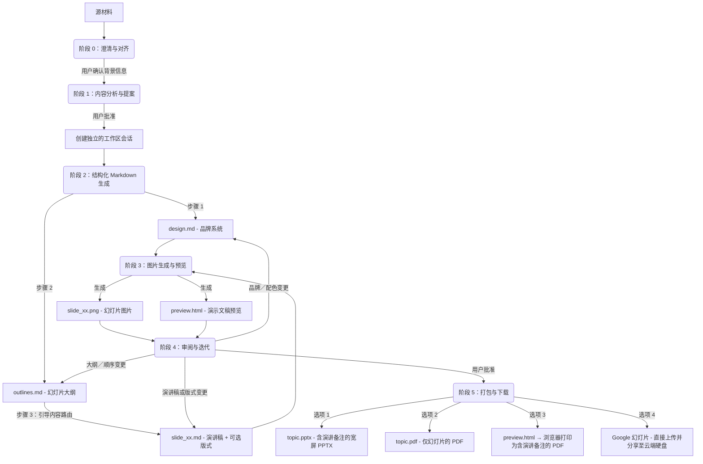

# Slide Gen Agent

[English (en)](README.md) | [繁體中文 (zh-TW)](README.zh-TW.md) | [简体中文 (zh-CN)](README.zh-CN.md) | [日本語 (ja)](README.ja.md) | [한국어 (ko)](README.ko.md)

`slide-gen-agent` 是一个对话式幻灯片生成器——只需与代理对话，就能将任何素材（文章、报告、大纲、原始笔记）转化为一份完整、视觉精美的演示文稿。描述你的需求、查看生成结果，并通过自然对话不断调整，直到演示文稿完全符合你的预期。

**核心能力：**
- **对话式与迭代式** — 告诉代理调整某张幻灯片的内容、更换配色，或在会话过程中重新规划整个大纲。改动会被精确应用，无需重新生成整套演示文稿。
- **内置演讲稿** — 每张幻灯片都配有一段完整的 1–2 分钟演讲稿，以自然的演讲者口吻撰写。演讲稿会嵌入 PPTX 的备注区域，并展示在预览页面中，让你上场前准备充分。
- **多语言支持** — 支持 100 多种语言，包括繁体中文、简体中文、英文、日语、韩语、泰语、越南语及其他亚洲文字体系，适用于幻灯片内容与演讲备注。可通过浏览器打印导出 PDF，在不依赖服务器端字体的情况下保留系统字体。
- **可直接交付的导出格式** — 可下载为 PPTX（内嵌演讲备注）、幻灯片 PDF、浏览器打印生成的演讲备注 PDF，或直接推送到 **Google 幻灯片**，立即在浏览器中编辑与分享。

本仓库的结构支持三种循序渐进的部署与使用方式，从轻量的提示词型技能到企业级生产环境代理皆涵盖在内。

---

## 📖 核心设计理念与逻辑

传统的 AI 幻灯片生成器在单一的黑盒步骤中同时完成排版与视觉设计，这往往导致设计风格不统一、格式混乱，以及粗糙的迭代流程——哪怕只是想微调某张幻灯片的结构，或整合修订后的演讲内容，通常都得重新生成整套演示文稿。

`slide-gen-agent` 采用**解耦的六阶段流程**，以纯文本中间文件作为骨架。每一项设计决策都保存在可编辑的 Markdown 文件中——因此你可以通过对话调整任意一层（全局样式、幻灯片结构，或单张幻灯片内容），而只有受影响的幻灯片会被重新生成。



### 六阶段流程

0. **阶段 0：澄清与对齐**
   - 在分析素材或提出设计风格之前，代理必须先确认演示文稿的三项核心背景信息：**预期演讲时长**（或幻灯片数量）、**目标受众**，以及**预期目标／成果**。
   - *代理会暂停并等待你的回复。* 如果初始请求中缺少其中任何一项，代理会在继续前先向你询问。

1. **阶段 1：内容分析与提案**
   - 代理会仔细阅读你的素材（文档、访谈记录、原始笔记），以理解内容所属的领域、语气，以及阶段 0 中确认的背景信息。
   - 随后会提出建议的**幻灯片数量**、**设计主题**，以及 **十六进制色号配色方案**。
   - *代理会暂停并等待你的回复。* 你可以接受该提案，或调整主题／配色方案。

2. **阶段 2：结构化 Markdown 生成**
   - 一旦获得确认，代理会在独立的会话文件夹中生成三类 Markdown 文件：
     - **`design.md`**：品牌系统——十六进制配色、字体排版、间距与视觉风格规则。这是确保所有幻灯片品牌一致性的唯一可信来源（SSoT）。
     - **`outlines.md`**：完整的幻灯片清单，包含每张幻灯片的版式类型与 2–3 句摘要。
     - **`slide_xx.md`**：每张幻灯片各自的文件，包含标题、演讲稿（260–300 词），以及一个可选的 `## Layout` 区块（首次生成时留空——图像模型会根据幻灯片类型与演讲稿自行推断出合适的构图）。
   - *流程会直接进入阶段 3，不会暂停。*

3. **阶段 3：图片生成与预览**
   - 代理会将 `design.md`（品牌规范）与 `slide_xx.md`（单张幻灯片的具体内容）合并成结构化提示词，供每张幻灯片使用。
   - 然后将其发送给图像生成模型，输出最终的 16:9 高保真 PNG 图片（`slide_xx.png`）。
   - 所有幻灯片图片与演讲备注会被汇总成一个 `preview.html` 页面，方便查看。
   - *流程会直接进入阶段 4。*

4. **阶段 4：审阅与迭代**
   - *代理会暂停并等待你的反馈。*
   - 用自然语言告诉代理需要修改的内容。改动会被精确应用——只有受影响的幻灯片会被重新生成：
     - 演讲稿或版式调整 → 更新对应的 `slide_xx.md`，仅重新生成该张幻灯片
     - 幻灯片重新排序／新增／删除 → 更新 `outlines.md` 及受影响的 `slide_xx.md` 文件（包括重写过渡与引导段落），仅重新生成发生变化的幻灯片
     - 品牌／配色变更 → 更新 `design.md`，并重新生成所有幻灯片
   - 这一循环会持续进行，直到你明确确认所有幻灯片均已满意为止。

5. **阶段 5：演示文稿打包与下载**
   - 一旦你确认了最终的幻灯片，代理会提供四种导出选项：
     - **Google 幻灯片**：代理会将 PPTX 上传到 Google 云端硬盘中的 `slide-gen-agent` 文件夹，转换为 Google 幻灯片文件，并以编辑者身份与你共享，可直接在 Google 幻灯片中打开，便于即时编辑与分享。*（需要在 GCP 中启用 Google Drive API，并在 Google Workspace 管理控制台中配置域范围委派。）*
     - **PPTX（含演讲备注的 PowerPoint）**：宽屏 PowerPoint 文件，包含所有幻灯片图片，演讲备注完整嵌入每张幻灯片的 PowerPoint 备注区域。文件名采用演示主题命名（例如 `ai-trends-2025.pptx`）。
     - **PDF：幻灯片**：由所有幻灯片图片汇总而成的 PDF（适合直接用于演示）。文件名采用演示主题命名（例如 `ai-trends-2025.pdf`）。
     - **PDF：演讲备注**：打开 `preview.html` 链接，点击 **“Save as PDF”** 按钮。浏览器会将每张幻灯片及其备注渲染成简洁、分页排版的 PDF，并使用本机系统字体——这能正确处理包括中日韩文字与东南亚文字在内的所有语言，且无需任何服务器端字体依赖。

---

## 🛠️ 目录结构

```text
slide-gen-agent/
├── README.md                # 项目概览与安装说明（本文件）
├── skills/
│   └── slide-gen-agent/     # 🌟 标准独立式代理技能（适用于 Antigravity/Codex）
│       ├── SKILL.md         # 操作手册／准则（YAML 头信息 + 操作指引）
│       ├── assets/          # 技能附带的静态模板
│       │   ├── design.md    # 品牌系统模板（配色、字体排版、视觉风格）
│       │   ├── outlines.md  # 演示大纲模板
│       │   └── slide_xx.md  # 单张幻灯片模板（标题、可选版式、演讲稿）
│       └── scripts/         # 随技能附带的自定义工具
│           ├── pdf_exporter.py # 宽屏演示 PDF 编译工具
│           ├── pptx_exporter.py # 含演讲备注的宽屏 PPTX 编译工具
│           └── preview_generator.py # HTML 预览页面编译工具（含 Save as PDF 功能）
└── adk_agent/               # 程序化主代理（Python ADK 2.0 实现）
    ├── requirements.txt     # Python 依赖配置（包含 python-pptx 与 reportlab）
    ├── agent.py             # 代理主入口
    └── tools/               # 代理工具
        ├── __init__.py
        ├── file_manager.py  # 会话初始化与文件写入工具
        ├── imagen.py        # Gemini 幻灯片图片生成工具
        ├── pdf_exporter.py  # 基于 Pillow 的宽屏 PDF 导出工具
        ├── pptx_exporter.py # 含演讲备注的 PowerPoint 宽屏（PPTX）导出工具
        ├── drive_exporter.py # Google 云端硬盘上传 → Google 幻灯片转换与分享工具
        └── preview_generator.py # HTML 幻灯片预览与备注编译工具（含 Save as PDF 功能）
```

---

## 🚀 安装与部署方式

请选择适合你目标环境的安装方式：

### 🔹 方式一：通用技能（`SKILL.md`）— 跨平台通用
这是纯粹基于提示词／准则的安装方式，无需托管任何代码。
* **适用场景**：支持 Agent Skills、提供沙箱化代码执行环境，且具备文生图能力的 LLM 系统（例如 Antigravity、Codex）。
* **安装方式**：
  1. 将 [SKILL.md](file:///Users/sylph/Documents/Antigravity/slide-gen-agent/skills/slide-gen-agent/SKILL.md) 的内容导入或复制到你的 LLM 助手的自定义系统指令或系统提示词中。
  2. 将 `skills/slide-gen-agent/templates/` 目录中的 Markdown 文件作为示例，供助手参考。

---

### 🔹 方式二：部署到 Agent Engine（Gemini Enterprise）生产环境
将该 Python 代理部署为 Vertex AI 上的 Reasoning Engine（Agent Engine）实例，并直接接入 **Gemini Enterprise**。

---

#### 第 A 部分 — 一次性项目设置
每个 GCP 项目只需执行一次。后续重新安装或重新部署时无需重复这些步骤。

##### 1. 启用 GCP API
请在你的 GCP 项目中启用以下 API：
- [Vertex AI API](https://console.cloud.google.com/apis/library/aiplatform.googleapis.com)
- [Google Drive API](https://console.cloud.google.com/apis/library/drive.googleapis.com)

##### 2. 配置 IAM 权限

Agent Engine 会以 **Vertex AI Reasoning Engine 服务代理**（`service-{PROJECT_NUMBER}@gcp-sa-aiplatform-re.iam.gserviceaccount.com`）的身份运行你的代码。这个由 Google 管理的服务账号负责处理 Vertex AI 与 GCS 的访问，但**无法**直接注册用于域范围委派（DWD）。为了支持 Google 云端硬盘导出功能，你需要创建一个由你管理的服务账号（`slide-gen-drive`），并允许运行时服务账号模拟该账号。

```bash
export GOOGLE_CLOUD_PROJECT="your-actual-gcp-project-id"

PROJECT_NUMBER=$(gcloud projects describe $GOOGLE_CLOUD_PROJECT --format="value(projectNumber)")

# 运行时服务账号：执行你的代理代码的 Google 管理身份
RUNTIME_SA="service-${PROJECT_NUMBER}@gcp-sa-aiplatform-re.iam.gserviceaccount.com"

# 构建服务账号：仅在 `adk deploy` 期间用于推送容器镜像和写入构建日志
BUILD_SA="${PROJECT_NUMBER}-compute@developer.gserviceaccount.com"

# Drive 服务账号：由你创建并拥有、用于注册 DWD 的用户管理服务账号
gcloud iam service-accounts create slide-gen-drive \
  --display-name="Slide Gen Drive Exporter" \
  --project=$GOOGLE_CLOUD_PROJECT
DRIVE_SA="slide-gen-drive@${GOOGLE_CLOUD_PROJECT}.iam.gserviceaccount.com"

# 必需：调用 Vertex AI 模型与 Gemini 图像生成功能
gcloud projects add-iam-policy-binding $GOOGLE_CLOUD_PROJECT \
  --member="serviceAccount:$RUNTIME_SA" \
  --role="roles/aiplatform.user"

# 必需：读写幻灯片、预览文件与导出文件到你的 GCS 存储桶
gcloud projects add-iam-policy-binding $GOOGLE_CLOUD_PROJECT \
  --member="serviceAccount:$RUNTIME_SA" \
  --role="roles/storage.objectUser"

# 必需：允许运行时服务账号以 Drive 服务账号身份签署 JWT（用于 DWD）。
# 注意这里的方向与上方／下方的项目级绑定“相反”：
# Drive 服务账号是资源本身（`service-accounts add-iam-policy-binding $DRIVE_SA`），
# 而运行时服务账号则是被授予该资源上角色的 `--member`——顺序不能颠倒。
# 反过来配置会让 Drive 服务账号获得模拟项目中“任意”服务账号的权限
# （这是错误的设置，也无法解决 signJwt 404 错误）。
gcloud iam service-accounts add-iam-policy-binding $DRIVE_SA \
  --member="serviceAccount:${RUNTIME_SA}" \
  --role="roles/iam.serviceAccountTokenCreator" \
  --project=$GOOGLE_CLOUD_PROJECT

# adk deploy 所需：构建日志写入与制品仓库推送
gcloud projects add-iam-policy-binding $GOOGLE_CLOUD_PROJECT \
  --member="serviceAccount:$BUILD_SA" \
  --role="roles/logging.logWriter"
gcloud projects add-iam-policy-binding $GOOGLE_CLOUD_PROJECT \
  --member="serviceAccount:$BUILD_SA" \
  --role="roles/artifactregistry.writer"
```

> **提示**：如果同一个角色 + 成员的绑定已经存在——无论它是否带有条件（例如其他配置流程，如 Cloud Build 留下的残留绑定）——`gcloud` 会提示你选择如何应用新的绑定：
> ```
>  [1] EXPRESSION=request.time < timestamp(...), TITLE=cloudbuild-connection-setup
>  [2] None
>  [3] Specify a new condition
> ```
> 请选择 **`[2] None`**——以上绑定必须是无条件的，这样代理才能始终拥有这些权限。

> **提示**：Drive 服务账号的绑定命令（`gcloud iam service-accounts add-iam-policy-binding $DRIVE_SA ...`）是这份脚本中**唯一方向相反**的绑定。其余每条命令都是把某个服务账号的角色授予在“项目”层级（`gcloud projects add-iam-policy-binding $GOOGLE_CLOUD_PROJECT --member="serviceAccount:<SA>" ...`）。而这条命令则是把角色授予在“Drive 服务账号自身”这一资源上，授权对象是运行时服务账号（`gcloud iam service-accounts add-iam-policy-binding $DRIVE_SA --member="serviceAccount:$RUNTIME_SA" ...`）。如果你不小心套用了项目级的写法——也就是在“项目”层级把 `roles/iam.serviceAccountTokenCreator` 授予给 `$DRIVE_SA`——Drive 服务账号最终会变成可以模拟项目中“任意”服务账号（授权范围大得多且是错误的），而运行时服务账号依然没有权限模拟 Drive 服务账号，导致 Google 云端硬盘导出持续报错 `[step:signJwt] HTTP 404`。运行 `gcloud iam service-accounts get-iam-policy $DRIVE_SA` 来确认绑定确实落在 Drive 服务账号这一资源上（你应该能看到 `roles/iam.serviceAccountTokenCreator`，成员为 `$RUNTIME_SA`）。


##### 3. 配置域范围委派（Google Workspace 管理控制台）
这能让代理将生成的演示文稿直接上传到每位用户自己的 Google 云端硬盘。

1. 前往 [Google Workspace 管理控制台](https://admin.google.com)，进入 **安全性 → API 控制 → 域范围委派**。
2. 点击 **新增**，并输入：
   - **客户端 ID**：**Drive 服务账号**（`slide-gen-drive@{PROJECT_ID}.iam.gserviceaccount.com`）的 OAuth 2 客户端 ID。可在 [IAM 服务账号页面](https://console.cloud.google.com/iam-admin/serviceaccounts) 中选择 `slide-gen-drive` → **详情** 选项卡找到。
   - **OAuth 范围**：`https://www.googleapis.com/auth/drive.file`
3. 点击 **授权**。

---

#### 第 B 部分 — 安装与部署
每次全新安装或重新部署时都需要重复以下步骤。

##### 1. 安装依赖
在根目录 `slide-gen-agent` 下创建虚拟环境：
```bash
python3 -m venv venv
source venv/bin/activate
cd adk_agent
pip install "google-adk[gcp]" google-genai Pillow python-dotenv
```

##### 2. 配置环境变量
在 `adk_agent` 目录下创建一个 `.env` 文件，使其能被打包进部署容器并在启动时加载。**这是必需的**——已部署的运行环境无法可靠地自动检测你的项目 ID（不同的托管环境会解析出不同的错误值，例如数字形式的项目编号或不相关的租户项目），错误的值会同时导致模型调用失败，以及导出功能所使用的 Drive 服务账号邮箱地址出错：
```bash
export GOOGLE_CLOUD_PROJECT="your-actual-gcp-project-id"

cat > .env <<EOF
GOOGLE_CLOUD_PROJECT="$GOOGLE_CLOUD_PROJECT"
EOF
```

##### 3. 部署
在 `adk_agent` 目录下运行 ADK 部署工具。代理会使用 `.env` 中的 `GOOGLE_CLOUD_PROJECT`，将 Drive 服务账号解析为 `slide-gen-drive@{PROJECT_ID}.iam.gserviceaccount.com`：
```bash
adk deploy agent_engine \
  --project=$GOOGLE_CLOUD_PROJECT \
  --region=us-central1 \
  --display_name="slide-gen-agent" \
  --artifact_service_uri="gs://your-runtime-bucket" \
  .
```
*ADK CLI 会处理容器化、部署暂存与 Reasoning Engine 注册。完成后会输出你的 **Reasoning Engine 资源 ID**（例如 `projects/{PROJECT_NUMBER}/locations/us-central1/reasoningEngines/{ENGINE_ID}`）。*

##### 4. 接入 Gemini Enterprise 控制台
1. 登录 **Gemini Enterprise 管理控制台**。
2. 在左侧导航栏中选择 **Agents**。
3. 点击 **+ 添加代理**。
4. 选择 **通过 Agent Engine 接入的自定义代理（Custom agent via Agent Engine）**，并输入你的 **Reasoning Engine 资源 ID**。
5. 配置 IAM 身份验证权限以保护连接安全。
