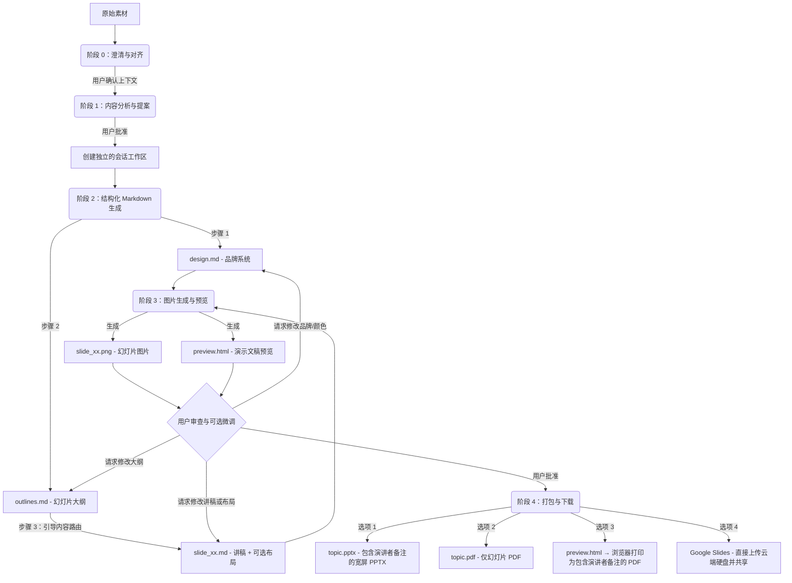

# Slide Gen Agent

[English](README.md) | [繁體中文 (zh-TW)](README.zh-TW.md) | [简体中文 (zh-CN)](README.zh-CN.md) | [日本語 (ja)](README.ja.md) | [한국어 (ko)](README.ko.md)

`slide-gen-agent` 是一款对话式幻灯片生成器 — 只需与 Agent 对话，即可将任何素材（文章、报告、大纲、原始笔记）转换为完整且视觉精美的演示文稿。描述您的需求、审查输出，并通过自然对话进行微调，直到演示文稿完全符合您的预期。

**关键功能：**
- **对话式与迭代式调整** — 告诉 Agent 调整幻灯片内容、更换颜色，或在过程中重构整个大纲。修改是局部且精确应用的，无需重新生成整份演示文稿。
- **内置演讲者讲稿** — 每张幻灯片都配有完整的 1–2 分钟口头讲稿，以自然的演讲者口吻撰写。讲稿会嵌入到 PPTX 的备注区域中，并包含在预览页面中，让您做好充足的准备登台。
- **多语言支持** — 支持任何语言的内容与演讲者备注，包括中日韩（CJK）与东南亚语系。可通过浏览器打印功能导出为 PDF，以保留系统字体，而无需依赖服务器端字体。
- **生产就绪的导出选项** — 下载为 PPTX（内置演讲者备注）、PDF 幻灯片、浏览器打印的备注 PDF，或直接推送到 **Google Slides** 进行即时浏览器编辑与分享。

此存储库的结构支持三种渐进式的部署与使用方法，从轻量级基于 Prompt 的 Skill 到生产级的企业级 Agent。

---

## 📖 核心设计理念与逻辑

传统的 AI 幻灯片生成器会在单一黑盒子步骤中创建布局与视觉效果，这通常会导致设计不一致、排版随机，且无法在不重新生成整个演示文稿的情况下微调单个幻灯片。

`slide-gen-agent` 采用**解耦的五阶段流程**，并以纯文本的中间文件作为主干。每个设计决策都存在于可编辑的 Markdown 文件中 — 因此您可以通过对话微调任何层面（全局样式、幻灯片结构或单张幻灯片内容），且只有受影响的幻灯片才会重新生成。



### 五阶段流程

0. **阶段 0：澄清与对齐 (Clarification & Alignment)**
   - 在处理原始素材之前，Agent 会先确认三个核心上下文要素：**预期演示时间**（或幻灯片张数）、**目标受众**，以及**预期目标/成果**。
   - *Agent 会暂停并等待您的回复。* 如果您初始的请求中缺少其中任何一项，Agent 会在继续之前向您询问。

1. **阶段 1：内容分析与提案 (Content Analysis & Proposal)**
   - Agent 会阅读您的原始素材（文件、逐字稿、原始笔记），以理解该领域、语调和目标受众。
   - 它会提议**幻灯片张数**、**设计主题**以及 **Hex 颜色代码调色板**。
   - *Agent 会暂停并等待您的回复。* 您可以接受提案，或调整主题/调色板。

2. **阶段 2：结构化 Markdown 生成 (Structured Markdown Generation)**
   - 获得批准后，Agent 会在独立的会话文件夹中生成三种 Markdown 文件：
     - **`design.md`**：品牌系统 — Hex 颜色调色板、字体、间距和视觉样式规则。这是确保所有幻灯片品牌一致性的唯一事实来源 (SSoT)。
     - **`outlines.md`**：完整的幻灯片列表，包含布局类型与每张幻灯片 2–3 句的摘要。
     - **`slide_xx.md`**：单张幻灯片文件，包含标题、演讲者讲稿（260–300 字）和可选的 `## Layout` 区域（首次生成时留空 — 图片模型会根据幻灯片类型与讲稿自动推导合适的版面）。
   - *流程会直接进入阶段 3，不会暂停。*

3. **阶段 3：图片生成与预览 (Image Generation & Preview)**
   - Agent 会将 `design.md`（品牌）和 `slide_xx.md`（单张幻灯片规格）结合，为每张幻灯片建立结构化 Prompt。
   - 它会将此 Prompt 发送到图片生成模型，以产生最终的 16:9 高保真 PNG (`slide_xx.png`)。
   - 所有幻灯片图片与演讲者备注会被编译成 `preview.html` 页面，以便于审查。
   - *Agent 会暂停并等待您的审查。*
   - **如何进行迭代微调**：以简明自然的语言告诉 Agent 需要修改的地方。修改讲稿会更新 `slide_xx.md`；修改布局（例如“将幻灯片 3 改为双栏，图表放右边”）会填入 `## Layout` 区域；修改颜色或品牌则会更新 `design.md`。只有受影响的幻灯片才会重新生成。

4. **阶段 4：演示文稿打包与下载 (Presentation Packaging & Download)**
   - 当您批准最终幻灯片后，Agent 会提供四种导出选项：
     - **PPTX（包含演讲者备注的 PowerPoint 文件）**：宽屏 PowerPoint 文件，包含幻灯片图片，并将演讲者讲稿完整嵌入到每张幻灯片的备注区域。文件名会使用演示主题（例如 `ai-trends-2025.pptx`）。
     - **PDF: 仅幻灯片**：由所有幻灯片图片编译而成的 PDF（适合直接进行演示）。文件名会使用演示主题（例如 `ai-trends-2025.pdf`）。
     - **PDF: 包含演讲者备注**：打开 `preview.html` 链接并点击 **"Save as PDF"** 按钮。浏览器将使用您的本地系统字体，将每张幻灯片及其备注转译为干净、分页的 PDF — 这能正确处理包括 CJK 和东南亚语系在内的所有语言，而不需要任何服务器端字体依赖。
     - **Google Slides**：Agent 会将 PPTX 上传到 Google 云端硬盘中的 `slide-gen-agent` 文件夹，并以编辑者权限与您共享。可在 Google Slides 中直接打开以进行即时编辑与分享。*(需要在 GCP 中启用 Google Drive API，并在服务帐户上设置云端硬盘写入权限。)*

---

## 🛠️ 目录结构

```text
slide-gen-agent/
├── README.md                # 项目概览与安装说明（本文件）
├── skills/
│   └── slide-gen-agent/     # 🌟 标准独立 Agent Skill（适用于 Antigravity/Codex）
│       ├── SKILL.md         # 执行指南/准则（YAML frontmatter + 指令说明）
│       ├── assets/          # Skill 使用的静态模板
│       │   ├── design.md    # 品牌系统模板（色彩、字体、视觉样式）
│       │   ├── outlines.md  # 演示文稿大纲模板
│       │   └── slide_xx.md  # 单张幻灯片模板（标题、可选布局、讲稿）
│       └── scripts/         # Skill 附带的自定义工具
│           ├── pdf_exporter.py # 宽屏演示文稿 PDF 编译器
│           ├── pptx_exporter.py # 包含演讲者备注的宽屏 PPTX 编译器
│           └── preview_generator.py # HTML 预览页面编译器（包含 Save as PDF）
└── adk_agent/               # 程序化主机 Agent（Python ADK 2.0 实现）
    ├── requirements.txt     # Python 依赖设置（包含 python-pptx & reportlab）
    ├── agent.py             # Agent 主要入口点
    └── tools/               # Agent 工具
        ├── __init__.py
        ├── file_manager.py  # 会话初始化与文件写入工具
        ├── imagen.py        # Gemini 幻灯片图片生成工具
        ├── pdf_exporter.py  # 基于 Pillow 的宽屏 PDF 导出工具
        ├── pptx_exporter.py # 包含演讲者备注的 PowerPoint 宽屏 (PPTX) 导出工具
        ├── drive_exporter.py # Google 云端硬盘上传 → Google Slides 转换与共享工具
        └── preview_generator.py # HTML 幻灯片预览与备注编译器（包含 Save as PDF）
```

---

## 🚀 安装与部署方法

选择符合您目标环境的安装方法：

### 🔹 方法 1：通用 Skill (`SKILL.md`) — 平台无关
这是一种纯粹基于 Prompt/指引的安装方式，不需要托管任何代码。
* **使用场景**：通用的 LLM 系统（如 Antigravity、Codex 或具备图片生成能力的标准对话助理）。
* **如何安装**：
  1. 将 [SKILL.md](file:///Users/sylph/Documents/Antigravity/slide-gen-agent/skills/slide-gen-agent/SKILL.md) 的内容导入或复制到您的 LLM 助理的自定义系统指令或系统 Prompt 中。
  2. 参考 `skills/slide-gen-agent/templates/` 目录中的 Markdown 文件，作为助理遵循的示例。

---

### 🔹 方法 2：通过 ADK Web 进行本地验证（推荐用于测试）
在您的电脑上本地运行具备完整功能的 Python Agent，并配有视觉化的 Web UI。这比标准的命令行界面更容易测试与验证。

#### 1. 前提条件
- **Python 3.10** (推荐 v3.11)
- 您的电脑上已安装并验证 **Google Cloud SDK (gcloud)**。
- 拥有已启用 **Vertex AI API** 的 **Google Cloud 项目 (GCP)**。
- 已配置本地 IAM 凭据 (`gcloud auth application-default login`)。

#### 2. 项目安装
在 **根** `slide-gen-agent` 目录中创建虚拟环境（在根目录而不是 `adk_agent` 中创建虚拟环境可以防止其在部署过程中被暂存），然后启用它并安装依赖项：
```bash
# 导航至 slide-gen-agent 根目录：
python3 -m venv venv
source venv/bin/activate

# 导航至 adk_agent 目录并安装依赖项：
cd adk_agent
pip install "google-adk[gcp]" google-genai Pillow python-dotenv
```

#### 3. 设置环境变量
在本地运行之前，您必须将 Google Cloud 项目 ID 设置为环境变量：
```bash
export GOOGLE_CLOUD_PROJECT="your-actual-gcp-project-id"
```
或者，您可以在 `adk_agent` 文件夹内创建一个 `.env` 文件来指定您的 GCP 项目 ID（其他设置如位置默认为 `'global'`，成品目录自动默认为 `./artifacts`）：
```text
GOOGLE_CLOUD_PROJECT="your-actual-gcp-project-id"
```

#### 4. 以 Web UI 模式运行
从 `adk_agent` 目录启动本地网页界面（包含 `--allow_origins="*"` 标志以确保其在本地电脑和 Google Cloud Shell 中皆能无缝运行）：
```bash
# 确保您位于 adk_agent 目录内，且虚拟环境已启用：
adk web --allow_origins="*" .
```
这将启动本地服务器。在浏览器中打开提供的 URL，即可与 Agent 进行视觉化互动！

---

### 🔹 方法 3：部署至 Agent Engine (Gemini Enterprise) 生产环境
将 Python Agent 作为 Reasoning Engine (Agent Engine) 实例部署到 Vertex AI，并直接挂载至 **Gemini Enterprise**。

#### 1. 设置与前提条件
确保 `requirements.txt` 中列有 `a2a-sdk`（此存储库已完成此设置）。这是必要的，因为 ADK 2.0 部署工具在 Reasoning Engine 启动期间会硬编码 `--a2a` 标志，这需要在容器中安装 `a2a-sdk` 以防止 `ModuleNotFoundError` 崩溃。

如果您尚未设置虚拟环境，请从 `slide-gen-agent` 根目录执行以下设置命令：
```bash
python3 -m venv venv
source venv/bin/activate
cd adk_agent
pip install "google-adk[gcp]" google-genai Pillow python-dotenv
```

#### 2. 设置环境变量
在部署之前，您必须将 Google Cloud 项目 ID 与项目编号设置为环境变量：
```bash
export GOOGLE_CLOUD_PROJECT="your-actual-gcp-project-id"
export GOOGLE_CLOUD_PROJECT_NUMBER="your-actual-gcp-project-number"
```

#### 3. 单一命令部署
设置好环境变量、安装好依赖项且虚拟环境处于启用状态后，从 `adk_agent` 目录执行 ADK 部署命令：
```bash
adk deploy agent_engine \
  --project=$GOOGLE_CLOUD_PROJECT \
  --region=us-central1 \
  --display_name="slide-gen-agent" \
  --artifact_service_uri="gs://your-runtime-bucket" \
  .
```
*在后台，ADK CLI 会处理容器化、部署暂存以及 Reasoning Engine 注册。命令完成后，它会输出您的 **Reasoning Engine 资源 ID**（例如 `projects/${GOOGLE_CLOUD_PROJECT_NUMBER}/locations/us-central1/reasoningEngines/{ENGINE_ID}`）。*

#### 4. 设置 IAM 权限

##### A. 构建与部署权限（一次性设置）
如果部署命令失败并显示“构建失败 (Build failed)”错误，表示您的项目默认计算服务帐户 (`${GOOGLE_CLOUD_PROJECT_NUMBER}-compute@developer.gserviceaccount.com`) 可能缺少写入构建记录或推送构建映像的权限。
在 **IAM 和管理员 > IAM** 中将以下角色授予该服务帐户：
- **日志写入器 (Logs Writer)** (`roles/logging.logWriter`)
- **Artifact Registry 写入器 (Artifact Registry Writer)** (`roles/artifactregistry.writer`)

##### B. 运行阶段权限（必要）
已部署的 Agent Engine (Reasoning Engine) 实例及其平台协调器需要调用 Vertex AI 模型以及对 GCS 存储桶进行读写的权限：

1. 打开 **Google Cloud 控制台**。
2. 前往 **IAM 和管理员 > IAM**。
3. **向 Agent 的运行阶段服务帐户授予权限**：
   - 寻找您项目的运行阶段身份（通常是 **Compute Engine 默认服务帐户**：`${GOOGLE_CLOUD_PROJECT_NUMBER}-compute@developer.gserviceaccount.com`）。
   - 授予其以下角色：
     - **Vertex AI 用户 (Agent Platform User)** (`roles/aiplatform.user`)（调用 Vertex AI 模型与 Gemini 图片生成所需）
     - **存储对象用户 (Storage Object User)** (`roles/storage.objectUser`)（将幻灯片、预览和 PDF 文件读写至您的 GCS 存储桶所需）

4. **向 Vertex AI 服务代理授予权限**：
   - 单击**添加**以添加成员。
   - 输入 Vertex AI Reasoning Engine 服务代理地址：
     `service-${GOOGLE_CLOUD_PROJECT_NUMBER}@gcp-sa-aiplatform-re.iam.gserviceaccount.com`
   - 授予其以下角色：
     - **存储空间对象用户 (Storage Object User)** (`roles/storage.objectUser`)（以便平台代表 Agent 同步并存储成品至 GCS 所需）
*无需管理任何原始 API 密钥或密钥文件；托管的推理引擎会自动使用安全的 IAM/ADC 凭据。*

#### 5. 连接至 Gemini Enterprise 控制台
若要让您的企业用户使用此 Agent：
1. 登录 **Gemini Enterprise 管理控制台**。
2. 从左侧列导航至 **Agents** 页面。
3. 单击 **+ 新增 Agent**。
4. 选择 **通过 Agent Engine 的自定义 Agent**，并在 **Agent Engine 推理引擎** 输入栏中输入您的 **Reasoning Engine 资源 ID**（从上述部署步骤中获得）。
5. 设置 IAM 验证权限，以安全地连接 Gemini Enterprise 与您的 Reasoning Engine Agent。

#### 6. (可选) 启用 Google Slides 导出

这将启用 **“在 Google Slides 中打开”** 导出选项，该选项会直接将生成的幻灯片上传到每个用户自己的 Google 云端硬盘，做为他们拥有的 Google Slides 文件。

**步骤 1 — 启用 Google Drive API**

在您的 GCP 项目中，启用 [Google Drive API](https://console.cloud.google.com/apis/library/drive.googleapis.com)。

**步骤 2 — 设置网域范围授权**

1. 在 [Google Workspace 管理控制台](https://admin.google.com)中，前往 **安全性 → API 控制 → 网域范围授权**。
2. 单击 **新增** 并输入：
   - **客户端 ID (Client ID)**：您 Agent Engine 服务帐户的客户端 ID（可在 [IAM 服务帐户页面](https://console.cloud.google.com/iam-admin/serviceaccounts)中找到 → 选择帐户 → **详细信息**选项卡）
   - **OAuth 范围**：`https://www.googleapis.com/auth/drive.file`
3. 单击 **授权**。

**步骤 3 — 将服务帐户密钥存储于 Secret Manager**

```bash
# 为 Agent Engine 服务帐户创建并下载 JSON 密钥
gcloud iam service-accounts keys create /tmp/drive-sa-key.json \
  --iam-account=${GOOGLE_CLOUD_PROJECT_NUMBER}-compute@developer.gserviceaccount.com

# 存储于 Secret Manager
gcloud secrets create drive-sa-key \
  --data-file=/tmp/drive-sa-key.json \
  --project=$GOOGLE_CLOUD_PROJECT

# 删除本地副本
rm /tmp/drive-sa-key.json
```

**步骤 4 — 在部署时插入密钥**

在部署时将秘密作为 `DRIVE_SERVICE_ACCOUNT_KEY` 环境变量传入：

```bash
adk deploy agent_engine \
  --project=$GOOGLE_CLOUD_PROJECT \
  --region=us-central1 \
  --display_name="slide-gen-agent" \
  --artifact_service_uri="gs://your-runtime-bucket" \
  --env_vars="DRIVE_SERVICE_ACCOUNT_KEY=$(gcloud secrets versions access latest --secret=drive-sa-key --project=$GOOGLE_CLOUD_PROJECT)" \
  .
```

配置完成后，Agent 会在每个用户的 **我的云端硬盘** 中创建一个 `slide-gen-agent` 文件夹，并将生成的幻灯片以他们完全拥有的 Google Slides 文件格式存储于此。
