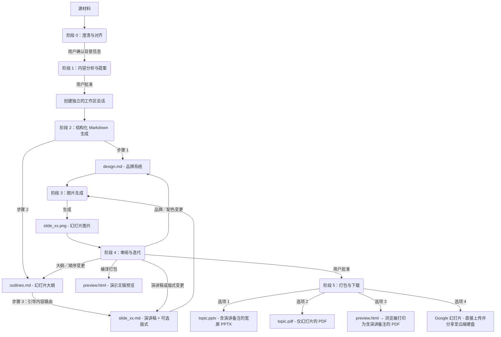

# Slide Gen Agent

[English (en)](README.md) | [繁體中文 (zh-TW)](README.zh-TW.md) | [简体中文 (zh-CN)](README.zh-CN.md) | [日本語 (ja)](README.ja.md) | [한국어 (ko)](README.ko.md)

`slide-gen-agent` 是一个对话式幻灯片生成器——只需与代理对话，就能将任何素材（文章、报告、大纲、原始笔记）转化为一份完整、视觉精美的演示文稿。描述您的需求、查看生成结果，并通过自然对话不断调整，直到演示文稿完全符合您的预期。

**核心能力：**
- **对话式与迭代式** — 告诉代理调整某张幻灯片的内容、更换配色，或在会话过程中重新规划整个大纲。改动会被精确应用，无需重新生成整套演示文稿。
- **内置演讲稿** — 每张幻灯片都配有一段完整的 1–2 分钟演讲稿，以自然的演讲者口吻撰写。演讲稿会嵌入 PPTX 的备注区域，并展示在预览页面中，让您上场前准备充分。
- **多语言支持** — 支持 100 多种语言，包括繁体中文、简体中文、英文、日语、韩语、泰语、越南语及其他亚洲文字体系，适用于幻灯片内容与演讲备注。可通过浏览器打印导出 PDF，在不依赖服务器端字体的情况下保留系统字体。
- **可直接交付的导出格式** — 可下载为 PPTX（含可编辑的演讲备注）、幻灯片 PDF、浏览器打印生成的演讲备注 PDF，或直接推送到 **Google 幻灯片**，立即在浏览器中进行演示与分享（含可编辑的演讲备注）。

本仓库的结构支持三种循序渐进的部署与使用方式，从轻量的提示词型技能到企业级生产环境代理皆涵盖在内。

---

## 📖 核心设计理念与逻辑

传统的 AI 幻灯片生成器在单一的黑盒步骤中同时完成排版与视觉设计，这往往导致设计风格不统一、格式混乱，以及粗糙的迭代流程——哪怕只是想微调某张幻灯片的结构，或整合修订后的演讲内容，通常都得重新生成整套演示文稿。

`slide-gen-agent` 采用**解耦的六阶段流程**，以纯文本中间文件作为骨架。每一项设计决策都保存在可编辑的 Markdown 文件中——因此您可以通过对话调整任意一层（全局样式、幻灯片结构，或单张幻灯片内容），而只有受影响的幻灯片会被重新生成。



### 六阶段流程

0. **阶段 0：澄清与对齐**
   - 在分析素材或提出设计风格之前，代理必须先确认演示文稿的三项核心背景信息：**预期演讲时长**（或幻灯片数量）、**目标受众**，以及**预期目标／成果**。
   - *代理会暂停并等待您的回复。* 如果初始请求中缺少其中任何一项，代理会在继续前先向您询问。

1. **阶段 1：内容分析与提案**
   - 代理会仔细阅读您的素材（文档、访谈记录、原始笔记），以理解内容所属的领域、语气，以及阶段 0 中确认的背景信息。
   - 随后会提出建议的**幻灯片数量**、**设计主题**，以及 **HEX 色值配色方案**。
   - *代理会暂停并等待您的回复。* 您可以接受该提案，或调整主题／配色方案。

2. **阶段 2：结构化 Markdown 生成**
   - 一旦获得确认，代理会在独立的会话文件夹中生成三类 Markdown 文件：
     - **`design.md`**：品牌系统——HEX 配色、间距与视觉风格规则。这是确保所有幻灯片品牌一致性的唯一可信来源（SSoT）。
     - **`outlines.md`**：完整的幻灯片清单，包含每张幻灯片的版式类型与 2–3 句摘要。
     - **`slide_xx.md`**：每张幻灯片各自的文件，包含标题、演讲稿（260–300 词），以及一个可选的 `## Layout` 区块（首次生成时留空——图像模型会根据幻灯片类型与演讲稿自行推断出合适的构图）。
   - *流程会直接进入阶段 3，不会暂停。*

3. **阶段 3：图片生成**
   - 代理会将 `design.md`（品牌规范）与 `slide_xx.md`（单张幻灯片规格）合并为每张幻灯片的结构化提示词。
   - 将其发送至图像生成模型，生成最终的 16:9 高保真 PNG 图片（`slide_xx.png`）。
   - *流程会直接进入阶段 4。*

4. **阶段 4：审阅与迭代**
   - 代理会将所有幻灯片图片与演讲备注编译成一个 `preview.html` 页面，并在对话中呈现预览链接与幻灯片图片。
   - *代理会暂停并等待您的反馈。*
   - 使用纯文字告诉代理需要修改什么。修改会被精确地应用——只有受影响的幻灯片会被重新生成：
     - 演讲稿或版式调整 → 更新相关的 `slide_xx.md` + 仅重新生成该张幻灯片。
     - 幻灯片顺序调整 / 新增 / 删除 → 更新 `outlines.md` + 受影响 of `slide_xx.md` 文件（包括转场与 Hook 重写）+ 仅重新生成已变更的幻灯片。
     - 品牌 / 配色变更 → 更新 `design.md` + 重新生成所有幻灯片。
   - 此循环会持续重复，直到您明确批准所有幻灯片。

5. **阶段 5：演示文稿打包与下载**
   - 一旦您批准最终的幻灯片，代理会提供四种导出选项：
     - **Google 幻灯片**：代理会将 PPTX 上传至 Google 云端硬盘，在 `slide-gen-agent` 文件夹中转换为 Google 幻灯片文件，并与您分享编辑权限。可直接在浏览器中打开进行演示与分享。*(注：幻灯片版式会以高解析度的静态图片呈现，而备注栏位中的演讲备注仍可完全编辑。需要在 GCP 中启用 Google Drive API，并在 Google Workspace 管理员控制台中配置域范围委派。)*
     - **PPTX（含演讲备注的 PowerPoint）**：宽屏 PowerPoint 文件，包含幻灯片图片，且演讲备注完全可编辑。文件名会使用演示文稿主题（例如 `ai-trends-2025.pptx`）。
     - **PDF：幻灯片**：由所有幻灯片图片编译而成的 PDF（适合直接进行演示）。文件名会使用演示文稿主题（例如 `ai-trends-2025.pdf`）。
     - **PDF：演讲备注**：打开 `preview.html` 链接并点击 **"Save as PDF"** 按钮。浏览器会使用您的本地系统字体，将每张幻灯片及其备注转译为干净、分页明确的 PDF——这能完美处理包括中日韩（CJK）与东南亚语系在内的所有语言，且完全不依赖服务器端的字体设置。

---

## 🛠️ 项目目录结构

```text
slide-gen-agent/
├── README.md                # 项目概览与设置（本文件）
├── deploy.sh                # 交互式自动化部署协调脚本
├── deploy/
│   └── terraform/           # 用于部署 GCP 资源的 Terraform 配置文件
│       ├── main.tf
│       ├── variables.tf
│       └── outputs.tf
├── skills/
│   └── slide-gen-agent/     # 🌟 标准独立 Agent Skill（适用于 Antigravity/Codex）
│       ├── SKILL.md         # Playbook/指引（YAML frontmatter + 说明）
│       ├── assets/          # Skill 使用的静态模板
│       │   ├── design.md    # 品牌系统模板（配色、字体、视觉风格）
│       │   ├── outlines.md  # 幻灯片大纲模板
│       │   └── slide_xx.md  # 单张幻灯片模板（标题、选用版面、演讲稿）
│       └── scripts/         # 随 Skill 打包的自定义工具
│           ├── pdf_exporter.py # 宽屏演示文稿 PDF 编译器
│           ├── pptx_exporter.py # 宽屏 PPTX 编译器（含演讲备注）
│           ├── notes_pdf_exporter.py # 结合幻灯片图片与演讲备注的 PDF 生成器
│           └── preview_generator.py # HTML 预览页面编译器（包含保存为 PDF）
└── adk_agent/               # 程序化 Host Agent（Python ADK 2.0 实现）
    ├── requirements.txt     # Python 依赖设置（包含 python-pptx 与 reportlab）
    ├── agent.py             # 主 Agent 入口点
    ├── config.py            # 环境变量与代理配置管理器
    └── tools/               # Agent 工具
        ├── __init__.py
        ├── file_manager.py  # 工作区会话初始化与文件写入工具
        ├── image_generation.py # Gemini 幻灯片图像生成工具
        ├── pdf_exporter.py  # 基于 Pillow 的宽屏 PDF 导出工具
        ├── pptx_exporter.py # 宽屏 PowerPoint (PPTX) 导出工具（含演讲备注）
        ├── notes_pdf_exporter.py # 结合幻灯片图片与演讲备注 of PDF 生成器
        ├── drive_exporter.py # Google 云端硬盘上传 → 转换为 Google 幻灯片并分享
        └── preview_generator.py # HTML 幻灯片预览与备注编译器（包含保存为 PDF）
```

---

## 🚀 安装与部署指南

请选择适合您目标环境的安装方法：

### 🔹 方法一：通用 Agent Skill (`SKILL.md`) — 平台无关
这是一个纯提示词／指引型的安装，不需要任何代码托管。
* **使用场景**：支持 Agent Skill、提供沙盒代码执行环境、且具备文本生成图像能力的 Agent Platform（例如 Antigravity、Codex）。
* **如何安装**：
  1. 将整个 `skills/slide-gen-agent/` 目录复制到您的 Agent Platform 的 skills 文件夹中。这能确保平台可以访问核心指南（`SKILL.md`）、`assets/` 中的静态模板以及 `scripts/` 中的自定义执行脚本（例如 PPTX 与 PDF 编译器）。
  2. 在您的 Agent Platform 中注册并启用该 skill。

---

### 🔹 方法二：Gemini Enterprise
此方法将代理部署为 Vertex AI Reasoning Engine 并连接至 Gemini Enterprise 控制台。

#### Option 1：一键安装 (One-Click Installation) (推荐)

> [!NOTE]
> 关于该脚本的前提条件、交互式配置与执行阶段的详细逐步说明，请参阅 [Deployment Script Details (英文)](deploy_details.md) 说明文档。
我们提供使用 **Terraform** 与配套 **协调脚本**（`deploy.sh`）的自动化生产级部署套件。这能完全自动化启用 API、创建 Google 云端硬盘委派服务账号、创建 GCS 会话存储桶、设置复杂的 IAM role 绑定、设置 Python 虚拟环境，以及在 Vertex AI 中注册代理。

##### 1. 前提条件
我们**强烈推荐**直接在 **[Google Cloud Shell](https://shell.cloud.google.com)** 中进行部署。它是浏览器中免费且已预先配置好的环境，所有必需的工具均已预装。

* **如果使用 Google Cloud Shell (推荐)**：
  - 所有工具（`gcloud` 与 `terraform`）均已预装。
  - 您只需要启用应用默认凭据 (ADC) 验证：
    ```bash
    gcloud auth application-default login
    ```

* **如果使用您的本地计算机**：
  - 您必须手动安装 [Google Cloud SDK](https://cloud.google.com/sdk/docs/install) 与 [Terraform CLI](https://developer.hashicorp.com/terraform/downloads)。
  - 您必须启用 gcloud CLI 与应用默认凭据 (ADC) 双重验证：
    ```bash
    gcloud auth login
    gcloud auth application-default login
    ```

##### 2. 执行部署
打开您的终端（或 Google Cloud Shell）并运行以下命令来克隆项目并启动交互式部署脚本：
```bash
git clone https://github.com/sylphlin/slide-gen-agent
cd slide-gen-agent
./deploy.sh
```

脚本将会引导您完成：
1. **交互式设置**：确认您的目标 GCP 项目 ID（Project ID）与地区（Region）。
2. **基础设施部署**：执行 Terraform 来设置 API、IAM 权限、GCS 存储桶与服务账号。
3. **环境变数设置**：自动在 `adk_agent/` 目录下生成含有项目配置的 `.env` 文件。
4. **代理打包与部署**：自动安装 Python 依赖包，并使用 ADK CLI 打包且注册代理为 Vertex AI Reasoning Engine。

完成后，脚本会输出您的 **Reasoning Engine 资源 ID**（例如 `projects/{PROJECT_NUMBER}/locations/{REGION}/reasoningEngines/{ENGINE_ID}`）。

##### 3. 部署后续设置
要完成集成，请手动执行以下两个步骤：

###### A. 设置域范围委派（Google Workspace 管理控制台）
这能让代理将生成的演示文稿直接上传到每位用户自己的 Google 云端硬盘：
1. 前往 [Google Workspace 管理控制台](https://admin.google.com)。
2. 进入 **安全性 → 访问和数据控制 → API 控制 → 域范围委派**。
3. 点击 **新增**，并输入：
   - **客户端 ID**：云端硬盘服务账号（Drive SA）的 OAuth2 客户端 ID。这会在 `deploy.sh` 脚本端显示，也可以在 Terraform 的输出中找到。
   - **OAuth 范围**：`https://www.googleapis.com/auth/drive.file`
4. 点击 **授权**。

###### B. 连接至 Gemini Enterprise 控制台
1. 登录 **Gemini Enterprise 管理控制台**。
2. 在左侧菜单中选择 **Agents**。
3. 点击 **+ 新增代理**。
4. 选择 **通过 Agent Engine 的自定义代理（Custom agent via Agent Engine）**，并贴上脚本输出的 **Reasoning Engine 资源 ID**。
5. 设置 IAM 验证权限以保护连接安全。

---

#### Option 2：手动安装 (Manual Installation)

> [!IMPORTANT]
> 如果您已经通过 **Option 1：一键安装 (One-Click Installation) (推荐)** 完成部署，可以完全跳过此手动安装章节。
如果您的组织政策限制使用 Terraform，或者您 prefer 使用 `gcloud` CLI 手动部署 GCP 资源，可以按照以下步骤进行。

##### Part A — 一次性项目设置
每个 GCP 项目只需执行一次。未来更新代理代码时不需要重复这些步骤。

###### 1. 启用 GCP API
请在您的 GCP 项目中启用以下必要 API：
- [Vertex AI API](https://console.cloud.google.com/apis/library/aiplatform.googleapis.com)
- [Google Drive API](https://console.cloud.google.com/apis/library/drive.googleapis.com)
- [Cloud Build API](https://console.cloud.google.com/apis/library/cloudbuild.googleapis.com)
- [Artifact Registry API](https://console.cloud.google.com/apis/library/artifactregistry.googleapis.com)

###### 2. 设置 IAM 权限
Reasoning Engine 会在 Google 管理的 **Vertex AI Reasoning Engine 服务代理**（`service-{PROJECT_NUMBER}@gcp-sa-aiplatform-re.iam.gserviceaccount.com`）下运行您的代码。此服务账号负责处理模型调用，但无法直接被注册为 Google Workspace 域范围委派。为了支持 Google 云端硬盘导出，您必须创建一个独立的由您管理的服务账号（`slide-gen-drive`），并授权运行期服务账号可以模拟扮演它。

请在终端中执行以下命令（将 `your-actual-gcp-project-id` 替换为您的实际项目 ID）：

```bash
export GOOGLE_CLOUD_PROJECT="your-actual-gcp-project-id"

PROJECT_NUMBER=$(gcloud projects describe $GOOGLE_CLOUD_PROJECT --format="value(projectNumber)")

# 运行期服务账号：运行您代理代码的 Google 管理身份
RUNTIME_SA="service-${PROJECT_NUMBER}@gcp-sa-aiplatform-re.iam.gserviceaccount.com"

# 构建服务账号：在 'adk deploy' 期间用于容器镜像构建与日志
BUILD_SA="${PROJECT_NUMBER}-compute@developer.gserviceaccount.com"

# 1. 创建云端硬盘服务账号
gcloud iam service-accounts create slide-gen-drive \
  --display-name="Slide Gen Drive Exporter" \
  --project=$GOOGLE_CLOUD_PROJECT

DRIVE_SA="slide-gen-drive@${GOOGLE_CLOUD_PROJECT}.iam.gserviceaccount.com"

# 2. 授予运行期服务账号 Vertex AI 访问权限
gcloud projects add-iam-policy-binding $GOOGLE_CLOUD_PROJECT \
  --member="serviceAccount:$RUNTIME_SA" \
  --role="roles/aiplatform.user"

# 3. 授予运行期服务账号 GCS 存储桶访问权限
gcloud projects add-iam-policy-binding $GOOGLE_CLOUD_PROJECT \
  --member="serviceAccount:$RUNTIME_SA" \
  --role="roles/storage.objectUser"

# 4. 授予构建服务账号日志记录与 container 注册表访问权限
gcloud projects add-iam-policy-binding $GOOGLE_CLOUD_PROJECT \
  --member="serviceAccount:$BUILD_SA" \
  --role="roles/logging.logWriter"

gcloud projects add-iam-policy-binding $GOOGLE_CLOUD_PROJECT \
  --member="serviceAccount:$BUILD_SA" \
  --role="roles/artifactregistry.writer"

# 5. 允许运行期服务账号模拟扮演云端硬盘服务账号（签署 JWT）
# 请注意：方向至关重要。此角色是绑定在云端硬盘服务账号资源本身。
gcloud iam service-accounts add-iam-policy-binding $DRIVE_SA \
  --member="serviceAccount:${RUNTIME_SA}" \
  --role="roles/iam.serviceAccountTokenCreator" \
  --project=$GOOGLE_CLOUD_PROJECT
```

###### 3. 创建 Cloud Storage 存储桶
在您的目标地区创建一个私有 GCS 存储桶以存储会话文件：
```bash
gcloud storage buckets create gs://slide-gen-sessions-your-actual-gcp-project-id --location=us-central1
```

###### 4. 设置域范围委派（Google Workspace 管理控制台）
1. 前往 [Google Workspace 管理控制台](https://admin.google.com)。
2. 进入 **安全性 → 访问和数据控制 → API 控制 → 域范围委派**。
3. 点击 **新增**，并输入：
   - **客户端 ID**：`slide-gen-drive` 服务账号的 OAuth2 客户端 ID。可在 GCP 控制台的 IAM 服务账号页面中，该服务账号的 **详细资料** 分页下找到。
   - **OAuth 范围**：`https://www.googleapis.com/auth/drive.file`
4. 点击 **授权**。

##### Part B — 安装与部署
每次您想更新代理代码时重复这些步骤。

###### 1. 准备本地环境与依赖包
在根目录 `slide-gen-agent` 中执行：
```bash
python3 -m venv venv
source venv/bin/activate
pip install "google-adk[gcp]" -r adk_agent/requirements.txt
```

###### 2. 配置环境变量
在 `adk_agent` 目录内建立一个 `.env` 文件以存储目标项目 ID 与服务账号邮箱：
```bash
cat > adk_agent/.env <<EOF
GOOGLE_CLOUD_PROJECT="your-actual-gcp-project-id"
DRIVE_SA_EMAIL="slide-gen-drive@your-actual-gcp-project-id.iam.gserviceaccount.com"
EOF
```

###### 3. 部署至 Vertex AI
在 `adk_agent` 目录中执行 ADK 部署工具：
```bash
cd adk_agent
adk deploy agent_engine \
  --project=your-actual-gcp-project-id \
  --region=us-central1 \
  --display_name="slide-gen-agent" \
  --artifact_service_uri="gs://slide-gen-sessions-your-actual-gcp-project-id" \
  .
```
*记下生成的 **Reasoning Engine 资源 ID**。*

###### 4. 连接至 Gemini Enterprise 控制台
1. 登录 **Gemini Enterprise 管理控制台**。
2. 前往 **Agents** -> **+ 新增代理**。
3. 选择 **通过 Agent Engine 的自定义代理（Custom agent via Agent Engine）**，并贴上您的 **Reasoning Engine 资源 ID**。
4. 设置 IAM 验证权限以保护连接安全。