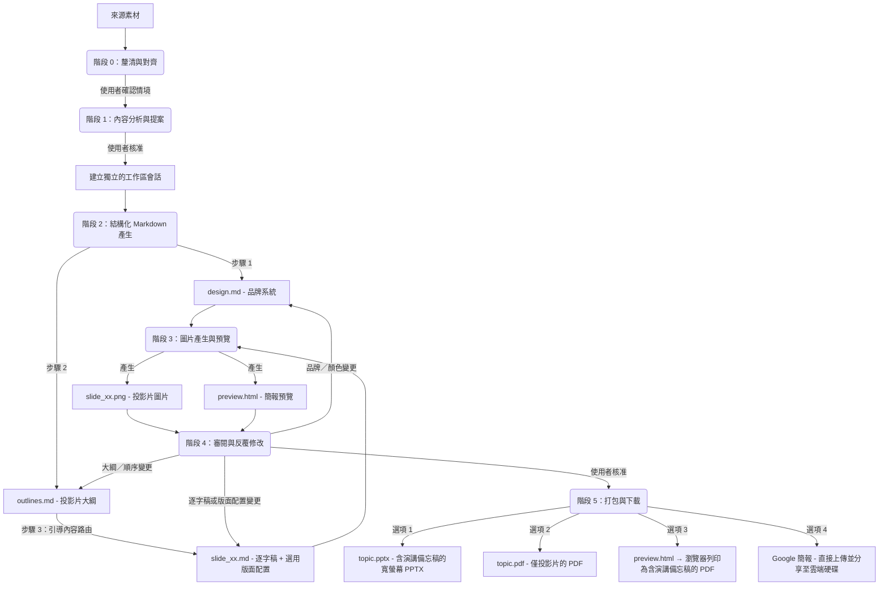

# Slide Gen Agent

[English (en)](README.md) | [繁體中文 (zh-TW)](README.zh-TW.md) | [简体中文 (zh-CN)](README.zh-CN.md) | [日本語 (ja)](README.ja.md) | [한국어 (ko)](README.ko.md)

`slide-gen-agent` 是一個對話式投影片簡報產生器——只要與代理人對話，就能將任何來源素材（文章、報告、大綱、原始筆記）轉換成完整、視覺精緻的簡報。描述你想要的內容、檢視產出結果，並透過自然對話反覆調整，直到簡報完全符合你的需求。

**核心能力：**
- **對話式與反覆運算** — 告訴代理人調整某張投影片的內容、更換顏色，或是在會話中途重新規劃整個大綱。變更會被精準套用，不需要重新產生整份簡報。
- **內含演講稿** — 每張投影片都附有完整的 1–2 分鐘演講逐字稿，以自然的講者口吻撰寫。逐字稿會內嵌在 PPTX 的備忘稿區段中，並包含在預覽頁面內，讓你上場前做好萬全準備。
- **多語言支援** — 支援 100 多種語言，包括繁體中文、簡體中文、英文、日文、韓文、泰文、越南文及其他亞洲文字系統，適用於投影片內容與演講備忘稿。可透過瀏覽器列印匯出 PDF，在不依賴伺服器端字型的情況下保留系統字型。
- **可直接交付的匯出格式** — 可下載為 PPTX（內嵌演講備忘稿）、PDF 投影片、瀏覽器列印的演講備忘稿 PDF，或直接推送至 **Google 簡報**，立即在瀏覽器中編輯與分享。

本儲存庫的結構支援三種漸進式的部署與使用方式，從輕量的提示詞型技能到企業級正式環境代理皆涵蓋在內。

---

## 📖 核心設計理念與邏輯

傳統的 AI 投影片產生器在單一黑盒步驟中同時完成版面配置與視覺設計，這往往導致設計不一致、格式混亂，以及粗糙的反覆運算流程——只是想微調單張投影片的結構，或是整合修訂後的演講內容，通常都得重新產生整份簡報。

`slide-gen-agent` 採用**解耦的六階段流程**，以純文字中介檔案作為骨幹。每個設計決策都存在於可編輯的 Markdown 檔案中——因此你可以透過對話調整任何一層（全域樣式、投影片結構，或單張投影片內容），而只有受影響的投影片會被重新產生。



### 六階段流程

0. **階段 0：釐清與對齊**
   - 在開始分析來源素材或提出設計風格之前，代理人必須先確認簡報的三項核心情境要素：**預期簡報時長**（或投影片數量）、**目標受眾**，以及**預期目標／成果**。
   - *代理人會暫停並等待你的回覆。* 如果初始請求中缺少其中任何一項，代理人會在繼續之前先詢問你。

1. **階段 1：內容分析與提案**
   - 代理人會仔細閱讀你的來源素材（文件、逐字稿、原始筆記），以理解內容的領域、語氣，以及階段 0 中確認的情境。
   - 接著提出建議的**投影片數量**、**設計主題**，以及 **HEX 色碼配色方案**。
   - *代理人會暫停並等待你的回覆。* 你可以接受此提案，或調整主題／配色方案。

2. **階段 2：結構化 Markdown 產生**
   - 一旦獲得核准，代理人會在獨立的會話資料夾中產生三種類型的 Markdown 檔案：
     - **`design.md`**：品牌系統——HEX 色彩配色、字體排印、間距與視覺風格規則。這是確保所有投影片品牌一致性的單一事實來源（SSoT）。
     - **`outlines.md`**：完整的投影片清單，含每張投影片的版面配置類型與 2–3 句摘要。
     - **`slide_xx.md`**：每張投影片各自的檔案，含標題、演講逐字稿（260–300 字），以及一個選用的 `## Layout` 區段（首次產生時留空——影像模型會根據投影片類型與逐字稿自行推斷出合適的構圖）。
   - *流程會直接進入階段 3，不會暫停。*

3. **階段 3：圖片產生與預覽**
   - 代理人會將 `design.md`（品牌規範）與 `slide_xx.md`（單張投影片規格）合併成結構化提示詞，供每張投影片使用。
   - 接著將其送至影像產生模型，產出最終的 16:9 高保真 PNG 圖片（`slide_xx.png`）。
   - 所有投影片圖片與演講備忘稿會被彙整成一份 `preview.html` 頁面，方便檢視。
   - *流程會直接進入階段 4。*

4. **階段 4：審閱與反覆修改**
   - *代理人會暫停並等待你的回饋。*
   - 用自然語言告訴代理人要修改什麼。變更會被精準套用——只有受影響的投影片會被重新產生：
     - 逐字稿或版面配置調整 → 更新對應的 `slide_xx.md` 並只重新產生該張投影片
     - 投影片重新排序／新增／刪除 → 更新 `outlines.md` 與受影響的 `slide_xx.md` 檔案（包含改寫銜接與引導段落），並只重新產生有變動的投影片
     - 品牌／顏色變更 → 更新 `design.md` 並重新產生所有投影片
   - 此循環會持續進行，直到你明確核准所有投影片為止。

5. **階段 5：簡報打包與下載**
   - 一旦你核准最終的投影片，代理人會提供四種匯出選項：
     - **Google 簡報**：代理人會將 PPTX 上傳到 Google 雲端硬碟中的 `slide-gen-agent` 資料夾，轉換成 Google 簡報檔案，並以編輯者身分與你分享。會直接以 Google 簡報開啟，方便立即編輯與分享。*（需要在 GCP 中啟用 Google Drive API，並在 Google Workspace 管理控制台中設定網域範圍委派。）*
     - **PPTX（含演講備忘稿的 PowerPoint）**：寬螢幕 PowerPoint 檔案，內含投影片圖片，演講備忘稿完整內嵌於每張投影片的 PowerPoint 備忘稿區段中。檔名會使用簡報主題（例如 `ai-trends-2025.pptx`）。
     - **PDF：投影片**：由所有投影片圖片彙整而成的 PDF（適合直接用於簡報）。檔名會使用簡報主題（例如 `ai-trends-2025.pdf`）。
     - **PDF：演講備忘稿**：開啟 `preview.html` 連結，並點擊 **「Save as PDF」** 按鈕。瀏覽器會將每張投影片及其備忘稿渲染成乾淨、分頁排版的 PDF，並使用你本機的系統字型——這能正確處理包含 CJK 與東南亞文字在內的所有語言，且不需要任何伺服器端字型相依性。

---

## 🛠️ 目錄結構

```text
slide-gen-agent/
├── README.md                # 專案概覽與安裝說明（本檔案）
├── skills/
│   └── slide-gen-agent/     # 🌟 標準獨立式代理技能（適用於 Antigravity/Codex）
│       ├── SKILL.md         # 操作手冊／準則（YAML 前置資料 + 操作指引）
│       ├── assets/          # 技能所附帶的靜態範本
│       │   ├── design.md    # 品牌系統範本（顏色、字體排印、視覺風格）
│       │   ├── outlines.md  # 簡報大綱範本
│       │   └── slide_xx.md  # 單張投影片範本（標題、選用版面配置、逐字稿）
│       └── scripts/         # 隨技能附帶的自訂工具
│           ├── pdf_exporter.py # 寬螢幕簡報 PDF 編譯工具
│           ├── pptx_exporter.py # 含演講備忘稿的寬螢幕 PPTX 編譯工具
│           └── preview_generator.py # HTML 預覽頁面編譯工具（含 Save as PDF 功能）
└── adk_agent/               # 程式化主代理人（Python ADK 2.0 實作）
    ├── requirements.txt     # Python 相依套件設定（包含 python-pptx 與 reportlab）
    ├── agent.py             # 代理人主要進入點
    └── tools/               # 代理人工具
        ├── __init__.py
        ├── file_manager.py  # 會話初始化與檔案寫入工具
        ├── imagen.py        # Gemini 投影片圖片產生工具
        ├── pdf_exporter.py  # 基於 Pillow 的寬螢幕 PDF 匯出工具
        ├── pptx_exporter.py # 含演講備忘稿的 PowerPoint 寬螢幕（PPTX）匯出工具
        ├── drive_exporter.py # Google 雲端硬碟上傳 → Google 簡報轉換與分享工具
        └── preview_generator.py # HTML 投影片預覽與備忘稿編譯工具（含 Save as PDF 功能）
```

---

## 🚀 安裝與部署方式

請選擇符合你目標環境的安裝方式：

### 🔹 方式一：通用技能（`SKILL.md`）— 跨平台通用
這是純粹基於提示詞／準則的安裝方式，不需要代管任何程式碼。
* **適用情境**：支援 Agent Skills、提供沙箱化程式碼執行環境，且具備文字轉圖片產生能力的 LLM 系統（例如 Antigravity、Codex）。
* **安裝方式**：
  1. 將 [SKILL.md](file:///Users/sylph/Documents/Antigravity/slide-gen-agent/skills/slide-gen-agent/SKILL.md) 的內容匯入或複製到你的 LLM 助理的自訂系統指令或系統提示詞中。
  2. 將 `skills/slide-gen-agent/templates/` 目錄中的 Markdown 檔案作為範例，供助理參考。

---

### 🔹 方式二：部署至 Agent Engine（Gemini Enterprise）正式環境
將此 Python 代理人部署為 Vertex AI 上的 Reasoning Engine（Agent Engine）執行個體，並直接串接至 **Gemini Enterprise**。

---

#### 第 A 部分 — 一次性專案設定
每個 GCP 專案只需執行一次。未來重新安裝或重新部署時不需要重複這些步驟。

##### 1. 啟用 GCP API
請在你的 GCP 專案中啟用以下 API：
- [Vertex AI API](https://console.cloud.google.com/apis/library/aiplatform.googleapis.com)
- [Google Drive API](https://console.cloud.google.com/apis/library/drive.googleapis.com)

##### 2. 設定 IAM 權限

Agent Engine 會在 **Vertex AI Reasoning Engine 服務代理**（`service-{PROJECT_NUMBER}@gcp-sa-aiplatform-re.iam.gserviceaccount.com`）下執行你的程式碼。這個由 Google 管理的服務帳號負責處理 Vertex AI 與 GCS 的存取，但**無法**直接被註冊為網域範圍委派（DWD）。為了支援 Google 雲端硬碟匯出，你需要建立另一個由你管理的服務帳號（`slide-gen-drive`），並讓執行階段服務帳號可以模擬扮演它。

```bash
export GOOGLE_CLOUD_PROJECT="your-actual-gcp-project-id"

PROJECT_NUMBER=$(gcloud projects describe $GOOGLE_CLOUD_PROJECT --format="value(projectNumber)")

# 執行階段服務帳號：執行你代理人程式碼的 Google 管理身分
RUNTIME_SA="service-${PROJECT_NUMBER}@gcp-sa-aiplatform-re.iam.gserviceaccount.com"

# 建置服務帳號：僅在 `adk deploy` 期間用於容器映像推送與建置紀錄
BUILD_SA="${PROJECT_NUMBER}-compute@developer.gserviceaccount.com"

# 雲端硬碟服務帳號：由你建立並擁有、註冊為 DWD 用的使用者管理服務帳號
gcloud iam service-accounts create slide-gen-drive \
  --display-name="Slide Gen Drive Exporter" \
  --project=$GOOGLE_CLOUD_PROJECT
DRIVE_SA="slide-gen-drive@${GOOGLE_CLOUD_PROJECT}.iam.gserviceaccount.com"

# 必要：呼叫 Vertex AI 模型與 Gemini 圖片產生功能
gcloud projects add-iam-policy-binding $GOOGLE_CLOUD_PROJECT \
  --member="serviceAccount:$RUNTIME_SA" \
  --role="roles/aiplatform.user"

# 必要：讀寫投影片、預覽檔與匯出檔至你的 GCS 儲存桶
gcloud projects add-iam-policy-binding $GOOGLE_CLOUD_PROJECT \
  --member="serviceAccount:$RUNTIME_SA" \
  --role="roles/storage.objectUser"

# 必要：允許執行階段服務帳號以雲端硬碟服務帳號的身分簽署 JWT（供 DWD 使用）。
# 請注意，這裡的方向與上方／下方的專案層級綁定「相反」：
# 雲端硬碟服務帳號是資源本身（`service-accounts add-iam-policy-binding $DRIVE_SA`），
# 而執行階段服務帳號則是被授予該資源上角色的 `--member`——順序不能顛倒。
# 顛倒過來會讓雲端硬碟服務帳號取得模擬扮演專案中「任何」服務帳號的權限
# （這是錯誤的設定，且無法修正 signJwt 404 錯誤）。
gcloud iam service-accounts add-iam-policy-binding $DRIVE_SA \
  --member="serviceAccount:${RUNTIME_SA}" \
  --role="roles/iam.serviceAccountTokenCreator" \
  --project=$GOOGLE_CLOUD_PROJECT

# adk deploy 所需：建置紀錄與容器映像推送
gcloud projects add-iam-policy-binding $GOOGLE_CLOUD_PROJECT \
  --member="serviceAccount:$BUILD_SA" \
  --role="roles/logging.logWriter"
gcloud projects add-iam-policy-binding $GOOGLE_CLOUD_PROJECT \
  --member="serviceAccount:$BUILD_SA" \
  --role="roles/artifactregistry.writer"
```

> **注意**：如果同一個角色 + 成員的綁定已經存在——無論它是否帶有條件（例如其他設定流程如 Cloud Build 留下的殘留綁定）——`gcloud` 會提示你選擇如何套用新的綁定：
> ```
>  [1] EXPRESSION=request.time < timestamp(...), TITLE=cloudbuild-connection-setup
>  [2] None
>  [3] Specify a new condition
> ```
> 請選擇 **`[2] None`**——上述綁定必須是無條件的，這樣代理人才能始終擁有這些權限。

> **注意**：雲端硬碟服務帳號的綁定指令（`gcloud iam service-accounts add-iam-policy-binding $DRIVE_SA ...`）是這份腳本中**唯一方向相反**的綁定。其他每一道指令都是把某個服務帳號的角色授予在「專案」層級（`gcloud projects add-iam-policy-binding $GOOGLE_CLOUD_PROJECT --member="serviceAccount:<SA>" ...`）。而這一道指令則是把角色授予在「雲端硬碟服務帳號自身」這個資源上，給執行階段服務帳號（`gcloud iam service-accounts add-iam-policy-binding $DRIVE_SA --member="serviceAccount:$RUNTIME_SA" ...`）。如果你不小心把專案層級的模式套用在這裡——也就是在「專案」層級把 `roles/iam.serviceAccountTokenCreator` 授予給 `$DRIVE_SA`——雲端硬碟服務帳號最終會變成可以模擬扮演專案中「任何」服務帳號（範圍大很多且是錯誤的授權），而執行階段服務帳號仍然沒有權限去模擬扮演雲端硬碟服務帳號，導致 Google 雲端硬碟匯出持續出現 `[step:signJwt] HTTP 404` 錯誤。執行 `gcloud iam service-accounts get-iam-policy $DRIVE_SA` 來確認綁定是否確實落在雲端硬碟服務帳號這個資源上（你應該會看到 `roles/iam.serviceAccountTokenCreator`，且成員為 `$RUNTIME_SA`）。


##### 3. 設定網域範圍委派（Google Workspace 管理控制台）
這能讓代理人將產生的簡報直接上傳到每位使用者自己的 Google 雲端硬碟。

1. 前往 [Google Workspace 管理控制台](https://admin.google.com)，進入 **安全性 → API 控制項 → 網域範圍委派**。
2. 點擊 **新增**，並輸入：
   - **用戶端 ID**：**雲端硬碟服務帳號**（`slide-gen-drive@{PROJECT_ID}.iam.gserviceaccount.com`）的 OAuth 2 用戶端 ID。可在 [IAM 服務帳號頁面](https://console.cloud.google.com/iam-admin/serviceaccounts) 中選擇 `slide-gen-drive` → **詳細資料** 分頁找到。
   - **OAuth 範圍**：`https://www.googleapis.com/auth/drive.file`
3. 點擊 **授權**。

---

#### 第 B 部分 — 安裝與部署
每次全新安裝或重新部署時都需要重複以下步驟。

##### 1. 安裝相依套件
從根目錄 `slide-gen-agent` 設定虛擬環境：
```bash
python3 -m venv venv
source venv/bin/activate
cd adk_agent
pip install "google-adk[gcp]" google-genai Pillow python-dotenv
```

##### 2. 設定環境變數
在 `adk_agent` 目錄內建立一個 `.env` 檔案，這樣它會被打包進部署容器中，並在啟動時載入。**這是必要的**——已部署的執行環境無法可靠地自動偵測你的專案 ID（不同的代管環境會解析出不同的錯誤值，例如數字格式的專案編號或不相關的承租戶專案），錯誤的值會同時導致模型呼叫失敗，以及匯出功能所使用的雲端硬碟服務帳號電子郵件地址出錯：
```bash
export GOOGLE_CLOUD_PROJECT="your-actual-gcp-project-id"

cat > .env <<EOF
GOOGLE_CLOUD_PROJECT="$GOOGLE_CLOUD_PROJECT"
EOF
```

##### 3. 部署
在 `adk_agent` 目錄中執行 ADK 部署工具。代理人會使用 `.env` 中的 `GOOGLE_CLOUD_PROJECT`，將雲端硬碟服務帳號解析為 `slide-gen-drive@{PROJECT_ID}.iam.gserviceaccount.com`：
```bash
adk deploy agent_engine \
  --project=$GOOGLE_CLOUD_PROJECT \
  --region=us-central1 \
  --display_name="slide-gen-agent" \
  --artifact_service_uri="gs://your-runtime-bucket" \
  .
```
*ADK CLI 會處理容器化、部署暫存與 Reasoning Engine 註冊。完成後，它會輸出你的 **Reasoning Engine 資源 ID**（例如 `projects/{PROJECT_NUMBER}/locations/us-central1/reasoningEngines/{ENGINE_ID}`）。*

##### 4. 連接至 Gemini Enterprise 控制台
1. 登入 **Gemini Enterprise 管理控制台**。
2. 在左側選單中選擇 **Agents**。
3. 點擊 **+ 新增代理人**。
4. 選擇 **透過 Agent Engine 的自訂代理人（Custom agent via Agent Engine）**，並輸入你的 **Reasoning Engine 資源 ID**。
5. 設定 IAM 驗證權限以保護連線安全。
