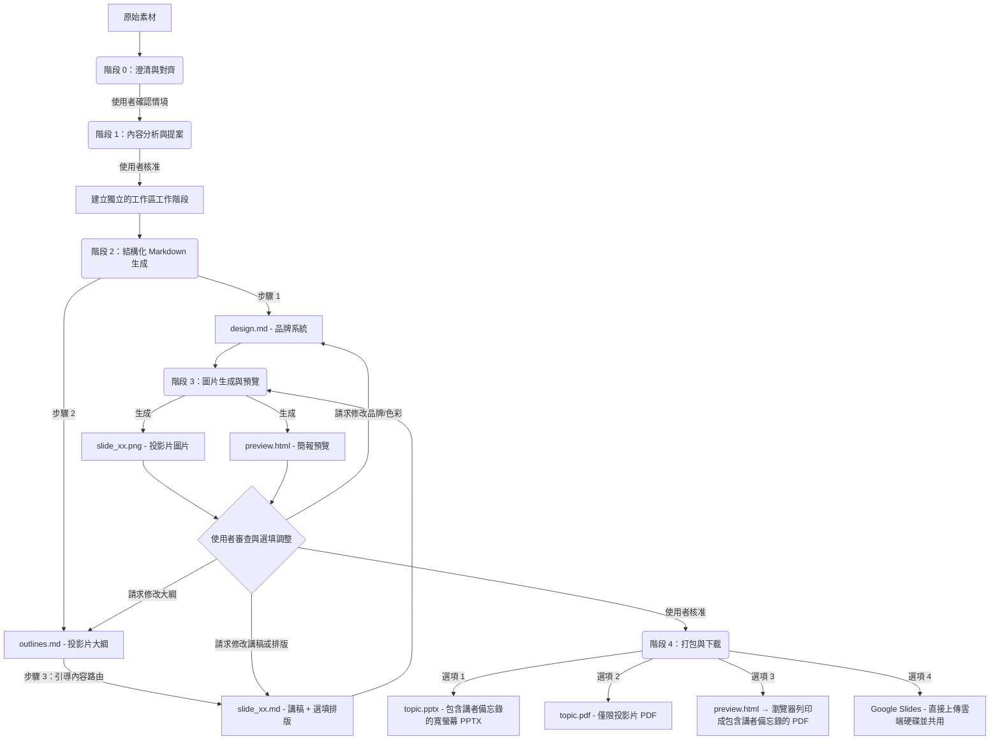

# Slide Gen Agent

[English](README.md) | [繁體中文 (zh-TW)](README.zh-TW.md) | [简体中文 (zh-CN)](README.zh-CN.md) | [日本語 (ja)](README.ja.md) | [한국어 (ko)](README.ko.md)

`slide-gen-agent` 是一款對話式簡報生成器 — 只要與 Agent 對話，就能將任何素材（文章、報告、大綱、原始筆記）轉換為完整且視覺精美的簡報。描述您的需求、審查輸出，並透過自然對話進行微調，直到簡報完全符合您的預期。

**關鍵功能：**
- **對話式與疊代式調整** — 告訴 Agent 調整投影片內容、更換顏色，或在過程中重構整個大綱。修改是局部且精確套用的，無需重新生成整份簡報。
- **內建講者講稿** — 每張投影片都配有完整的 1–2 分鐘口頭講稿，以自然的演講者口氣撰寫。講稿會嵌入到 PPTX 的備忘錄區域中，並包含在預覽頁面中，讓您做好充足的準備登台。
- **多國語言支援** — 支援任何語言的內容與講者備忘錄，包括中日韓（CJK）與東南亞語系。可透過瀏覽器列印功能匯出為 PDF，以保留系統字型，而無需依賴伺服器端字型。
- **生產就緒的匯出選項** — 下載為 PPTX（內建講者備忘錄）、PDF 投影片、瀏覽器列印的講稿 PDF，或直接推送到 **Google Slides** 進行即時瀏覽器編輯與分享。

此儲存庫的結構支援三種漸進式的部署與使用方法，從輕量級基於 Prompt 的 Skill 到生產級的企業級 Agent。

---

## 📖 核心設計理念與邏輯

傳統的 AI 簡報生成器會在單一黑盒子步驟中建立排版與視覺效果，這通常會導致設計不一致、排版隨機，且無法在不重新生成整個簡報的情況下微調單個投影片。

`slide-gen-agent` 採用**解耦的五階段流程**，並以純文字的中間檔案作為主幹。每個設計決策都存在於可編輯的 Markdown 檔案中 — 因此您可以透過對話微調任何層面（全域樣式、投影片結構或單張投影片內容），且只有受影響的投影片才會重新生成。



### 五階段流程

0. **階段 0：澄清與對齊 (Clarification & Alignment)**
   - 在處理原始素材之前，Agent 會先確認三個核心情境要素：**預期簡報時間**（或投影片張數）、**目標觀眾**，以及**預期目標/成果**。
   - *Agent 會暫停並等待您的回覆。* 如果您初始的請求中缺少其中任何一項，Agent 會在繼續之前向您詢問。

1. **階段 1：內容分析與提案 (Content Analysis & Proposal)**
   - Agent 會閱讀您的原始素材（文件、逐字稿、原始筆記），以理解該領域、語調和目標觀眾。
   - 它會提議**投影片張數**、**設計主題**以及 **Hex 顏色代碼調色盤**。
   - *Agent 會暫停並等待您的回覆。* 您可以接受提案，或調整主題/調色盤。

2. **階段 2：結構化 Markdown 生成 (Structured Markdown Generation)**
   - 獲得核准後，Agent 會在獨立的工作階段資料夾中生成三種 Markdown 檔案：
     - **`design.md`**：品牌系統 — Hex 顏色調色盤、字型、間距和視覺樣式規則。這是確保所有投影片品牌一致性的唯一事實來源 (SSoT)。
     - **`outlines.md`**：完整的投影片清單，包含排版類型與每張投影片 2–3 句的摘要。
     - **`slide_xx.md`**：單張投影片檔案，包含標題、講者講稿（260–300 字）和選填的 `## Layout` 區段（首次生成時留空 — 圖片模型會根據投影片類型與講稿自動推導合適的版面）。
   - *流程會直接進入階段 3，不會暫停。*

3. **階段 3：圖片生成與預覽 (Image Generation & Preview)**
   - Agent 會將 `design.md`（品牌）和 `slide_xx.md`（單張投影片規格）結合，為每張投影片建立結構化 Prompt。
   - 它會將此 Prompt 發送至圖片生成模型，以產生最終的 16:9 高保真 PNG (`slide_xx.png`)。
   - 所有投影片圖片與講者備忘錄會被編譯成 `preview.html` 頁面，以便於審查。
   - *Agent 會暫停並等待您的審查。*
   - **如何進行疊代調整**：以簡明自然的語言告訴 Agent 需要修改的地方。修改講稿會更新 `slide_xx.md`；修改排版（例如「將投影片 3 改為雙欄，圖表放右邊」）會填入 `## Layout` 區段；修改顏色或品牌則會更新 `design.md`。只有受影響的投影片才會重新生成。

4. **階段 4：簡報打包與下載 (Presentation Packaging & Download)**
   - 當您核准最終投影片後，Agent 會提供四種匯出選項：
     - **PPTX（包含講者備忘錄的 PowerPoint 檔案）**：寬螢幕 PowerPoint 檔案，包含投影片圖片，並將講者講稿完整嵌入至每張投影片的備忘錄區域。檔名會使用簡報主題（例如 `ai-trends-2025.pptx`）。
     - **PDF: 僅限投影片**：由所有投影片圖片編譯而成的 PDF（適合直接進行簡報）。檔名會使用簡報主題（例如 `ai-trends-2025.pdf`）。
     - **PDF: 包含講者備忘錄**：開啟 `preview.html` 連結並點擊 **"Save as PDF"** 按鈕。瀏覽器將使用您的本機系統字型，將每張投影片及其備忘錄轉譯為乾淨、分頁的 PDF — 這能正確處理包括 CJK 和東南亞語系在內的所有語言，而不需要任何伺服器端字型依賴。
     - **Google Slides**：Agent 會將 PPTX 上傳到 Google 雲端硬碟中的 `slide-gen-agent` 資料夾，並以編輯者權限與您共用。可在 Google Slides 中直接開啟以進行即時編輯與分享。*(需要在 GCP 中啟用 Google Drive API，並在服務帳戶上設定雲端硬碟寫入權限。)*

---

## 🛠️ 目錄結構

```text
slide-gen-agent/
├── README.md                # 專案概覽與安裝說明（本檔案）
├── skills/
│   └── slide-gen-agent/     # 🌟 標準獨立 Agent Skill（適用於 Antigravity/Codex）
│       ├── SKILL.md         # 執行指南/準則（YAML frontmatter + 指令說明）
│       ├── assets/          # Skill 使用的靜態範本
│       │   ├── design.md    # 品牌系統範本（色彩、字型、視覺樣式）
│       │   ├── outlines.md  # 簡報大綱範本
│       │   └── slide_xx.md  # 單張投影片範本（標題、選填排版、講稿）
│       └── scripts/         # Skill 附帶的自訂工具
│           ├── pdf_exporter.py # 寬螢幕簡報 PDF 編譯器
│           ├── pptx_exporter.py # 包含講者備忘錄的寬螢幕 PPTX 編譯器
│           └── preview_generator.py # HTML 預覽頁面編譯器（包含 Save as PDF）
└── adk_agent/               # 程式化主機 Agent（Python ADK 2.0 實作）
    ├── requirements.txt     # Python 依賴設定（包含 python-pptx & reportlab）
    ├── agent.py             # Agent 主要進入點
    └── tools/               # Agent 工具
        ├── __init__.py
        ├── file_manager.py  # 工作階段初始化與檔案寫入工具
        ├── imagen.py        # Gemini 投影片圖片生成工具
        ├── pdf_exporter.py  # 基於 Pillow 的寬螢幕 PDF 匯出工具
        ├── pptx_exporter.py # 包含講者備忘錄的 PowerPoint 寬螢幕 (PPTX) 匯出工具
        ├── drive_exporter.py # Google 雲端硬碟上傳 → Google Slides 轉換與共用工具
        └── preview_generator.py # HTML 投影片預覽與備忘錄編譯器（包含 Save as PDF）
```

---

## 🚀 安裝與部署方法

選擇符合您目標環境的安裝方法：

### 🔹 方法 1：通用 Skill (`SKILL.md`) — 平台無關
這是一種純粹基於 Prompt/指引的安裝方式，不需要託管任何程式碼。
* **使用場景**：通用的 LLM 系統（如 Antigravity、Codex 或具備圖片生成能力的标准對話助理）。
* **如何安裝**：
  1. 將 [SKILL.md](file:///Users/sylph/Documents/Antigravity/slide-gen-agent/skills/slide-gen-agent/SKILL.md) 的內容匯入或複製到您的 LLM 助理的自訂系統指令或系統 Prompt 中。
  2. 參考 `skills/slide-gen-agent/templates/` 目錄中的 Markdown 檔案，作為助理遵循的範例。

---

### 🔹 方法 2：透過 ADK Web 進行本機驗證（推薦用於測試）
在您的電腦上本機運行具備完整功能的 Python Agent，並配有視覺化的 Web UI。這比標準的命令列介面更容易測試與驗證。

#### 1. 前提條件
- **Python 3.10** (推薦 v3.11)
- 您的電腦上已安裝並驗證 **Google Cloud SDK (gcloud)**。
- 擁有已啟用 **Vertex AI API** 的 **Google Cloud 專案 (GCP)**。
- 已設定本機 IAM 憑證 (`gcloud auth application-default login`)。

#### 2. 專案安裝
在 **根** `slide-gen-agent` 目錄中建立虛擬環境（在根目錄而不是 `adk_agent` 中建立虛擬環境可以防止其在部署過程中被暫存），然後啟用它並安裝依賴項：
```bash
# 導覽至 slide-gen-agent 根目錄：
python3 -m venv venv
source venv/bin/activate

# 導覽至 adk_agent 目錄並安裝依賴項：
cd adk_agent
pip install "google-adk[gcp]" google-genai Pillow python-dotenv
```

#### 3. 設定環境變數
在本機運行之前，您必須將 Google Cloud 專案 ID 設定為環境變數：
```bash
export GOOGLE_CLOUD_PROJECT="your-actual-gcp-project-id"
```
或者，您可以在 `adk_agent` 資料夾內建立一個 `.env` 檔案來指定您的 GCP 專案 ID（其他設定如位置預設為 `'global'`，成品目錄自動預設為 `./artifacts`）：
```text
GOOGLE_CLOUD_PROJECT="your-actual-gcp-project-id"
```

#### 4. 以 Web UI 模式執行
從 `adk_agent` 目錄啟動本機網頁介面（包含 `--allow_origins="*"` 旗標以確保其在本機電腦和 Google Cloud Shell 中皆能無縫運行）：
```bash
# 確保您位於 adk_agent 目錄內，且虛擬環境已啟用：
adk web --allow_origins="*" .
```
這將啟動本機伺服器。在瀏覽器中開啟提供的 URL，即可與 Agent 進行視覺化互動！

---

### 🔹 方法 3：部署至 Agent Engine (Gemini Enterprise) 生產環境
將 Python Agent 作為 Reasoning Engine (Agent Engine) 執行個體部署到 Vertex AI，並直接掛載至 **Gemini Enterprise**。

#### 1. 設定與前提條件
確保 `requirements.txt` 中列有 `a2a-sdk`（此儲存庫已完成此設定）。這是必要的，因為 ADK 2.0 部署工具在 Reasoning Engine 啟動期間會硬編碼 `--a2a` 旗標，這需要在容器中安裝 `a2a-sdk` 以防止 `ModuleNotFoundError` 崩潰。

如果您尚未設定虛擬環境，請從 `slide-gen-agent` 根目錄執行以下設定命令：
```bash
python3 -m venv venv
source venv/bin/activate
cd adk_agent
pip install "google-adk[gcp]" google-genai Pillow python-dotenv
```

#### 2. 設定環境變數
在部署之前，您必須將 Google Cloud 專案 ID 與專案編號設定為環境變數：
```bash
export GOOGLE_CLOUD_PROJECT="your-actual-gcp-project-id"
export GOOGLE_CLOUD_PROJECT_NUMBER="your-actual-gcp-project-number"
```

#### 3. 單一指令部署
設定好環境變數、安裝好依賴項且虛擬環境處於啟用狀態後，從 `adk_agent` 目錄執行 ADK 部署命令：
```bash
adk deploy agent_engine \
  --project=$GOOGLE_CLOUD_PROJECT \
  --region=us-central1 \
  --display_name="slide-gen-agent" \
  --artifact_service_uri="gs://your-runtime-bucket" \
  .
```
*在後台，ADK CLI 會處理容器化、部署暫存以及 Reasoning Engine 註冊。命令完成後，它會輸出您的 **Reasoning Engine 資源 ID**（例如 `projects/${GOOGLE_CLOUD_PROJECT_NUMBER}/locations/us-central1/reasoningEngines/{ENGINE_ID}`）。*

#### 4. 設定 IAM 權限

##### A. 建置與部署權限（一次性設定）
如果部署命令失敗並顯示「建置失敗 (Build failed)」錯誤，表示您的專案預設運算服務帳戶 (`${GOOGLE_CLOUD_PROJECT_NUMBER}-compute@developer.gserviceaccount.com`) 可能缺少寫入建置記錄或推送建置映像檔的權限。
在 **IAM 和管理員 > IAM** 中將以下角色授予該服務帳戶：
- **記錄寫入器 (Logs Writer)** (`roles/logging.logWriter`)
- **Artifact Registry 寫入器 (Artifact Registry Writer)** (`roles/artifactregistry.writer`)

##### B. 執行階段權限（必要）
已部署的 Agent Engine (Reasoning Engine) 執行個體及其平台協調器需要呼叫 Vertex AI 模型以及對 GCS 儲存貯體進行讀寫的權限：

1. 開啟 **Google Cloud 主控台**。
2. 前往 **IAM 和管理員 > IAM**。
3. **向 Agent 的執行階段服務帳戶授予權限**：
   - 尋找您專案的執行階段身分（通常是 **Compute Engine 預設服務帳戶**：`${GOOGLE_CLOUD_PROJECT_NUMBER}-compute@developer.gserviceaccount.com`）。
   - 授予其以下角色：
     - **Vertex AI 使用者 (Agent Platform User)** (`roles/aiplatform.user`)（呼叫 Vertex AI 模型與 Gemini 圖片生成所需）
     - **儲存空間物件使用者 (Storage Object User)** (`roles/storage.objectUser`)（將投影片、預覽和 PDF 檔案讀寫至您的 GCS 儲存貯體所需）

4. **向 Vertex AI 服務代理授予權限**：
   - 按一下**新增**以新增成員。
   - 輸入 Vertex AI Reasoning Engine 服務代理地址：
     `service-${GOOGLE_CLOUD_PROJECT_NUMBER}@gcp-sa-aiplatform-re.iam.gserviceaccount.com`
   - 授予其以下角色：
     - **儲存空間物件使用者 (Storage Object User)** (`roles/storage.objectUser`)（以便平台代表 Agent 同步並儲存成品至 GCS 所需）
*無需管理任何原始 API 金鑰或金鑰檔案；託管的推理引擎會自動使用安全的 IAM/ADC 憑證。*

#### 5. 連線至 Gemini Enterprise 主控台
若要讓您的企業使用者使用此 Agent：
1. 登入 **Gemini Enterprise 管理主控台**。
2. 從左側列導覽至 **Agents** 頁面。
3. 按一下 **+ 新增 Agent**。
4. 選擇 **透過 Agent Engine 的自訂 Agent**，並在 **Agent Engine 推理引擎** 輸入欄位中輸入您的 **Reasoning Engine 資源 ID**（從上述部署步驟中取得）。
5. 設定 IAM 驗證權限，以安全地連線 Gemini Enterprise 與您的 Reasoning Engine Agent。

#### 6. (選填) 啟用 Google Slides 匯出

這將啟用 **「在 Google Slides 中開啟」** 匯出選項，該選項會直接將產生的簡報上傳到每個使用者自己的 Google 雲端硬碟，做為他們擁有的 Google Slides 檔案。

**步驟 1 — 啟用 Google Drive API**

在您的 GCP 專案中，啟用 [Google Drive API](https://console.cloud.google.com/apis/library/drive.googleapis.com)。

**步驟 2 — 設定網域範圍授權**

1. 在 [Google Workspace 管理主控台](https://admin.google.com)中，前往 **安全性 → API 控制 → 網域範圍授權**。
2. 按一下 **新增** 並輸入：
   - **用戶端 ID (Client ID)**：您 Agent Engine 服務帳戶的用戶端 ID（可在 [IAM 服務帳戶頁面](https://console.cloud.google.com/iam-admin/serviceaccounts)中找到 → 選擇帳戶 → **詳細資料**頁籤）
   - **OAuth 範圍**：`https://www.googleapis.com/auth/drive.file`
3. 按一下 **授權**。

**步驟 3 — 將服務帳戶金鑰儲存於 Secret Manager**

```bash
# 為 Agent Engine 服務帳戶建立並下載 JSON 金鑰
gcloud iam service-accounts keys create /tmp/drive-sa-key.json \
  --iam-account=${GOOGLE_CLOUD_PROJECT_NUMBER}-compute@developer.gserviceaccount.com

# 儲存於 Secret Manager
gcloud secrets create drive-sa-key \
  --data-file=/tmp/drive-sa-key.json \
  --project=$GOOGLE_CLOUD_PROJECT

# 刪除本機複本
rm /tmp/drive-sa-key.json
```

**步驟 4 — 在部署時插入金鑰**

在部署時將祕密作為 `DRIVE_SERVICE_ACCOUNT_KEY` environment variable 傳入：

```bash
adk deploy agent_engine \
  --project=$GOOGLE_CLOUD_PROJECT \
  --region=us-central1 \
  --display_name="slide-gen-agent" \
  --artifact_service_uri="gs://your-runtime-bucket" \
  --env_vars="DRIVE_SERVICE_ACCOUNT_KEY=$(gcloud secrets versions access latest --secret=drive-sa-key --project=$GOOGLE_CLOUD_PROJECT)" \
  .
```

設定完成後，Agent 會在每個使用者的 **我的雲端硬碟** 中建立一個 `slide-gen-agent` 資料夾，並將生成的簡報以他們完全擁有的 Google Slides 檔案格式儲存於此。
