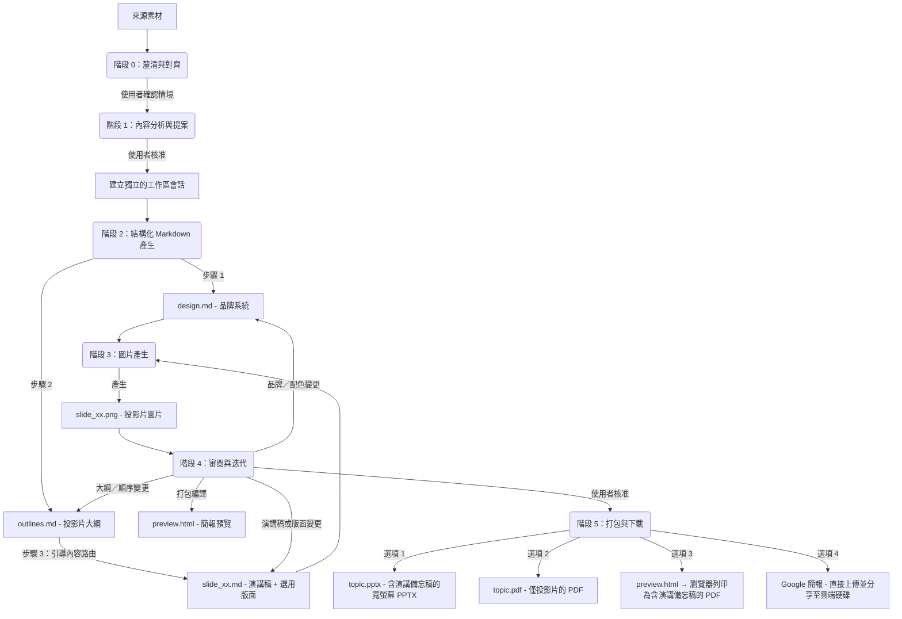

# Slide Gen Agent

[English (en)](README.md) | [繁體中文 (zh-TW)](README.zh-TW.md) | [简体中文 (zh-CN)](README.zh-CN.md) | [日本語 (ja)](README.ja.md) | [한국어 (ko)](README.ko.md)

`slide-gen-agent` 是一個對話式投影片簡報產生器——只要與代理人對話，就能將任何來源素材（文章、報告、大綱、原始筆記）轉換成完整、視覺精緻的簡報。描述你想要的內容、檢視產出結果，並透過自然對話反覆調整，直到簡報完全符合你的需求。

**核心能力：**
- **對話式與反覆運算** — 告訴代理人調整某張投影片的內容、更換顏色，或是在會話中途重新規劃整個大綱。變更會被精準套用，不需要重新產生整份簡報。
- **內含演講稿** — 每張投影片都附有完整的 1–2 分鐘演講逐字稿，以自然的講者口吻撰寫。逐字稿會內嵌在 PPTX 的備忘稿區段中，並包含在預覽頁面內，讓你上場前做好萬全準備。
- **多語言支援** — 支援 100 多種語言，包括繁體中文、簡體中文、英文、日文、韓文、泰文、越南文及其他亞洲文字系統，適用於投影片內容與演講備忘稿。可透過瀏覽器列印匯出 PDF，在不依賴伺服器端字型的情況下保留系統字型。
- **可直接交付的匯出格式** — 可下載為 PPTX（含可編輯的演講備忘稿）、PDF 投影片、瀏覽器列印的演講備忘稿 PDF，或直接推送至 **Google 簡報**，立即在瀏覽器中進行簡報與分享（含可編輯的演講備忘稿）。

本儲存庫的結構支援三種漸進式的部署與使用方式，從輕量的提示詞型技能到企業級正式環境代理皆涵蓋在內。

---

## 📖 核心設計理念與邏輯

傳統的 AI 投影片產生器在單一黑盒步驟中同時完成版面配置與視覺設計，這往往導致設計不一致、格式混亂，以及粗糙的反覆運算流程——只是想微調單張投影片的結構，或是整合修訂後的演講內容，通常都得重新產生整份簡報。

`slide-gen-agent` 採用**解耦的六階段流程**，以純文字中介檔案作為骨幹。每個設計決策都存在於可編輯的 Markdown 檔案中——因此你可以透過對話調整任何一層（全域樣式、投影片結構，或單張投影片內容），而只有受影響的投影片會被重新產生。



### 六階段流程

0. **階段 0：釐清與對齊**
   - 在開始分析來源素材或提出設計風格之前，代理人必須先確認簡報的三項核心情境要素：**預期簡報時長**（或投影片數量）、**目標受眾**，以及**預期目標／成果**。
   - *代理人會暫停並等待你的回覆。* 如果初始請求中缺少其中任何一項，代理人會在繼續之前先詢問你。

1. **階段 1：內容分析與提案**
   - 代理人會仔細閱讀你的來源素材（文件、逐字稿、原始筆記），以理解內容的領域、語氣，以及階段 0 中確認的情境。
   - 接著提出建議的**投影片數量**、**設計主題**，以及 **HEX 色碼配色方案**。
   - *代理人會暫停並等待你的回覆。* 你可以接受此提案，或調整主題／配色方案。

2. **階段 2：結構化 Markdown 產生**
   - 一旦獲得核准，代理人會在獨立的會話資料夾中產生三種類型的 Markdown 檔案：
     - **`design.md`**：品牌系統——HEX 色彩配色、字體排印、間距與視覺風格規則。這是確保所有投影片品牌一致性的單一事實來源（SSoT）。
     - **`outlines.md`**：完整的投影片清單，含每張投影片的版面配置類型與 2–3 句摘要。
     - **`slide_xx.md`**：每張投影片各自的檔案，含標題、演講逐字稿（260–300 字），以及一個選用的 `## Layout` 區段（首次產生時留空——影像模型會根據投影片類型與逐字稿自行推斷出合適的構圖）。
   - *流程會直接進入階段 3，不會暫停。*

3. **階段 3：圖片產生**
   - 代理人會將 `design.md`（品牌規範）與 `slide_xx.md`（單張投影片規格）合併為每張投影片的結構化提示詞。
   - 將此提示詞發送至影像產生模型，產生最終的 16:9 高保真 PNG 圖片（`slide_xx.png`）。
   - *流程會直接進入階段 4。*

4. **階段 4：審閱與迭代**
   - 代理人會將所有投影片圖片與講稿備忘錄編譯成一個 `preview.html` 頁面，並在對話中呈現預覽連結與投影片圖片。
   - *代理人會暫停並等待您的回饋。*
   - 使用純文字告訴代理人需要修改什麼。修改會被精確地套用——只有受影響的投影片會被重新產生：
     - 講稿或版面調整 → 更新相關的 `slide_xx.md` + 僅重新生成該張投影片。
     - 投影片順序調整 / 新增 / 刪除 → 更新 `outlines.md` + 受影響的 `slide_xx.md` 檔案（包括轉場與 Hook 重寫）+ 僅重新生成已變更的投影片。
     - 品牌 / 配色變更 → 更新 `design.md` + 重新生成所有投影片。
   - 此循環會持續重複，直到您明確批准所有投影片。

5. **階段 5：簡報打包與下載**
   - 一旦您批准最終的投影片，代理人會提供四種匯出選項：
     - **Google 簡報**：代理人會將 PPTX 上傳至 Google 雲端硬碟，在 `slide-gen-agent` 資料夾中轉換為 Google 簡報檔案，並與您分享編輯權限。可直接在瀏覽器中開啟進行簡報與分享。*(註：投影片版面會以高解析度的靜態圖片呈現，而備忘稿欄位中的演講備忘錄仍可完全編輯。需要在 GCP 中啟用 Google Drive API，並在 Google Workspace 管理員控制台中配置全網域授權。)*
     - **PPTX（含演講備忘錄的 PowerPoint）**：寬螢幕 PowerPoint 檔案，包含投影片圖片，且演講備忘錄完全可編輯。檔名會使用簡報主題（例如 `ai-trends-2025.pptx`）。
     - **PDF：投影片**：由所有投影片圖片編譯而成的 PDF（適合直接進行簡報）。檔名會使用簡報主題（例如 `ai-trends-2025.pdf`）。
     - **PDF：演講備忘錄**：開啟 `preview.html` 連結並點擊 **"Save as PDF"** 按鈕。瀏覽器會使用您的本機系統字型，將每張投影片及其備忘錄轉譯為乾淨、分頁明確的 PDF——這能完美處理包括中日韓（CJK）與東南亞語系在內的所有語言，且完全不依賴伺服器端的字型設定。

---

## 🛠️ 專案目錄結構

```text
slide-gen-agent/
├── README.md                # 專案概覽與設定（本檔案）
├── deploy.sh                # 互動式自動化部署協調腳本
├── deploy/
│   └── terraform/           # 用於佈署 GCP 資源的 Terraform 設定檔
│       ├── main.tf
│       ├── variables.tf
│       └── outputs.tf
├── skills/
│   └── slide-gen-agent/     # 🌟 標準獨立 Agent Skill（適用於 Antigravity/Codex）
│       ├── SKILL.md         # Playbook/指引（YAML frontmatter + 說明）
│       ├── assets/          # Skill 使用的靜態範本
│       │   ├── design.md    # 品牌系統範本（配色、字型、視覺風格）
│       │   ├── outlines.md  # 投影片大綱範本
│       │   └── slide_xx.md  # 單張投影片範本（標題、選用版面、講稿）
│       └── scripts/         # 隨 Skill 打包的自訂工具
│           ├── pdf_exporter.py # 寬螢幕簡報 PDF 編譯器
│           ├── pptx_exporter.py # 寬螢幕 PPTX 編譯器（含演講備忘錄）
│           ├── notes_pdf_exporter.py # 結合投影片圖片與講稿的 PDF 產生器
│           └── preview_generator.py # HTML 預覽頁面編譯器（包含儲存為 PDF）
└── adk_agent/               # 程式化 Host Agent（Python ADK 2.0 實作）
    ├── requirements.txt     # Python 依賴設定（包含 python-pptx 與 reportlab）
    ├── agent.py             # 主 Agent 入口點
    ├── config.py            # 環境變數與代理人組態管理器
    └── tools/               # Agent 工具
        ├── __init__.py
        ├── file_manager.py  # 工作區工作階段初始化與檔案寫入工具
        ├── imagen.py        # Gemini 投影片影像產生工具
        ├── pdf_exporter.py  # 基於 Pillow 的寬螢幕 PDF 匯出工具
        ├── pptx_exporter.py # 寬螢幕 PowerPoint (PPTX) 匯出工具（含演講備忘錄）
        ├── notes_pdf_exporter.py # 結合投影片圖片與講稿的 PDF 產生器
        ├── drive_exporter.py # Google 雲端硬碟上傳 → 轉換為 Google 簡報並分享
        └── preview_generator.py # HTML 投影片預覽與備忘錄編譯器（包含儲存為 PDF）
```

---

## 🚀 安裝與部署指南

請選擇適合您目標環境的安裝方法：

### 🔹 方法一：通用 Agent Skill (`SKILL.md`) — 平台無關
這是一個純提示詞／指引型的安裝，不需要任何代碼託管。
* **使用場景**：支援 Agent Skill、提供沙盒程式碼執行環境、且具備文字產生影像能力的 Agent Platform（例如 Antigravity、Codex）。
* **如何安裝**：
  1. 將整個 `skills/slide-gen-agent/` 目錄複製到您的 Agent Platform 的 skills 資料夾中。這能確保平台可以存取核心指南（`SKILL.md`）、`assets/` 中的靜態範本以及 `scripts/` 中的自訂執行腳本（例如 PPTX 與 PDF 編譯器）。
  2. 在您的 Agent Platform 中註冊並啟用該 skill。

---

### 🔹 方法二：Gemini Enterprise
此方法將代理人部署為 Vertex AI Reasoning Engine 並連接至 Gemini Enterprise 控制台。

#### Option 1：一鍵安裝 (One-Click Installation) (推薦)

> [!NOTE]
> 關於此腳本的前提條件、互動式設定與執行階段的詳細逐步說明，請參閱 [Deployment Script Details (英文)](deploy_details.md) 說明文件。
我們提供使用 **Terraform** 與配套 **協調腳本**（`deploy.sh`）的自動化生產級部署套件。這能完全自動化啟用 API、建立 Google 雲端硬碟委派服務帳號、建立 GCS 工作階段儲存桶、設定複雜的 IAM 角色綁定、設定 Python 虛擬環境，以及在 Vertex AI 中註冊代理人。

##### 1. 前提條件
我們**強烈推薦**直接在 **[Google Cloud Shell](https://shell.cloud.google.com)** 中進行部署。它是瀏覽器中免費且已預先配置好的環境，所有必需的工具均已預裝。

* **如果使用 Google Cloud Shell (推薦)**：
  - 所有工具（`gcloud` 與 `terraform`）均已預裝。
  - 您只需要啟用應用程式預設憑證 (ADC) 驗證：
    ```bash
    gcloud auth application-default login
    ```

* **如果使用您的本地電腦**：
  - 您必須手動安裝 [Google Cloud SDK](https://cloud.google.com/sdk/docs/install) 與 [Terraform CLI](https://developer.hashicorp.com/terraform/downloads)。
  - 您必須啟用 gcloud CLI 與應用程式預設憑證 (ADC) 雙重驗證：
    ```bash
    gcloud auth login
    gcloud auth application-default login
    ```

##### 2. 執行部署
開啟您的終端機（或 Google Cloud Shell）並執行以下指令來複製專案並啟動互動式部署腳本：
```bash
git clone https://github.com/sylphlin/slide-gen-agent
cd slide-gen-agent
./deploy.sh
```

腳本將會引導您完成：
1. **互動式設定**：確認您的目標 GCP 專案 ID（Project ID）與地區（Region）。
2. **基礎設施部署**：執行 Terraform 來設定 API、IAM 權限、GCS 儲存桶與服務帳號。
3. **環境變數設定**：自動在 `adk_agent/` 目錄下產生含有專案設定的 `.env` 檔案。
4. **代理人打包與部署**：自動安裝 Python 相依套件，並使用 ADK CLI 打包且註冊代理人為 Vertex AI Reasoning Engine。

完成後，腳本會輸出您的 **Reasoning Engine 資源 ID**（例如 `projects/{PROJECT_NUMBER}/locations/{REGION}/reasoningEngines/{ENGINE_ID}`）。

##### 3. 部署後續設定
要完成整合，請手動執行以下兩個步驟：

###### A. 設定網域範圍委派（Google Workspace 管理控制台）
這能讓代理人將產生的簡報直接上傳到每位使用者自己的 Google 雲端硬碟：
1. 前往 [Google Workspace 管理控制台](https://admin.google.com)。
2. 進入 **安全性 → 存取與資料控制 → API 控制項 → 網域範圍委派**。
3. 點擊 **新增**，並輸入：
   - **用戶端 ID**：雲端硬碟服務帳號（Drive SA）的 OAuth2 用戶端 ID。這會在 `deploy.sh` 腳本結束時顯示，也可以在 Terraform 的輸出中找到。
   - **OAuth 範圍**：`https://www.googleapis.com/auth/drive.file`
4. 點擊 **授權**。

###### B. 連接至 Gemini Enterprise 控制台
1. 登入 **Gemini Enterprise 管理控制台**。
2. 在左側選單中選擇 **Agents**。
3. 點擊 **+ 新增代理人**。
4. 選擇 **透過 Agent Engine 的自訂代理人（Custom agent via Agent Engine）**，並貼上腳本輸出的 **Reasoning Engine 資源 ID**。
5. 設定 IAM 驗證權限以保護連線安全。

---

#### Option 2：手動安裝 (Manual Installation)

> [!IMPORTANT]
> 如果您已經透過 **Option 1：一鍵安裝 (One-Click Installation) (推薦)** 完成部署，可以完全跳過此手動安裝章節。
如果您的組織政策限制使用 Terraform，或者您偏好使用 `gcloud` CLI 手動部署 GCP 資源，可以按照以下步驟進行。

##### Part A — 一次性專案設定
每個 GCP 專案只需執行一次。未來更新代理人程式碼時不需要重複這些步驟。

###### 1. 啟用 GCP API
請在您的 GCP 專案中啟用以下必要 API：
- [Vertex AI API](https://console.cloud.google.com/apis/library/aiplatform.googleapis.com)
- [Google Drive API](https://console.cloud.google.com/apis/library/drive.googleapis.com)
- [Cloud Build API](https://console.cloud.google.com/apis/library/cloudbuild.googleapis.com)
- [Artifact Registry API](https://console.cloud.google.com/apis/library/artifactregistry.googleapis.com)

###### 2. 設定 IAM 權限
Reasoning Engine 會在 Google 管理的 **Vertex AI Reasoning Engine 服務代理**（`service-{PROJECT_NUMBER}@gcp-sa-aiplatform-re.iam.gserviceaccount.com`）下執行您的程式碼。此服務帳號負責處理模型呼叫，但無法直接被註冊為 Google Workspace 網域範圍委派。為了支援 Google 雲端硬碟匯出，您必須建立一個獨立的由您管理的服務帳號（`slide-gen-drive`），並授權執行階段服務帳號可以模擬扮演它。

請在終端機中執行以下指令（將 `your-actual-gcp-project-id` 替換為您的實際專案 ID）：

```bash
export GOOGLE_CLOUD_PROJECT="your-actual-gcp-project-id"

PROJECT_NUMBER=$(gcloud projects describe $GOOGLE_CLOUD_PROJECT --format="value(projectNumber)")

# 執行階段服務帳號：執行您代理人程式碼的 Google 管理身分
RUNTIME_SA="service-${PROJECT_NUMBER}@gcp-sa-aiplatform-re.iam.gserviceaccount.com"

# 建置服務帳號：在 'adk deploy' 期間用於容器映像建置與紀錄
BUILD_SA="${PROJECT_NUMBER}-compute@developer.gserviceaccount.com"

# 1. 建立雲端硬碟服務帳號
gcloud iam service-accounts create slide-gen-drive \
  --display-name="Slide Gen Drive Exporter" \
  --project=$GOOGLE_CLOUD_PROJECT

DRIVE_SA="slide-gen-drive@${GOOGLE_CLOUD_PROJECT}.iam.gserviceaccount.com"

# 2. 授予執行階段服務帳號 Vertex AI 存取權限
gcloud projects add-iam-policy-binding $GOOGLE_CLOUD_PROJECT \
  --member="serviceAccount:$RUNTIME_SA" \
  --role="roles/aiplatform.user"

# 3. 授予執行階段服務帳號 GCS 儲存桶存取權限
gcloud projects add-iam-policy-binding $GOOGLE_CLOUD_PROJECT \
  --member="serviceAccount:$RUNTIME_SA" \
  --role="roles/storage.objectUser"

# 4. 授予建置服務帳號日誌記錄與容器登錄存取權限
gcloud projects add-iam-policy-binding $GOOGLE_CLOUD_PROJECT \
  --member="serviceAccount:$BUILD_SA" \
  --role="roles/logging.logWriter"

gcloud projects add-iam-policy-binding $GOOGLE_CLOUD_PROJECT \
  --member="serviceAccount:$BUILD_SA" \
  --role="roles/artifactregistry.writer"

# 5. 允許執行階段服務帳號模擬扮演雲端硬碟服務帳號（簽署 JWT）
# 請注意：方向至關重要。此角色是綁定在雲端硬碟服務帳號資源本身。
gcloud iam service-accounts add-iam-policy-binding $DRIVE_SA \
  --member="serviceAccount:${RUNTIME_SA}" \
  --role="roles/iam.serviceAccountTokenCreator" \
  --project=$GOOGLE_CLOUD_PROJECT
```

###### 3. 建立 Cloud Storage 儲存桶
In your target region to store session files:
```bash
gcloud storage buckets create gs://slide-gen-sessions-your-actual-gcp-project-id --location=us-central1
```

###### 4. 設定網域範圍委派（Google Workspace 管理控制台）
1. 前往 [Google Workspace 管理控制台](https://admin.google.com)。
2. 進入 **安全性 → 存取與資料控制 → API 控制項 → 網域範圍委派**。
3. 點擊 **新增**，並輸入：
   - **用戶端 ID**：`slide-gen-drive` 服務帳號的 OAuth2 用戶端 ID。可在 GCP 控制台的 IAM 服務帳號頁面中，該服務帳號的 **詳細資料** 分頁下找到。
   - **OAuth 範圍**：`https://www.googleapis.com/auth/drive.file`
4. 點擊 **授權**。

##### Part B — 安裝與部署
每次您想更新代理人程式碼時重複這些步驟。

###### 1. 準備本地環境與相依套件
在根目錄 `slide-gen-agent` 中執行：
```bash
python3 -m venv venv
source venv/bin/activate
pip install "google-adk[gcp]" -r adk_agent/requirements.txt
```

###### 2. 設定環境變數
在 `adk_agent` 目錄內建立一個 `.env` 檔案以儲存目標專案 ID 與服務帳號信箱：
```bash
cat > adk_agent/.env <<EOF
GOOGLE_CLOUD_PROJECT="your-actual-gcp-project-id"
DRIVE_SA_EMAIL="slide-gen-drive@your-actual-gcp-project-id.iam.gserviceaccount.com"
EOF
```

###### 3. 部署至 Vertex AI
在 `adk_agent` 目錄中執行 ADK 部署工具：
```bash
cd adk_agent
adk deploy agent_engine \
  --project=your-actual-gcp-project-id \
  --region=us-central1 \
  --display_name="slide-gen-agent" \
  --artifact_service_uri="gs://slide-gen-sessions-your-actual-gcp-project-id" \
  .
```
*記下產生的 **Reasoning Engine 資源 ID**。*

###### 4. 連接至 Gemini Enterprise 控制台
1. 登入 **Gemini Enterprise 管理控制台**。
2. 前往 **Agents** -> **+ 新增代理人**。
3. 選擇 **透過 Agent Engine 的自訂代理人（Custom agent via Agent Engine）**，並貼上您的 **Reasoning Engine 資源 ID**。
4. 設定 IAM 驗證權限以保護連線安全。