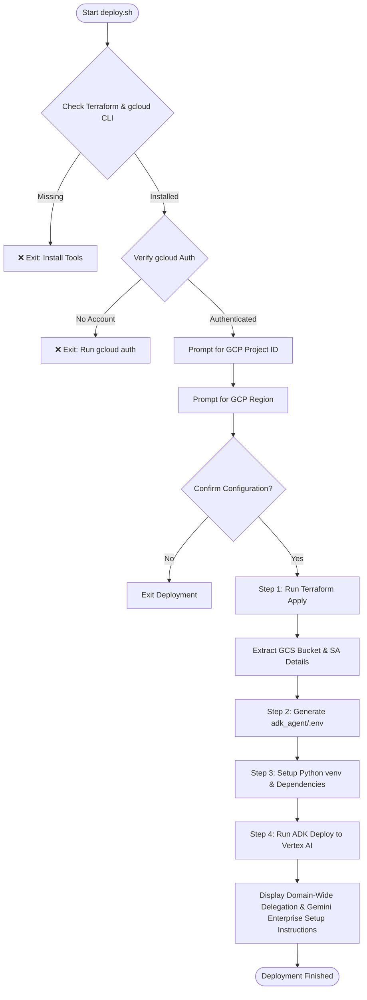

# Slide Gen Agent: Deployment Script Details (`deploy.sh`)

This document provides a detailed, technical breakdown of the automated deployment script `deploy.sh`. It serves as an architectural overview and troubleshooting reference for how the agent is provisioned and deployed to Google Cloud Platform (GCP) and Vertex AI Agent Engine.

---

## 🗺️ Execution Flow

The `deploy.sh` script is a bash orchestrator that manages prerequisite verification, Terraform infrastructure provisioning, local environment setup, and Vertex AI Agent Engine deployment.



---

## 🔍 Step-by-Step Breakdown

### 1. Prerequisite & Environment Checks
Before running any deployment steps, the script performs validation on the local environment to prevent half-provisioned failures:
* **Tool Verification**: Checks if `terraform` and `gcloud` CLI are installed and in the user's `PATH`. If missing, the script aborts with installation links.
* **Authentication Verification**: Runs `gcloud config get-value account` to check if a Google Cloud account is actively authenticated. If not, it prompts the user to run `gcloud auth login` and `gcloud auth application-default login`.

### 2. Interactive Configuration
To provide a smooth user experience, the script prompts for configuration details while offering sensible defaults:
* **GCP Project ID**: Detects the default project set in the active `gcloud` context. The user is prompted to enter their project ID, defaulting to the detected one.
* **GCP Region**: Prompts for the deployment region, defaulting to `us-central1`.
* **Configuration Confirmation**: Displays the chosen Project ID and Region, prompting the user for a final confirmation (`y/N`) before initiating changes.

### 3. Step 1: Infrastructure Provisioning (Terraform)
The script navigates to [deploy/terraform](file:///Users/sylph/Documents/Antigravity/slide-gen-agent/deploy/terraform) and runs Terraform to build the required cloud infrastructure:
1. **Initialization**: Runs `terraform init` to download the Google provider plugins.
2. **Conflict Resolution (Smart Checks)**: Before applying the infrastructure changes, the script performs two intelligent pre-checks to detect if any target resources already exist in your GCP project (which is common if you previously performed a manual installation). It pauses and prompts the user with interactive choices for each conflict:
   * **Service Account Conflict (`slide-gen-drive@...`)**:
     - **Option 1 (Adopt/Import) [Recommended]**: Automatically runs `terraform import` to adopt the existing service account into the Terraform state under its management.
     - **Option 2 (Recreate)**: Deletes the existing service account from GCP using `gcloud` and lets Terraform recreate it cleanly.
     - **Option 3 (Cancel)**: Gracefully aborts the deployment.
   * **GCS Bucket Conflict (`slide-gen-sessions-...`)**:
     - **Option 1 (Adopt/Import) [Recommended]**: Automatically runs `terraform import` to adopt the existing GCS bucket into the Terraform state under its management, **preserving all your existing session history, images, and presentations!**
     - **Option 2 (Recreate/Wipe)**: Deletes all files inside the existing bucket, deletes the bucket from GCP, and lets Terraform recreate it cleanly.
     - **Option 3 (Cancel)**: Gracefully aborts the deployment.
3. **Application**: Runs `terraform apply` with `-auto-approve`, passing the target `project_id` and `region` as variables.

4. **Terraform Outputs**: Once Terraform finishes, the script extracts three critical outputs:
   - `gcs_bucket_name`: The name of the GCS bucket created for storing session history, generated presentations, and images.
   - `drive_sa_email`: The service account email (`slide-gen-drive@...`) used to upload slides to Google Drive.
   - `drive_sa_client_id`: The OAuth2 Client ID of the Drive service account (required for Workspace Domain-Wide Delegation).


### 4. Step 2: Local Environment Configuration
To bridge the infrastructure and the application, the script automatically generates the local environment file [adk_agent/.env](file:///Users/sylph/Documents/Antigravity/slide-gen-agent/adk_agent/.env):
```env
# Generated automatically by deploy.sh on <timestamp>
GOOGLE_CLOUD_PROJECT="<your-gcp-project-id>"
DRIVE_SA_EMAIL="slide-gen-drive@<your-gcp-project-id>.iam.gserviceaccount.com"
```
This ensures the Python ADK runtime knows which GCP project to target and which Service Account it needs to impersonate when uploading presentations to Google Drive.

### 5. Step 3: Python Environment & Dependencies
The script prepares the local Python environment required to package and deploy the agent code, taking into account Vertex AI's runtime compatibility:
1. **Python Version Detection**: Vertex AI Reasoning Engine only supports **Python 3.10** and **Python 3.11**. The script automatically scans your system for `python3.11` or `python3.10` and uses it to build the environment. If your default `python3` is incompatible (e.g., Python 3.13) and no compatible version is found, it will warn you and prompt to abort, preventing cloud deployment failures (Error Code 13).
2. **Virtual Environment Creation**: Creates a local virtual environment `venv` using the detected compatible Python binary. If an incompatible `venv` already exists from a previous run, the script automatically deletes and recreates it with the correct version.
3. **Activation**: Activates the virtual environment.
4. **Pip Upgrade**: Upgrades `pip` to the latest version silently.
5. **Dependency Installation**: Installs the Google Agent Development Kit with GCP support (`google-adk[gcp]`) and the application requirements from [adk_agent/requirements.txt](file:///Users/sylph/Documents/Antigravity/slide-gen-agent/adk_agent/requirements.txt) **in a single, unified `pip install` command**. This is a critical design choice that forces `pip` to perform a joint dependency resolution, preventing subtle package version conflicts that would otherwise lead to container build failures on the Vertex AI platform (Error Code 13).


### 6. Step 4: Deploying to Vertex AI Agent Engine
Using the ADK CLI, the script packages the local agent code and deploys it as a Vertex AI Reasoning Engine:
```bash
cd adk_agent
adk deploy agent_engine \
  --project="$GOOGLE_CLOUD_PROJECT" \
  --region="$REGION" \
  --display_name="slide-gen-agent" \
  --artifact_service_uri="gs://$BUCKET_NAME" \
  .
```
* **Packaging**: The ADK packages the Python code inside `adk_agent/`.
* **Artifact Storage**: The GCS bucket (extracted from Terraform) is passed as the `--artifact_service_uri` to store session-specific metadata and output files.
* **Deployment**: The agent is registered as a Reasoning Engine in the specified region. This outputs a unique **Reasoning Engine Resource ID** (e.g., `projects/<PROJECT_NUMBER>/locations/<REGION>/reasoningEngines/<ENGINE_ID>`).

---

## ⚙️ Post-Deployment Manual Steps

After the script finishes, there are two manual tasks required to activate the agent:

### A. Enable Google Workspace Domain-Wide Delegation
This step authorizes the agent's dedicated Google Drive service account to upload presentations and share them with Workspace users:
1. Go to the [Google Workspace Admin Console](https://admin.google.com) (admin privileges required).
2. Go to **Security** ➔ **Access and data Control** ➔ **API Control** ➔ **Domain-wide delegation**.
3. Click **Add new** and configure:
   - **Client ID**: The Client ID of the Drive service account (printed by the script).
   - **OAuth scopes**: `https://www.googleapis.com/auth/drive.file`
4. Click **Authorise**.

### B. Connect to Gemini Enterprise
This step makes the custom agent available directly inside your Gemini Enterprise environment:
1. Log into the **Gemini Enterprise Admin Console**.
2. Go to **Agents** in the left sidebar.
3. Click **+ Add Agent** and select **Custom agent via Agent Engine**.
4. Paste the **Reasoning Engine Resource ID** printed by the `adk deploy` command.
5. Complete the IAM permission configuration to secure the connection between the enterprise workspace and the reasoning engine.
